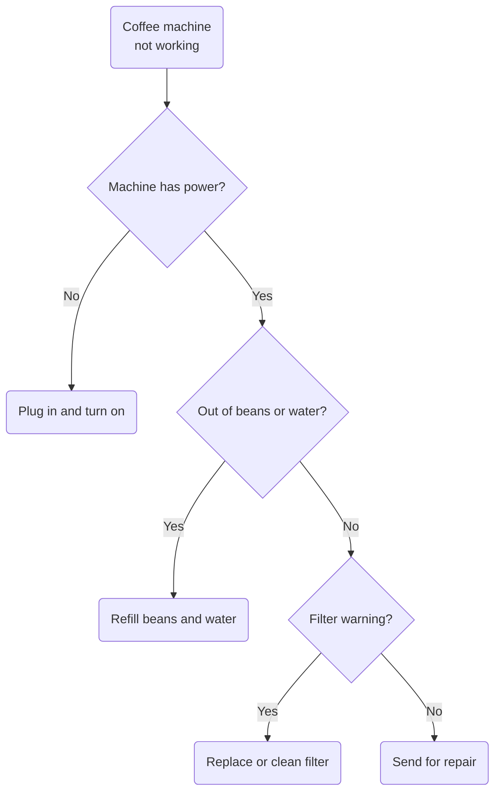
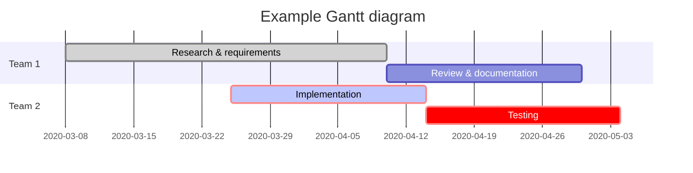
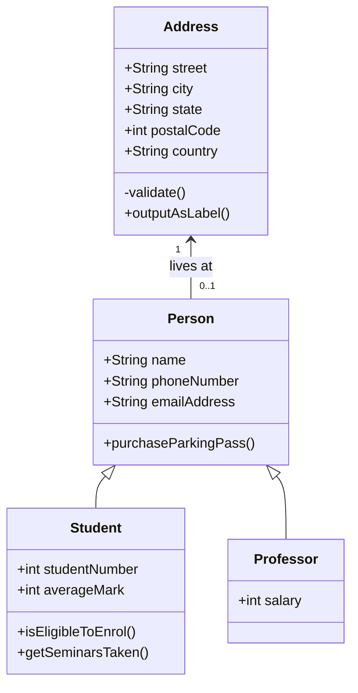
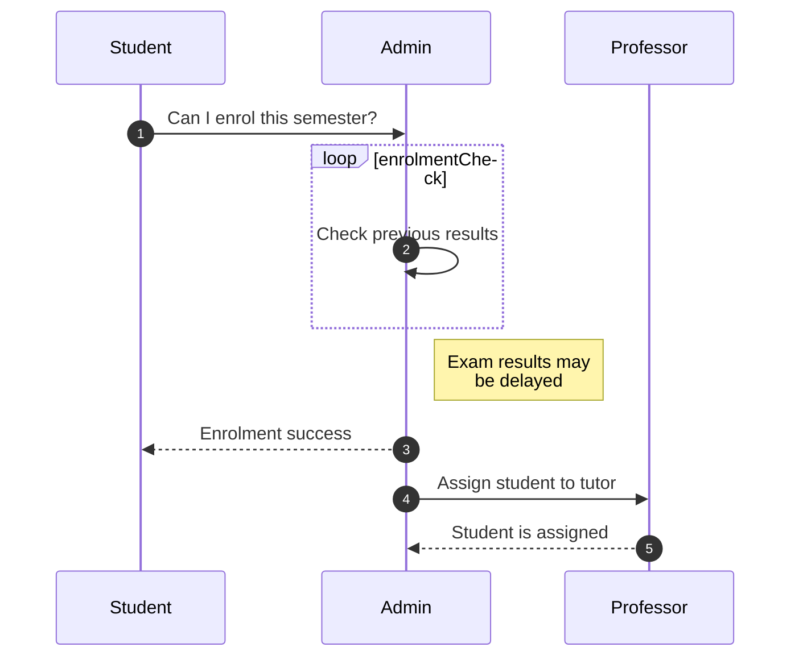
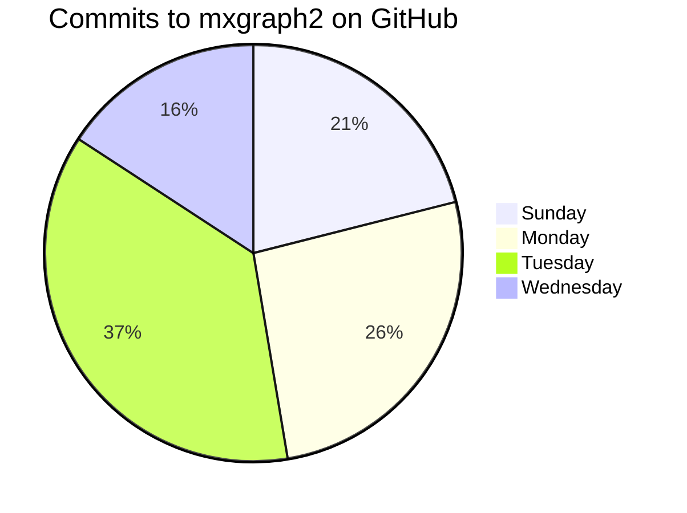

GFM test 

2022/2/20+  

[GitHub Flavored Markdown Spec](https://github.github.com/gfm/)

 This is head1  
 =============  

 This is head 2  
 --------------  
 
## table (PHP-Markdown style)
 
 First Header  | Second Header
------------- | -------------
Content Cell  | Content Cell
Content Cell  | Content Cell


| Item      | Value |
| --------- | -----:|
| Computer  | $1600 |
| Phone     |   $12 |
| Pipe      |    $1 |


## autolink

http://google.com

## strikethrough

this is ~~good~~ bad

## Task Lists

- [x] @mentions, #refs, [links](), **formatting**, and <del>tags</del> supported
- [x] list syntax required (any unordered or ordered list supported)
- [x] this is a complete item
- [ ] this is an incomplete item


## superscript

this is the 2^(nd) time

## underline

This is _underlined_ but this is still *italic*

## highlight(NotWork)

This is ==highlighted==  


## Color Test(NotWork)  
<span style="color:blue">some *blue* text</span>    
`#ffce44`  
`rgb(255,0,0)`  
`rgba(0,255,0,0.4)`  
`hsl(100, 10%, 10%)`  
`hsla(100, 24%, 40%, 0.5)`  

---

## 見出し  
1個から6個シャープで見出しを記述する。  
※シャープと見出し文字の間には半角スペースを1つ入れること  

# 見出し1
## 見出し2
### 見出し3
#### 見出し4
##### 見出し5
###### 見出し6


## 箇条書きリスト  
ハイフン、プラス、アスタリスクのいずれかで箇条書きリストを記述可能。  
※ハイフン、プラス、アスタリスクと箇条書きの項目の間には半角スペースを1つ入れること  

- リスト1
    - ネスト リスト1_1
        - ネスト リスト1_1_1
        - ネスト リスト1_1_2
    - ネスト リスト1_2
- リスト2
- リスト3

## 番号付きリスト  
数値+半角ドットで番号付きリストを記述可能。  
番号の内容は何でもいい。実際に表示される際に適切な番号で表示される。  
そのため、一般的にはすべて 1. 内容 で記載すると変更に強く楽です。  
※数値+半角ドットと箇条書きの項目の間には半角スペースを1つ入れること  

1. 番号付きリスト1
    1. 番号付きリスト1_1
    1. 番号付きリスト1_2
1. 番号付きリスト2
1. 番号付きリスト3


## 引用  
> お世話になります。xxxです。
> 
> ご連絡いただいた、バグの件ですが、仕様です。
>> お世話になります。 yyyです。
>> 
>> あの新機能バグってるっすね

## pre記法(スペース4 or タブ)  
半角スペース4個もしくはタブで、コードブロックをpre表示できます  

    # Tab
    class Hoge
        def hoge
            print 'hoge'
        end
    end

---

    # Space
    class Hoge
      def hoge
        print 'hoge'
      end
    end
    

## code記法  
バッククォートで文字列を囲むことでコードの一部を表示可能です。   
インストールコマンドは `gem install hoge` です  

## 強調など
normal *italic* normal  
normal _italic_ normal  

normal **bold** normal  
normal __bold__ normal  

normal ***bold*** normal  
normal ___bold___ normal  

## 水平線
アンダースコア、アスタリスク、ハイフンなどを3つ以上連続して記述することで水平線を表示します。  
※連続するハイフンなどの間にはスペースがあっても良い  


***
X
___
Y(下にスペースが必要)

---
Z(下にスペースが必要)

***


## リンク
\[表示文字\](リンクURL)形式でリンクを記述できます

[Google先生](https://www.google.co.jp/)

## 定義参照リンク
Markdownの文書の途中に長いリンクを記述したくない場合は、  
同じリンクの参照を何度も利用する場合は、リンク先への参照を定義することができます。  

[こっちからgoogle][google]  
その他の文章  
[こっちからもgoogle][google]   

[google]: https://www.google.co.jp/  


# GitHub Flavored Markdown(GFM)


## GFM:リンクテキスト簡易記法

https://www.google.co.jp/  


## GFM:取り消し線
チルダ2個で文字列を囲むことで取り消し線を利用できます。  
~~取り消し線~~

## GFM:pre記法(チルダ×3)
~~~
　class Hoge
　  def hoge
　    print 'hoge'
　  end
　end
~~~

## GFM:pre記法(バッククォート×3)

```
　class Hoge  
　  def hoge  
　    print 'hoge'  
　  end  
　end  
```

## GFM:pre記法(シンタックスハイライト)
チルダ、もしくはバッククォート3つの後ろに対象シンタックスの言語名を記述します。

~~~ruby  
　class Hoge  
　  def hoge  
　    print 'hoge'  
　  end  
　end
~~~  
　
## GFM:表組み

|header1|header2|header3|  
|:--|--:|:--:|  
|align left|align right|align center|  
|a|b|c|  

　　
## GFM:ページ内リンク
GitHubのMarkdownを利用すると、見出し記法を利用した際に  
アンカーが自動的に作成されます。  
そのアンカーを利用したページ内リンクを簡単に作成できます。  

## menu
* [to header1](#header1)  
* [to header2](#header2)  

<!-- some long code -->  

[return to menu](#menu)  
### header1
### header2

----   

## emoji test
==== Emojis ====  
:bug: バグ修正  
:+1: 機能改善  
:sparkles: 部分的な機能追加  
:tada: 盛大に祝うべき大きな機能追加  
:recycle: リファクタリング  
:shower: 不要な機能・使われなくなった機能の削除  
:green_heart: テストやCIの修正・改善  
:shirt: Lintエラーの修正やコードスタイルの修正  
:rocket: パフォーマンス改善  
:up: 依存パッケージなどのアップデート  
:lock: 新機能の公開範囲の制限  
:cop: セキュリティ関連の改善  
:books: ドキュメント  
:art: デザインUI/UX  
:horse: パフォーマンス  
:wrench: ツール  
:rotating_light: テスト  
:hankey: 非推奨追加  
:wastebasket: 削除  
:construction: WIP  
:truck: ファイルの移動  
:bookmark: バージョンタグ  
  
---

## Mermaid Test

[Use Mermaid syntax to create diagrams](https://www.diagrams.net/blog/mermaid-diagrams)

flowchart


Gantt chart



UML  class diagram


UML sequence diagram


Pie chart


simple0
```mermaid
graph TD
A[Hard] -->|Text| B(Round)
B --> C{Decision}
C -->|One| D[Result 1]
C -->|Two| E[Result 2]
````

simple1
```mermaid
sequenceDiagram
Alice->>John: Hello John, how are you?
loop Healthcheck
    John->>John: Fight against hypochondria
end
Note right of John: Rational thoughts!
John-->>Alice: Great!
John->>Bob: How about you?
Bob-->>John: Jolly good!
```
simpleX
<div class="mermaid> 
sequenceDiagram
Alice->>John: Hello John, how are you?
loop Healthcheck
    John->>John: Fight against hypochondria
end
Note right of John: Rational thoughts!
John-->>Alice: Great!
John->>Bob: How about you?
Bob-->>John: Jolly good!
</mermaid>


以上

