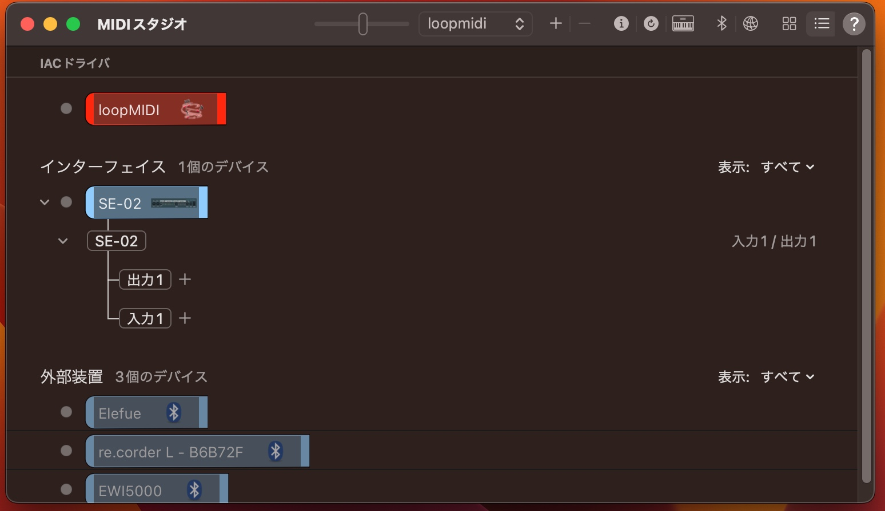

    
# Elefue/re.corderをSE-02と接続する

2022/11/20      
初版    
  
## 概要   
SE-02(アナログシンセ/ハードウェア音源)をElefue/re.corderにPC経由(windows/linux/Mac)で接続する。  
PCには、CCMapperを動作させ以下のようにMIDIデータが流れるようにする：  
```
[Elefue/re.corder] -(bluetooth MIDI)-> [PC(CCMapper)] -(USB MIDI)->[SE-02]  

```

参照：  
[SE-02 Analog Synthesizer](https://www.roland.com/jp/products/se-02/)  


## 準備
OSの種類によっては、USB-MIDIのドライバーをインストールする必要がある。

1. windowsの場合
ネットに接続していれば、SE-02とPCをUSBで接続すると自動的にドライバーがインストールされる。  
自分自身の環境では、既に以下のkorgのドライバーがインストールされていたので、それが動作しているようだ。

[KORG BLE-MIDI Driver](https://www.korg.com/jp/support/download/product/1/301/)  

正常にSE-02が接続されている場合は、  
「デバイスマネジャー」の「サウンド、ビデオ、およびゲームコントローラ」の下に  
「SE-02」が出現する。  

2. linuxの場合
linuxの場合、特にドライバーが必要でなく、SE-02をUSB接続して
コマンドlsusbで「SE-02」が出現すれば、正常と確認できる。
出力例：  
```
lsusb

Bus 002 Device 001: ID 1d6b:0003 Linux Foundation 3.0 root hub
Bus 001 Device 005: ID 138a:0097 Validity Sensors, Inc.
Bus 001 Device 004: ID 04f2:b5ce Chicony Electronics Co., Ltd Integrated Camera
Bus 001 Device 003: ID 8087:0a2b Intel Corp.
Bus 001 Device 002: ID 1199:9079 Sierra Wireless, Inc. Sierra Wireless EM7455 Qualcomm Snapdragon X7 LTE-A
Bus 001 Device 006: ID 0582:0201 Roland Corp. SE-02
Bus 001 Device 007: ID 7104:1101 CME (Central Music Co.) WIDI Bud Pro
Bus 001 Device 001: ID 1d6b:0002 Linux Foundation 2.0 root hub

```

3. Macの場合
Macの場合、以下のリンクからドライバーをダウンロードしてインストールする：  
[https://www.roland.com/jp/products/se-02/downloads/](https://www.roland.com/jp/products/se-02/downloads/)    
SE-02 Driver Ver.1.0.4 for macOS 11/12        

インストール後、SE-02をUSB接続して[MIDIスタジオ]に入ると   
以下のように「SE-02」が出現する：  

  

「SE-02」が出現すれば正常にデバイスを認識していることになる。

## Windows版の変更

openframeworks版で以下のような修正を行なう：  
```c++

	// open port by number (you may need to change this)
	//midiIn.openPort(1);

	//midiIn.openPort("WIDI Bud Pro 1");
	midiIn.openPort("WIDI Bud Pro 2");

	//<------------------------------------------------------------------
	
	// print the available output ports to the console
	midiOut.listOutPorts();

	// connect
	//midiOut.openPort(3); // by number

	midiOut.openPort("SE-02 3"); // by name
	//midiOut.openPort("loopMIDI Port 1 3"); // by name

```
デバイス名の後ろの数字は接続状況により変わるので  
個々の環境に合わせること。

## linux版の変更
openframeworks版で以下のような修正を行なう：  
```c++

// open port by number (you may need to change this)
//midiIn.openPort(2);

midiIn.openPort("WIDI Bud Pro:WIDI Bud Pro MIDI 1 24:0");
//midiIn.openPort("WIDI Bud Pro 2");

//midiIn.openPort("IAC Pure Data In"); // by name
//midiIn.openVirtualPort("ofxMidiIn Input"); // open a virtual port

//<------------------------------------------------------------------

// print the available output ports to the console
midiOut.listOutPorts();

// connect
//midiOut.openPort(1); // by number

midiOut.openPort("SE-02:SE-02 MIDI 1 20:0"); // by name
//midiOut.openPort("loopMIDI Port 1 3"); // by name
//midiOut.openPort("MidiView 4"); // by name
```
デバイス名の後ろの文字列は接続状況により変わるので  
個々の環境に合わせること。
                        
参考：上のソース変更は以下のデバイス名の出力例に対応したものである：  
```
[notice ] ofxMidiIn: 3 ports available
[notice ] ofxMidiIn: 0: Midi Through:Midi Through Port-0 14:0
[notice ] ofxMidiIn: 1: SE-02:SE-02 MIDI 1 20:0
[notice ] ofxMidiIn: 2: WIDI Bud Pro:WIDI Bud Pro MIDI 1 24:0
[notice ] ofxMidiOut: 4 ports available
[notice ] ofxMidiOut: 0: Midi Through:Midi Through Port-0 14:0
[notice ] ofxMidiOut: 1: SE-02:SE-02 MIDI 1 20:0
[notice ] ofxMidiOut: 2: WIDI Bud Pro:WIDI Bud Pro MIDI 1 24:0
[notice ] ofxMidiOut: 3: ofxMidiIn Client:ofxMidi Input 1 128:0

```

## Mac版の変更
openframeworks版で以下のような修正を行なう：   
\# re.corderを入力デバイスにした場合
```c++

    //midiIn.openPort("Elefue Bluetooth");
    midiIn.openPort("re.corder L - B6B72F Bluetooth");

    //midiIn.openPort("IAC Pure Data In");    // by name
    //midiIn.openVirtualPort("ofxMidiIn Input"); // open a virtual port

    //<------------------------------------------------------------------

    // print the available output ports to the console

    midiOut.listOutPorts();

    // connect
    //midiOut.openPort(3); // by number

    midiOut.openPort("SE-02"); // by name
    //midiOut.openVirtualPort("ofxMidiOut"); // open a virtual port
```

C#版を使用する場合は以下のような修正を行なう：  
```c#
        public Program()
        {
            bool logOut = false; // true; // true to disp log on console

            bool enableSendNote = true; // false will Not send note

            // the following device will be opened
            string ID0 = "WIDI Bud Pro"; // for Windows
            string ID1 = "Elefue"; // for Mac
            string ID2 = "re.corder"; // for Mac
            //string OD = "loopMIDI"; // for Windows/Mac
            string OD = "SE-0"; // for Mac
```
出力デバイスは「SE-02」だが、ライブラリのバグで「SE-0」と認識されるようなので、ソースコードは、それに合わせてある。


## 引用ソース
1. [CCMapper改良版(openFrameworks)](https://xshigee.github.io/web0/md/CCMapper2_improved_ofx.html)  
1. [CCMapper(C#版/RtMidi)](https://xshigee.github.io/web0/md/CCMapper_CS_RtMidi.html)の改良版CCMapperのソース  


## 関連情報  
CCMapper関連：  
[CCMapper改良版(openFrameworks)](https://xshigee.github.io/web0/md/CCMapper2_improved_ofx.html)  
[CCMapper(C#版/RtMidi)](https://xshigee.github.io/web0/md/CCMapper_CS_RtMidi.html)  
[processingでCCMapperを実装する](https://xshigee.github.io/web0/md/CCMapper_processing.html)  
[python版CCMapper - re.corder/ElefueをCCMapper経由で外部音源(Aria/Windows)と接続する(WIDI_Bud_Pro使用)](https://xshigee.github.io/web0/md/CCMapper_Aria.html)  

openframework関連：   
[openFrameworksを使用して独自のMIDI生成のリアルタイムビジュアルを作成します。](https://ask.audio/articles/create-your-own-midi-generated-realtime-visuals-with-openframeworks/ja)  
[Novation LauchpadとopenFrameworksを使ってResolumeのVJコントローラを作る : コーディング編](https://artteknika.hatenablog.com/entry/2016/09/30/223230)  
[プロジェクトにアドオンを追加する方法](https://openframeworks.cc/ja/learning/01_basics/how_to_add_addon_to_project/)   
[新規プロジェクトの作成](https://openframeworks.cc/ja/learning/01_basics/create_a_new_project/)  
[Listen to events](https://openframeworks.cc/learning/06_events/event_example_how_to/)  
[変数の値を見る](https://openframeworks.cc/ja/learning/01_basics/how_to_view_value/)  
[ofLog](https://openframeworks.cc/documentation/utils/ofLog/)  
[openFrameworks-コンソール表示する](https://qiita.com/y_UM4/items/99c875a7a32056d006b5)  
[oF：Windowsのopenframeworksでコンソールウインドウを出さない方法](http://wishupon.me/?p=312)  
[openFrameworks-Log vol.1／環境設定と導入](https://barbegenerativediary.com/tutorials/openframeworks-log-1-setup/)  
[openFramewoks – OSC (Open Sound Control) を利用したネットワーク連携](https://yoppa.org/ma2_10/2279.html)  
                                   
pygame.midi関連：  
[PythonでMIDI](https://webmidiaudio.com/npage507.html)  
[pygame.midi](https://runebook.dev/ja/docs/pygame/ref/midi)   

loopMIDI関連：  
[loopMIDI](https://www.tobias-erichsen.de/software/loopmidi.html)  
[loopMIDIでつなぐ](https://webmidiaudio.com/npage501.html)  

WIDI_Bud_Pro関連：  
[WIDI Bud Pro](https://hookup.co.jp/products/cme/widi-bud-pro)  
[WIDI Bud Pro 技術情報](https://hookup.co.jp/support/product/widi-bud-pro)  

re.corder関連：  
[owner’s manual re.corder](http://www.artinoise.com/wp-content/uploads/2021/02/artinoise-recorder-manual-ENG-v10.pdf)  
[re.corder Downloads](https://www.recorderinstruments.com/en/support-downloads/)  
[re.corder Frequently Asked Questions](https://www.recorderinstruments.com/en/frequently-asked-questions/)    

MIDI関連：  
[現時点、最強のBluetooth MIDIかも!?　各種BLE-MIDI機器と自動でペアリングしてくれるWIDI Masterがスゴイ！](https://www.dtmstation.com/archives/32976.html)  
[Midi View](https://hautetechnique.com/midi/midiview/)  

ASIO関連：  
[asio4all - ASIOドライバーのないオーディオインターフェイスをASIO対応にできるソフト](https://forest.watch.impress.co.jp/library/software/asio4all/)

Aria関連：  
[EWI MASTER BOOK CD付教則完全ガイド【改訂版】](https://www.alsoj.net/store/view/ALEWIS1-2.html#.YmNpctpBxPY)のp100-p119の音色の設定方法がある

以上  

[Go to Toplevel](https://xshigee.github.io/web0/)  

