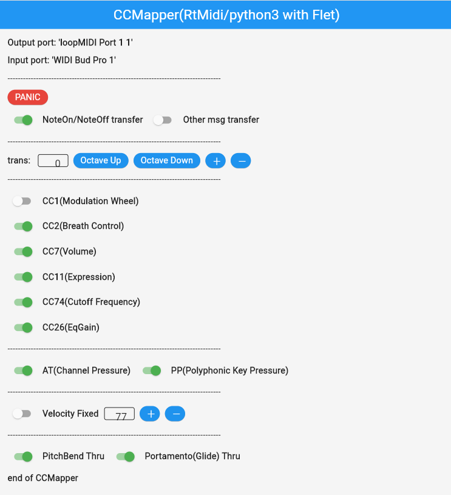

    
# Flet_CCMapper(RtMidi/python3) for R1/Elesa

2023/12/24  
Note_Offの音源の処理が重い場合、それを落とすことがあるようなので
Note_OffのあとAll_Note_Offを送ることで改善した。  

2023/12/20++  
インストール方法を見直した。  

2023/12/12  
実行ファイル(exeなど)の作成方法を追加した。  

2023/12/17        
初版    
  
## 概要    
本記事は[Flet_CCMapper(RtMidi/python3)](https://xshigee.github.io/web0/md/CCMapper_Flet_Pyhon3RtMidi.html)をベースにR1/Elesaのサポートを追加したものである。Winの場合、MIDI_Bud(USB dongle)経由なので本件の変更なしでも動作する。したがって、Mac専用の修正になる。
具体的には、ソースであるFlet_CCMapper.pyのみの変更である。

以下、変更なしの部分に関しては、そのまま前記事をコピーしたものになる。  

---

CCMapper(RtMidi/python3)をFletライブラリを利用して、GUI付CCMapperに改良した。
Fletライブラリはクロスプラットフォーム対応なので、window/mac/linuxで動作する。

本機能は、[WIDI Bud Pro]経由でMIDIデータをリアルタイムでCC#2またはCC#11を受信して、CC#を任意のもの(複数、AT、PPを含む)に変更して音源に送信する。Pitch_Bendは,そのまま接続されている音源に送られる。     

ref:  
[Wind Synthesizer R1 - Musical Instrument From the Future!](https://store.robkoo.com/products/buy_r1)  
[TAHORNG Elesa10](https://www.fineassist.jp/products/TH/Elesa/entry-234.html)   


## 準備

1.Windowsの場合、  
仮想MIDIデバイスとして、loopMIDIがインストールされている必要がある。  
参照：[loopMIDI](https://www.tobias-erichsen.de/software/loopmidi.html)  

MIDI信号の流れとしては以下のようになる：
```
[wind_controler(re.corder/Elfue etc)]→[WIDI Bud Pro]→(CCMapper)→[loopMIDI]→ [PC音源]
```

2.Macの場合  
仮想MIDIデバイスとして、IACドライバを設定する。名前はWindowsに合わせて「loopMIDI」とする。
参照：[MacのAudio MIDI設定でMIDI情報をアプリケーション間で送信する](https://support.apple.com/ja-jp/guide/audio-midi-setup/ams1013/mac)  

MIDI信号の流れとしては以下のようになる：
```
[wind_controler(re.corder/Elfue etc)]→(CCMapper)→[loopMIDI(IAC)]→ [PC音源]
```

3.linuxの場合  
仮想MIDIデバイスとして、既存の[Midi Through port]を利用する。

MIDI信号の流れとしては以下のようになる： 

```
[wind_controler(re.corder/Elfue etc)]→[WIDI Bud Pro]→(CCMapper)→[Midi Through Port]→ [PC音源]
```

## 準備
python-rtmidiのインストールから説明する：

1.windowsの場合  
以下を実行してインストールする：  
\# scoopで必要なコマンドがインストール済みの前提  
```
基本的には以下の方法であるが、エラーが出たので一部変更している：  
https://spotlightkid.github.io/python-rtmidi/install-windows.html  

python -m pip install -U virtualenv
python.exe -m pip install --upgrade pip

python -m virtualenv rtmidi
rtmidi\Scripts\activate
ここで、仮想環境rtmidiにはいる

pip install -U pip setuptools

pip download python-rtmidi
tar -xzf python-rtmidi-1.4.9.tar.gz
cd python-rtmidi-1.4.9
python setup.py install

# fletのインストール
pip install flet
```

仮想環境に該当ライブラリをインストールしたので、
rtmidi/fletライブラリを使用する場合は、
以下を実行して仮想環境に入ること。  

```
.\rtmidi\Scripts\activate
```

2.Macの場合  
以下を実行してインストールする：  
\# brewでpython3がインストール済みの前提
```
pip install python-rtmidi

pip install flet
```

実際の実行にあたり、python3は、コマンド名として、Macではpython3になっているので、 以下のように実行すること  
(これに対して、linux/windowsの場合、python)  
```
python3 flet_CCMapper.py
```

3.linuxの場合  
以下を実行してライブラリをインストールする：   
\# Flet実行時にエラーなったので、それを回避するために、     
\# pythonの仮想環境を設定している  
```
# To install GStreamer on Ubuntu/Debian run the following commands:

sudo apt-get update
sudo apt-get install libgstreamer1.0-dev libgstreamer-plugins-base1.0-dev libgstreamer-plugins-bad1.0-dev gstreamer1.0-plugins-base gstreamer1.0-plugins-good gstreamer1.0-plugins-bad gstreamer1.0-plugins-ugly gstreamer1.0-libav  gstreamer1.0-tools gstreamer1.0-x gstreamer1.0-alsa gstreamer1.0-gl gstreamer1.0-gtk3 gstreamer1.0-qt5 gstreamer1.0-pulseaudio

# pythonの仮想環境fletを設定する
python -m venv flet

. ./flet/bin/activate

pip install python-rtmidi
pip install flet

```

仮想環境に該当ライブラリをインストールしたので、
fletライブラリを使用する場合は、
以下を実行して仮想環境に入ること。  

```

. ./flet/bin/activate

```
ref:   
[Creating Flet apps in Python - linux](https://flet.dev/docs/guides/python/getting-started)  


## 実行

以下のコマンドラインで実行する：
```

windows/linuxの場合
# python仮想環境に入る
python flet_CCMapper.py

macの場合
python3 flet_CCMapper.py

```

以下、実行画面： 

---


 

---

1. スイッチが緑色のときはオンを意味する。オンの場合、入力デバイスから受信したCC#2かCC＃11の値を、control#を変更して転送する。
1. [Output port/Input port]  
接続されているデバイス(ポート)が表示される。  
1. [PANIC]  
[PANIC]ボタンは、[All Note Off],[All Sound Off]を送信するが、音源が、サポートしていないと効果がない。
1. [NoteOn/NoteOff transfer]  
Macなど音源ホストでMIDI入力ソースを限定できない場合(＝複数の入力をがある場合)、入力デバイスのMIDIメッセージとCCMapper出力のメッセージがダブって送信される。
それを避けるためにCCMapperのNoteOn/NoteOffの転送をオフできる。
1. [Other msg transfer]
対応していないMidiメッセージに対して転送するかどうかを決めるスイッチ。  
(デフォルトはオフ)
1. [Octave Up],[Octave Down],[+],[-]  
オクターブ関係のボタンを押すとオクターブの値が変化して、その数値の分(半音単位)、ピッチが変わる。
1. [CC1]  
CC1がオフの場合、入力デバイスからのCC1をそのまま転送する。オンの場合、入力されたCC#2/CC#11からCC1を作り転送する。
1. [AT/PP]  
AT/PPをオフ/オフできる。オンの場合、入力されたCC#2/CC#11からAT/PPに変換して転送する。オフの場合、入力デバイスからのAT/PPがあれば、それをそのまま出力に転送する。    
1. [Velocity Fixed]  
オンすると固定のベロシティを送信する。その固定値を表示しており、[+][-] で変更できる。オフすると、コントローラ自身のベロシティが転送される。  
1. [PitchBend Thru]  
受信したPitchBendの転送をオン/オフできる。    
コントローラに慣れていなくてPitchBendが煩わしい場合、オフにできる。
1. [Portamento(Glide) Thru]
受信したPortamento(Glide)関係のMIDIメッセージの転送をオン/オフできる。  
(デフォルトはオン)  


## ソースコード
CCMapperのプログラムとしては以下を使用する：  

Flet_CCMapper.py
```python

#!/usr/bin/env python
#
# flet_CCMapper_RtMidi.py
#
# written by: xshige
#
# 2023/12/24: issue All Note Off after Note Off to assure Note Off done with heavy tone generator
# 2023/12/17: TAHORNG Elesa support version
# 2023/6/28: ROBKOO R1 support version (USB-MIDI for YDS-150 removed)
# 2023/1/22: code refined
# 2023/1/20: compare order is changed to reduce overhead
# 2023/1/19: Hires Messages are ignored
# 2023/1/18: glide/portamento support
# 2023/1/16: added device name(USB-MIDI) for YDS-150
# 2023/1/15: 1st version
    
# related URLs
# https://github.com/flet-dev/flet
# https://github.com/SpotlightKid/python-rtmidi
# https://veliugurguney.com/blog/post/real_time_midi_in_python_using_sched_and_rtmidi
# https://courses.ideate.cmu.edu/16-375/f2021/text/code/midi-examples.html

import os
import sys

import flet as ft

from rtmidi.midiconstants import (ALL_NOTES_OFF, ALL_SOUND_OFF, BALANCE, BANK_SELECT_LSB,
                                  BANK_SELECT_MSB, BREATH_CONTROLLER, CHANNEL_PRESSURE,
                                  CHANNEL_VOLUME, CONTROL_CHANGE, DATA_ENTRY_LSB, DATA_ENTRY_MSB,
                                  END_OF_EXCLUSIVE, EXPRESSION_CONTROLLER, FOOT_CONTROLLER,
                                  LOCAL_CONTROL, MIDI_TIME_CODE, MODULATION, NOTE_OFF, NOTE_ON,
                                  NRPN_LSB, NRPN_MSB, PAN, PITCH_BEND, POLY_PRESSURE,
                                  PROGRAM_CHANGE, RESET_ALL_CONTROLLERS, RPN_LSB, RPN_MSB,
                                  SONG_POSITION_POINTER, SONG_SELECT, TIMING_CLOCK)

from rtmidi import MidiIn
from rtmidi import MidiOut

#--------------------------------------------------------------------------
def midiin_callback(event, data=None):
    global curNote
    message, deltatime = event

    if message[0] & 0xF0 == NOTE_OFF: # NoteOff is FIRST PRIORITY! 
        status, note, velocity = message
        channel = (status & 0xF) + 1
        print("NoteOff note:%d velocity:%d" % (note, velocity))
        #message[1] = curNote # 2023/1/22 REMOVED
        if (XFER.value):
            midiout.send_message(message)
            # All Note Off
            msg = [CONTROL_CHANGE + channel - 1]
            msg.append(123)
            msg.append(0)
            midiout.send_message(msg)
        """
        if (XFER.value):
            # experimental code
            # All Sound Off
            msg = [CONTROL_CHANGE + channel - 1]
            msg.append(120)
            msg.append(0)
            midiout.send_message(msg)
        """
        return

    elif message[0] & 0xF0 == NOTE_ON:
        status, note, velocity = message
        channel = (status & 0xF) + 1
        print("NoteOn note:%d velocity:%d" % (note, velocity))
        if (velocity == 0 and XFER.value):
            # change NoteOn to NoteOff (patch 2023/1/15 for NuRad)
            message[0] = NOTE_OFF + channel - 1
            transpose = int(trans.value)
            curNote = note+transpose
            message[1] = curNote
            midiout.send_message(message)
            return
        transpose = int(trans.value)
        curNote = note+transpose
        message[1] = curNote
        if (VFIX.value): message[2] = int(vel.value)
        if (XFER.value): midiout.send_message(message)
        return
    
    elif message[0] & 0xF0 == CONTROL_CHANGE:
        status, control, value = message
        channel = (status & 0xF) + 1
        print("CONTROL_CHANGE control:%d value:%d" % (control, value))
        if ((control == 2)|(control == 11)):
            message[1] = 1
            if (CC1.value): midiout.send_message(message)
            message[1] = 2
            if (CC2.value): midiout.send_message(message)
            message[1] = 7
            if (CC7.value): midiout.send_message(message)
            message[1] = 11
            if (CC11.value): midiout.send_message(message)
            message[1] = 74
            if (CC74.value): midiout.send_message(message)
            message[1] = 26
            if (CC26.value): midiout.send_message(message)
            # AT
            msg2 = [CHANNEL_PRESSURE + channel - 1]
            msg2.append(value & 0x7F)
            if (AT.value): midiout.send_message(msg2)
            # PP
            msg2 = [POLY_PRESSURE + channel - 1]
            msg2.append(curNote & 0x7F)
            msg2.append(value & 0x7F)
            if (PP.value): midiout.send_message(msg2)
            return
        # the following CC ignore(not sent)
        if (control == 102): return # EWI5000
        if (control == 103): return # EWI5000
        if (control == 123): return # EWI5000 (All Note Off)
        if (control == 7): return # EWI5000
        if (control == 68): return # EWI5000
        if (control == 74): return # EWI5000
        if (control == 34): return # CC#34(Hires/Breath Controler) ignored
        if (control == 39): return # CC#39(Hires/Volume) ignored
        if (control == 43): return # CC#43(Hires/Expression) ignored 
        if (control == 88): return # CC#88(Hires/NoteOn) ignored
        # Incomming Modulation Wheel
        if (control == 1):
            if (not CC1.value): midiout.send_message(message)
            return
        # portamento/glide support
        if (control == 65): # portamento on/off
            if (PORTA.value): midiout.send_message(message)
            return
        if (control == 5): # portamento/glide time
            if (PORTA.value): midiout.send_message(message)
            return
        if (control == 84): # portamento control
            if (PORTA.value): midiout.send_message(message)
            return
        if (control == 104): # Legato Time (EWI5000)
            if (PORTA.value): midiout.send_message(message)
            return
        #----------------------
        else: # other CC
            # other messsage
            if (OTHER.value):
                midiout.send_message(message)
                print("********** unexpected CC **********")
                print(hex(message[0]),message[1],message[2])
                return
    #--------------------------------------------------------
    elif message[0] & 0xF0 == CHANNEL_PRESSURE:
        if (not AT.value): midiout.send_message(message)
        value = message[1] # bug fix 2023/1/12
        channel = (status & 0xF) + 1
        print("AT(CHANNEL_PRESSURE) value:%d" % (value))
    elif message[0] & 0xF0 == POLY_PRESSURE:
        if (not PP.value): midiout.send_message(message)
        status, note, value = message
        channel = (status & 0xF) + 1
        print("PP(POLY_PRESSURE) note:%d value:%d" % (note, value))
    elif message[0] & 0xF0 == PITCH_BEND:
        if (PB.value): midiout.send_message(message)
        int14 = message[2] # 2nd byte
        int14 = (int14<<7)
        int14 = (int14|(message[1]&0x7F))
        #### print("PITCH_BEND value:%d" % (int14))
        return
    else:
        # other messsage
        if (OTHER.value):
            midiout.send_message(message)
            print("********** unexpected message **********")
            print(hex(message[0]),message[1],message[2])

#---------------------------------------------------------

def panic(e):
    channel = 1
    # All Sound Off
    msg = [CONTROL_CHANGE + channel - 1]
    msg.append(120)
    msg.append(0)
    midiout.send_message(msg)
    # All Note Off
    msg = [CONTROL_CHANGE + channel - 1]
    msg.append(123)
    msg.append(0)
    midiout.send_message(msg)

#---------------------------------------------------------

def main(page):
    global midiout

    ver = "2023/6/28" # version
    ##ver = "2023/1/22" # version

    # flet related variable
    global CC1,CC2,CC7,CC11,CC74,CC26,AT,PP,PB,PORTA
    global XFER,OTHER,VFIX
    global trans,vel

    print(ver)
    print("Running at: "+page.platform)
    ##print(ft.get_platform()) # you also can use it 

    # the following device will be opened
    ID0 = "WIDI Bud Pro" # for Windows/Linux
    ID1 = "Elefue" # for Mac
    ID2 = "re.corder" # for Mac
    ID3 = "Nu" # for Mac (with WIDI Master/NuRAD,NuEVI)
    ID4 = "EWI" # for Mac (with WIDI Master/EWI5000,EWI4000,EVI3010 etc)
    ID5 = "AE-" # for Mac (Roland)
    ID6 = "YDS-" # for Mac (YAMAHA)
    ##ID7 = "Saxophone" # for USB-MIDI (YAMAHA)
    ID7 = "ROBKOO" # for R1 (ROBKOO)
    ID8 = "Elesa" # for R1 (TAHORNG)
    OD0 = "loopMIDI" # for Windows/Mac
    OD1 = "Midi Throu" # for Linux
    # OD = "SE-0" # 
 
    # search OUTPUT/INPUT device
    outdev = -1
    midiout = MidiOut()
    for n, outport in enumerate(midiout.get_ports()):
        if (OD0 in outport):
            outdev = n
            break
        if (OD1 in outport):
            outdev = n
            break
    #print(outdev)

    indev = -1
    midiin = MidiIn()
    for n, inport in enumerate(midiin.get_ports()):
        #print(n,inport)
        if (ID0 in inport):
            indev = n
            break
        if (ID1 in inport):
            indev = n
            break
        if (ID2 in inport):
            inndev = n
            break
        if (ID3 in inport):
            indev = n
            break
        if (ID4 in inport):
            indev = n
            break
        if (ID5 in inport):
            indev = n
            break
        if (ID6 in inport):
            indev = n
            break
        if (ID7 in inport):
            indev = n
        if (ID8 in inport):
            indev = n
            break
    #print(indev)
    # end of search OUTPUT/INPUT device

    if (outdev == -1):
        print("**** output device not found! *****")
        sys.exit(-1)
    midiout.open_port(outdev) # loopMIDI for windows/mac, Midi Through for linux
    print("output port: '%s'" % outport)

    if (indev == -1):
        print("**** input device not found! *****")
        sys.exit(-1)
    midiin.open_port(indev) # WIDI Bud Pro for linux/windows, dev name for mac
    print("input port: '%s'" % inport)
    midiin.set_callback(midiin_callback)

    #-----------------------------------------------------
    page.appbar = ft.AppBar(
        title=ft.Text("CCMapper(RtMidi/python3 with Flet)", color=ft.colors.WHITE),    # title of the AppBar, with a white color
        center_title=True,          # we center the title
        bgcolor=ft.colors.BLUE,     # a color for the AppBar's background
    )
    
    page.title = "CCMapper(RtMidi/python3)"
    page.vertical_alignment = ft.MainAxisAlignment.CENTER
    page.bgcolor =  "#f5f5f5"   
    page.padding = 15
    page.scroll = "adaptive"
    page.window_width = 600       # window's width is 200 px
    page.window_height = 700      # window's height is 200 px
    page.window_resizable = True  # window is resizable 
    page.theme_mode = "light" # "system" #"light" #"dark" 

    def octupClicked(e):
        trans.value = str(int(trans.value) +12)
        page.update()

    def octdwnClicked(e):
        trans.value = str(int(trans.value) -12)
        page.update()
        
    def semiupClicked(e):
        trans.value = str(int(trans.value) +1)
        page.update()

    def semidwnClicked(e):
        trans.value = str(int(trans.value) -1)
        page.update()

    def velupClicked(e):
        vel.value = str(int(vel.value) +1)
        page.update()

    def veldwnClicked(e):
        vel.value = str(int(vel.value) -1)
        page.update()

    # buttons
    octup = ft.ElevatedButton(
        "Octave Up",
        height=30,
        bgcolor=ft.colors.BLUE,
        color=ft.colors.WHITE,
        on_click=octupClicked)

    octdwn = ft.ElevatedButton(
        "Octave Down",
        height=30,
        bgcolor=ft.colors.BLUE,
        color=ft.colors.WHITE,
        on_click=octdwnClicked)
    
    semiup = ft.ElevatedButton(
        "＋",
        height=30,
        width=40,
        bgcolor=ft.colors.BLUE,
        color=ft.colors.WHITE,
        on_click=semiupClicked)

    semidwn = ft.ElevatedButton(
        "－",
        height=30,
        width=40,
        bgcolor=ft.colors.BLUE,
        color=ft.colors.WHITE,
        on_click=semidwnClicked)
    
    velup = ft.ElevatedButton(
        "＋",
        height=30,
        width=40,
        bgcolor=ft.colors.BLUE,
        color=ft.colors.WHITE,
        on_click=velupClicked)
    
    veldwn = ft.ElevatedButton(
        "－",
        height=30,
        width=40,
        bgcolor=ft.colors.BLUE,
        color=ft.colors.WHITE,
        on_click=veldwnClicked)
    
    #velup = ft.FilledTonalButton(text="+",on_click=velupClicked)
    #veldwn = ft.FilledTonalButton(text="-",on_click=veldwnClicked)

    #ttl = ft.Text("CCMapper(RtMidi/python3 with Flet)",weight="bold")
    outdev =  ft.Text("Output port: '"+outport+"'",weight="bold")
    indev = ft.Text("Input port: '"+inport+"'",weight="bold")
    
    htrans = ft.Text("trans: ",weight="bold")
    endApp  = ft.Text("end of CCMapper",weight="bold")

    trans = ft.TextField(value="0", text_align="right", width=60, height=25) #15)
    vel = ft.TextField(value="77", text_align="right", width=60, height=25) #15)

    HLINE = ft.Text("-----------------------------------------------------------------------------------")
   
    #-------------------------------------

    PANIC = ft.ElevatedButton(height=30,width=80,bgcolor="RED",color=ft.colors.WHITE,
                                text="PANIC",on_click=panic)

    #-------------------------------------

    OTHER = ft.Switch(
        #label="Other msg transfer", 
        #label_position=ft.LabelPosition.LEFT,
        value = False,
        active_color="GREEN"
    )
    OTHERL = ft.Text("Other msg transfer",weight="bold")
    #-------------------------------------

    XFER = ft.Switch(
        #label="NoteOn/NoteOff transfer", 
        #label_position=ft.LabelPosition.LEFT,
        value = True,
        active_color="GREEN"
    )
    XFERL = ft.Text("NoteOn/NoteOff transfer",weight="bold")

    #-------------------------------------

    CC1 = ft.Switch(
        #label="CC1(Modulation Wheel)", 
        #label_position=ft.LabelPosition.LEFT,
        value = False,
        active_color="GREEN"
    )
    CC1L = ft.Text("CC1(Modulation Wheel)",weight="bold")

    CC2 = ft.Switch(
        #label="CC2(Breath Control)", 
        #label_position=ft.LabelPosition.LEFT,
        value = True,
        active_color="GREEN"
    )
    CC2L = ft.Text("CC2(Breath Control)",weight="bold")

    CC7 = ft.Switch(
        #label="CC7(Volume)", 
        #label_position=ft.LabelPosition.LEFT,
        value = True,
        active_color="GREEN"
    )
    CC7L = ft.Text("CC7(Volume)",weight="bold")

    CC11 = ft.Switch(
        #label="CC11(Expression)", 
        #label_position=ft.LabelPosition.LEFT,
        value = True,
        active_color="GREEN"
    )
    CC11L = ft.Text("CC11(Expression)",weight="bold")

    CC74 = ft.Switch(
        #label="CC74(Cutoff Frequency)", 
        #label_position=ft.LabelPosition.LEFT,
        value = True,
        active_color="GREEN"
    )
    CC74L = ft.Text("CC74(Cutoff Frequency)",weight="bold")

    CC26 = ft.Switch(
        #label="CC26(EqGain)", 
        #label_position=ft.LabelPosition.LEFT,
        value = True,
        active_color="GREEN"
    )
    CC26L = ft.Text("CC26(EqGain)",weight="bold")

    AT = ft.Switch(
        #label="AT(Channel Pressure)", 
        #label_position=ft.LabelPosition.LEFT,
        value = True,
        active_color="GREEN"
    )
    ATL = ft.Text("AT(Channel Pressure)",weight="bold")

    PP = ft.Switch(
        #label="PP(Polyphonic Key Pressure)", 
        #label_position=ft.LabelPosition.LEFT,
        value = True,
        active_color="GREEN"
    )
    PPL = ft.Text("PP(Polyphonic Key Pressure)",weight="bold")

    #-------------------------------------

    VFIX = ft.Switch(
        #label="Velocity Fixed", 
        #label_position=ft.LabelPosition.LEFT,
        value = False,
        active_color="GREEN"
    )
    VFIXL = ft.Text("Velocity Fixed",weight="bold")

    #-------------------------------------

    PB = ft.Switch(
        #label="PitchBend Thru", 
        #label_position=ft.LabelPosition.LEFT,
        value = True,
        active_color="GREEN"
    )
    PBL = ft.Text("PitchBend Thru",weight="bold")

    PORTA = ft.Switch(
        #label="Poartamento(Glid) Thru", 
        #label_position=ft.LabelPosition.LEFT,
        value = True,
        active_color="GREEN"
    )
    PORTAL = ft.Text("Portamento(Glide) Thru",weight="bold")

    #-------------------------------------

    page.add(
        #ttl,
        #ft.Row([outdev,indev]),
        outdev,indev,
        HLINE,
        PANIC,
        ft.Row([XFER,XFERL,OTHER,OTHERL]),
        HLINE,
        #ft.Row([htrans,trans,octup,octdwn,semiup,semidwn],alignment=ft.MainAxisAlignment.CENTER,),
        ft.Row([htrans,trans,octup,octdwn,semiup,semidwn]),
        HLINE,
        ft.Row([CC1,CC1L]), 
        ft.Row([CC2,CC2L]), 
        ft.Row([CC7,CC7L]), 
        ft.Row([CC11,CC11L]), 
        ft.Row([CC74,CC74L]),
        ft.Row([CC26,CC26L]), 
        HLINE,
        ft.Row([AT,ATL,PP,PPL]),
        HLINE,
        ft.Row([VFIX,VFIXL,vel,velup,veldwn]),
        HLINE,
        ft.Row([PB,PBL,PORTA,PORTAL]), 
        endApp)

#ft.app(target=main, view=ft.WEB_BROWSER)
ft.app(target=main)
#=====================================
```

CCMapperを起動したら、入出力MIDIデバイスは自動的に設定されるので  
次に音源を立ち上げて、そのままwind_controlerで吹くと音が出る。  　　
Macの場合、WIDI_Bud経由でないので、あらかじめ、bluetooth対応controlerを接続(ペアリング)しておく必要がある。  
また、USB-MIDI対応controlerの場合、PC/Macに接続すると自動認識して、そのまま使用できる。  

なお、色々な音源で必要と思われるCC#を有効にしているので、linuxでは以下の音源が、そのまま利用できる。

1. Surge XT  
[SURGE XT - Free & Open Source Hybrid Synthesizer](https://surge-synthesizer.github.io/)  
[Surge XT User Manual](https://surge-synthesizer.github.io/manual-xt/)  
1. Vital  
[VITAL - Spectral warping wavetable synth](https://vital.audio/)  
[Get Vital](https://vital.audio/#getvital)(フリー版もある)   


## 特別対応

ファームウェアのバージョンで、異なる可能性があるが、現在、所有のNuRadの場合、(バグか仕様かは不明だが)NoteOffの代わりにベロシティがゼロのNoteOnを送っているようだ。今のところ実害はないがCCMapperでベロシティがゼロのNoteOnは、NoteOffに変換して転送している。

## GUI無し版
上のGUI有り版だとVitalのようにソフト音源の処理が重い場合、  
GUIのオーバーヘッドが気になるときがあるので  
以下にGUI無し版も用意した：  
\# GUI無しでもオーバーヘッドが気になる場合は、  
\# C#実装のCCMapperのほうがオーバーヘッドが小さいので、それを使用する、   

以下のソースは前記事のままなので、R1/Elesaのサポートはしていない。(上のソースと同様の修正を行なえばサポートできる)   
ad_CCMapper_RtMidi.py
```python

#!/usr/bin/env python
#
# ad_CCMapper_RtMidi.py
# (simple version: no flags)
#
# written by: xshige
# 2023/1 /22: added ad(Auto Device select), code refined
# 2022/12/19: 1st version

import sys
import time

from rtmidi.midiconstants import (ALL_NOTES_OFF, ALL_SOUND_OFF, BALANCE, BANK_SELECT_LSB,
                                  BANK_SELECT_MSB, BREATH_CONTROLLER, CHANNEL_PRESSURE,
                                  CHANNEL_VOLUME, CONTROL_CHANGE, DATA_ENTRY_LSB, DATA_ENTRY_MSB,
                                  END_OF_EXCLUSIVE, EXPRESSION_CONTROLLER, FOOT_CONTROLLER,
                                  LOCAL_CONTROL, MIDI_TIME_CODE, MODULATION, NOTE_OFF, NOTE_ON,
                                  NRPN_LSB, NRPN_MSB, PAN, PITCH_BEND, POLY_PRESSURE,
                                  PROGRAM_CHANGE, RESET_ALL_CONTROLLERS, RPN_LSB, RPN_MSB,
                                  SONG_POSITION_POINTER, SONG_SELECT, TIMING_CLOCK)

#from rtmidi.midiutil import open_midioutput
#from rtmidi.midiutil import open_midiinput
from rtmidi import MidiIn
from rtmidi import MidiOut

def midiin_callback(event, data=None):
    global curNote
    message, deltatime = event

    if message[0] & 0xF0 == NOTE_OFF:  # NoteOff is FIRST PRIORITY! 
        status, note, velocity = message
        channel = (status & 0xF) + 1
        print("NoteOff note:%d velocity:%d" % (note, velocity))
        #message[1] = curNote # 2023/1/22 REMOVED
        midiout.send_message(message)    
        """
        # experimental code
        # All Sound Off
        msg = [CONTROL_CHANGE + channel - 1]
        msg.append(120)
        msg.append(0)
        midiout.send_message(msg)
        """

    elif message[0] & 0xF0 == NOTE_ON:
        status, note, velocity = message
        channel = (status & 0xF) + 1
        print("NoteOn note:%d velocity:%d" % (note, velocity))
        if (velocity == 0):
            # change NoteOn to NoteOff (patch 2023/1/15 for NuRad)
            message[0] = NOTE_OFF + channel - 1
            #transpose = int(trans.value)
            #curNote = note+transpose
            #message[1] = curNote
            midiout.send_message(message)
            return
        curNote = note
        midiout.send_message(message)

    elif message[0] & 0xF0 == CONTROL_CHANGE:
        status, control, value = message
        channel = (status & 0xF) + 1
        print("CONTROL_CHANGE control:%d value:%d" % (control, value))
        if ((control == 2)|(control == 11)):
            #message[1] = 1
            #midiout.send_message(message)
            message[1] = 2
            midiout.send_message(message)
            message[1] = 7
            midiout.send_message(message)
            message[1] = 11
            midiout.send_message(message)
            message[1] = 74
            midiout.send_message(message)
            message[1] = 26
            midiout.send_message(message)
            # AT
            msg2 = [CHANNEL_PRESSURE + channel - 1]
            msg2.append(value & 0x7F)
            midiout.send_message(msg2)
            # PP
            msg2 = [POLY_PRESSURE + channel - 1]
            msg2.append(curNote & 0x7F)
            msg2.append(value & 0x7F)
            midiout.send_message(msg2)
            """
            if (value == 0):
                # PATCH All Sound Off (2023/1/21)
                msg2 = [CONTROL_CHANGE + channel - 1]
                msg2.append(120)
                msg2.append(0)
                midiout.send_message(msg2)
                return
            """          
            return
        # the following CC ignore(not sent)
        if (control == 102): return # EWI5000
        if (control == 103): return # EWI5000
        if (control == 123): return # EWI5000 (All Note Off)
        if (control == 7): return # EWI5000
        if (control == 68): return # EWI5000
        if (control == 74): return # EWI5000
        if (control == 34): return # CC#34(Hires/Breath Controler) ignored
        if (control == 39): return # CC#39(Hires/Volume) ignored
        if (control == 43): return # CC#43(Hires/Expression) ignored 
        if (control == 88): return # CC#88(Hires/NoteOn) ignored
        # Incomming Modulation Wheel
        if (control == 1):
            #if (not CC1.value): midiout.send_message(message)
            midiout.send_message(message)
            return
        # portamento/glide support
        if (control == 65): # portamento on/off
            #if (PORTA.value): midiout.send_message(message)
            midiout.send_message(message)
            return
        if (control == 5): # portamento/glide time
            #if (PORTA.value): midiout.send_message(message)
            midiout.send_message(message)
            return
        if (control == 84): # portamento control
            #if (PORTA.value): midiout.send_message(message)
            midiout.send_message(message)
            return
        if (control == 104): # Legato Time (EWI5000)
            #if (PORTA.value): midiout.send_message(message)
            midiout.send_message(message)
            return
        #----------------------
        else:
            # other CC messsage
            midiout.send_message(message)
            print("********** unexpected CC **********")
            print(hex(message[0]),message[1],message[2])
            return
            #if (OTHER.value):
            #    midiout.send_message(message)
            #    print("********** unexpected CC **********")
            #    print(hex(message[0]),message[1],message[3])
            #    return
    #--------------------------------------------------------
    elif message[0] & 0xF0 == CHANNEL_PRESSURE:
        value = message[0]
        channel = (status & 0xF) + 1
        print("AT(CHANNEL_PRESSURE) value:%d" % (value))
    elif message[0] & 0xF0 == POLY_PRESSURE:
        status, note, value = message
        channel = (status & 0xF) + 1
        print("PP(POLY_PRESSURE) note:%d value:%d" % (note, value))
    elif message[0] & 0xF0 == PITCH_BEND:
        value = message[0]
        print("PITCH_BEND value:%d" % (value))
        midiout.send_message(message)
        return
    else:
        print("********** unexpected message **********")
        print(hex(message[0]),message[1],message[2])
        return
#---------------------------------------------------------

def panic(e):
    channel = 1
    # All Sound Off
    msg = [CONTROL_CHANGE + channel - 1]
    msg.append(120)
    msg.append(0)
    midiout.send_message(msg)
    # All Note Off
    msg = [CONTROL_CHANGE + channel - 1]
    msg.append(123)
    msg.append(0)
    midiout.send_message(msg)

#---------------------------------------------------------

def main(args=None):
    global midiout
    
    # the following device will be opened
    ID0 = "WIDI Bud Pro" # for Windows/Linux
    ID1 = "Elefue" # for Mac
    ID2 = "re.corder" # for Mac
    ID3 = "Nu" # for Mac (with WIDI Master/NuRAD,NuEVI)
    ID4 = "EWI" # for Mac (with WIDI Master/EWI5000,EWI4000,EVI3010 etc)
    ID5 = "AE-" # for Mac (Roland)
    ID6 = "YDS-" # for Mac (YAMAHA)
    ID7 = "Saxophone" # for USB-MIDI (YAMAHA)
    OD0 = "loopMIDI" # for Windows/Mac
    OD1 = "Midi Throu" # for Linux

    # search OUTPUT/INPUT device
    outdev = -1
    midiout = MidiOut()
    for n, outport in enumerate(midiout.get_ports()):
        if (OD0 in outport):
            outdev = n
            break
        if (OD1 in outport):
            outdev = n
            break
    #print(outdev)

    indev = -1
    midiin = MidiIn()
    for n, inport in enumerate(midiin.get_ports()):
        #print(n,inport)
        if (ID0 in inport):
            indev = n
            break
        if (ID1 in inport):
            indev = n
            break
        if (ID2 in inport):
            inndev = n
            break
        if (ID3 in inport):
            indev = n
            break
        if (ID4 in inport):
            indev = n
            break
        if (ID5 in inport):
            indev = n
            break
        if (ID6 in inport):
            indev = n
            break
        if (ID7 in inport):
            indev = n
            break
    #print(indev)
    # end of search OUTPUT/INPUT device
    
    if (outdev == -1):
        print("**** output device not found! *****")
        sys.exit(-1)
    midiout.open_port(outdev) # loopMIDI for windows/mac, Midi Through for linux
    print("output port: '%s'" % outport)

    if (indev == -1):
        print("**** input device not found! *****")
        sys.exit(-1)
    midiin.open_port(indev) # WIDI Bud Pro for linux/windows, dev name for mac
    print("input port: '%s'" % inport)
    midiin.set_callback(midiin_callback)
    #-----------------------------------------------------
    
    """
    midiout, outport = open_midioutput(outdev) # loopMIDI for windows
    #midiout, outport = open_midioutput(0) # Midi Through for linux
    print("output port: '%s'" % outport)

    #midiin, port_name = open_midiinput(args[0] if args else None)
    midiin, inport = open_midiinput(indev) # WIDI Bud Pro for linux/windows
    print("input port: '%s'" % inport)
    midiin.set_callback(midiin_callback)
    """
    #-----------------------------------------------------
    print("PLEASE set MIDI CONTROL switch ON when AE-20 connected! (DON'T FOREGET IT)")
    #-----------------------------------------------------
    
    try:
        while True:
            time.sleep(0.01)
    except KeyboardInterrupt:
        print("Bye.")
        pass
    finally:
        midiin.close_port()
        del midiin
        midiout.close_port()
        del midiout 


if __name__ == '__main__':
    import sys
    sys.exit(main(sys.argv[1:]) or 0)

#=====================================-
```

## 実行ファイル作成方法(Packaging desktop app)

```bash

# windowsの場合
python -m virtualenv rtmidi
rtmidi\Scripts\activate
ここで、仮想環境rtmidiにはいる

# Mac/Windows/Linux共通
# Macの場合、pipではなくpip3になる
pip install pyinstaller
flet pack your_program.py
```

以下の場所に実行ファイルができる：  
```bash

On macOS:
dist/your_program.app

on Windows:
dist\your_program.exe

on Linux:
dist/your_program
```

実際には上手く行かない場合があり、その場合は以下を実行する：  

windowsでエラーになった場合：  
```
pyinstaller --onefile  .\Flet_CCMapper.py
```
ref:  
[Packaging desktop app](https://flet.dev/docs/guides/python/packaging-desktop-app)  
[\*win32ctypes.pywin32.pywintypes.error when using pyinstaller in VS Code - Possible Virus/Trojan?](https://stackoverflow.com/questions/77239487/win32ctypes-pywin32-pywintypes-error-when-using-pyinstaller-in-vs-code-possib)  


linuxでエラーになった場合：
```

# pythonの仮想環境fletを設定する
python -m venv flet
. ./flet/bin/activate

python -m PyInstaller Flet_CCMapper.py

# 実行ファイルの場所も異なる
cd dist/Flet_CCMapper
ls
Flet_CCMapper  _internal

# 実行
./Flet_CCMapper

```
ref:   
[pyinstaller No module named pyinstaller](https://stackoverflow.com/questions/44740792/pyinstaller-no-module-named-pyinstaller)  

## インストール対応
インストール中に\*.whlができた場合、以下を実行すると正常にインストールできる。  

実例：  
```bash

python -m pip install --no-deps .\python_rtmidi-1.5.8-cp311-cp311-win_amd64.whl python_rtmidi
```
ref:  
[【Python】wheel（.whl）とは](https://rurukblog.com/post/python-wheel/)  

## 参考情報 
Mac関連：  
[Macでエイリアスを作成する/削除する](https://support.apple.com/ja-jp/guide/mac-help/mchlp1046/mac)  
一部抜粋：  
「Option＋Commandキーを押しながらオリジナルの項目を他のフォルダまたはデスクトップにドラッグすると、エイリアスの作成と移動をワンステップで行えます。」

MIDI tool関連：  
[Protokol - A responsive heavy duty console for troubleshooting control protocols](https://hexler.net/protokol#get)  
MIDIトラフィックをモニターできるツール。(お勧め)  

MIDI関連：  
[ポルタメントで滑らかに音をつなぐ](https://dtm-hyper.com/midicc/portament.html)  
[Legato Pedal](http://midi.teragonaudio.com/tech/midispec/leg.htm)  
[MIDI CC List for Continuous Controllers](https://anotherproducer.com/online-tools-for-musicians/midi-cc-list/)  

Flet関連：  
[Flet app framework ](https://github.com/flet-dev/flet)  
[Creating Flet apps in Python](https://flet.dev/docs/guides/python/getting-started/)  
[Packaging desktop apps with a custom icon](https://flet.dev/blog/packaging-desktop-apps-with-custom-icon)  
[Pythonだけでクロスプラットフォームなアプリを作れるFletについて](https://qiita.com/NasuPanda/items/48849d7f925784d6b6a0)  
[Auto PY to EXE](https://github.com/brentvollebregt/auto-py-to-exe)  

python-rtmidi関連：  
[https://github.com/SpotlightKid/python-rtmidi](https://github.com/SpotlightKid/python-rtmidi)  

OS関連：  
[brewをインストールする/MIDI関連 - Macことはじめ](https://xshigee.github.io/web0/md/Mac_beginner.html)  
[scoopをインストール - windows10にplatformioをインストールする(scoop版)](https://beta-notes.way-nifty.com/blog/cat24313500/index.html)    

loopMIDI関連：  
[loopMIDI](https://www.tobias-erichsen.de/software/loopmidi.html)  
[loopMIDIでつなぐ](https://webmidiaudio.com/npage501.html)  


WIDI_Bud_Pro関連：  
[WIDI Bud Pro](https://hookup.co.jp/products/cme/widi-bud-pro)  
[WIDI Bud Pro 技術情報](https://hookup.co.jp/support/product/widi-bud-pro)  

PC音源関連：  
[[WS音源探訪02] Vital Free Patch for Windsynth つくってみました](https://note.com/windsynth/n/n247ac73351b8)  
wind_controler向けのパッチがあり役に立つ  
[[WS音源探訪01] Vital](https://note.com/windsynth/n/na3b11d4a4f8e)  
[【無料】VitalAudioのWaveTableシンセVitalの紹介](https://chilloutwithbeats.com/vitalaudio-wavetable-vital-intro/)  
[Macことはじめ/仮想MIDIデバイスの設定,Bluetooth_MIDIデバイスの接続](https://xshigee.github.io/web0/md/Mac_beginner.html)  
[Respiro(VST3)を使ってみる](https://xshigee.github.io/web0/md/Respiro.html)  
[Lyrihorn 2(VST3)を使ってみる](https://xshigee.github.io/web0/md/re.corder_Lyrihorn-2.html)  
[EVI-NER(VST3)を使ってみる](https://xshigee.github.io/web0/md/re.corder_EVI-NER.html)  
[re.corder/Elefueに外部音源(Aria/Windows)を接続する(WIDI_Bud_Pro経由)](https://xshigee.github.io/web0/md/re.corder_Aria.html)  
[EWI5000をソフト音源(IFW)と接続する](https://xshigee.github.io/web0/md/EWI5000_IFW.html)  

re.corder関連：  
[owner’s manual re.corder](http://www.artinoise.com/wp-content/uploads/2021/02/artinoise-recorder-manual-ENG-v10.pdf)  
[re.corder Downloads](https://www.recorderinstruments.com/en/support-downloads/)  
[re.corder Frequently Asked Questions](https://www.recorderinstruments.com/en/frequently-asked-questions/)    

MIDI関連：  
[現時点、最強のBluetooth MIDIかも!?　各種BLE-MIDI機器と自動でペアリングしてくれるWIDI Masterがスゴイ！](https://www.dtmstation.com/archives/32976.html)  
[Midi View](https://hautetechnique.com/midi/midiview/)  

ASIO関連：  
[asio4all - ASIOドライバーのないオーディオインターフェイスをASIO対応にできるソフト](https://forest.watch.impress.co.jp/library/software/asio4all/)

Aria関連：  
[EWI MASTER BOOK CD付教則完全ガイド【改訂版】](https://www.alsoj.net/store/view/ALEWIS1-2.html#.YmNpctpBxPY)のp100-p119の音色の設定方法がある

以上  

[Go to Toplevel](https://xshigee.github.io/web0/)  

