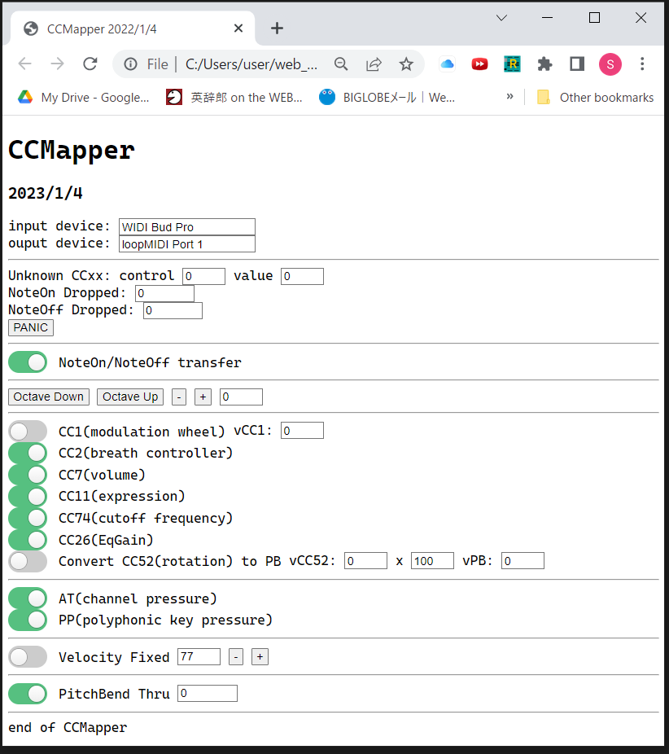

    
# CCMapper(Web Midi)  

2023/1/4    
CCMapper改版：  
以下を追加した:  
Transfering CC1 if [CC1] switch off,  
Convert&Transfering CC52 to PitchBend if [CC51] swich off,  
displaying a control# and value of unknown CCxx  

2023/1/2+    
CCMapper改版：  
以下を追加した:  
[Velocity Fixed],[PicthBend Thru]switches,     
displaying input/output device name,    
displaying NoteOn/NoteOff Dropped count,    
[NoteOn/NoteOff transfer]switch  

2022/12/31      
初版    
  
## 概要    

CCMapperをjavascript+html(Web Midi)で実装した。  
ブラウザーは、chromeの限定されるが、Windows/Mac/Linux上で動作する。  
この機能は、[WIDI Bud Pro]経由でMIDIデータをリアルタイムでCC#2またはCC#11を受信して、CC#を任意のもの(複数)に変更して音源に送信する。   
webによるGUIを持っており、トランスポーズ、CCのオン/オフ(オンは緑色)を画面上で行なえる。　　 

なお、本プログラムは、https://fukuno.jig.jp/app/midi/midimonitor.html と https://github.com/tadfmac/poormidi のものを流用させていただいた。

## 準備
1.Windowsの場合  
仮想MIDIデバイスとして、loopMIDIがインストールされている必要がある。  
参照：[loopMIDI](https://www.tobias-erichsen.de/software/loopmidi.html)  

MIDI信号の流れとしては以下のようになる：

```
[wind_controler(re.corder/Elfue etc)]→[WIDI Bud Pro]→(CCMapper)→[loopMIDI]→ [PC音源]
```

2.Macの場合  
仮想MIDIデバイスとして、IACドライバを設定する。名前はWindowsに合わせて「loopMIDI」とする。   
参照：[仮想MIDIデバイスの設定 - Macことはじめ](https://xshigee.github.io/web0/md/Mac_beginner.html)  

MIDI信号の流れとしては以下のようになる：

```
[wind_controler(re.corder/Elfue etc)]→(CCMapper)→[loopMIDI(IAC)]→ [PC音源]
```

3.linuxの場合、  
仮想MIDIデバイスとして、既存の[Midi Through port]を利用する。

MIDI信号の流れとしては以下のようになる：
```
[wind_controler(re.corder/Elfue etc)]→[WIDI Bud Pro]→(CCMapper3)→[Midi Through Port]→ [PC音源]
```

## 実行

以下の構成のファイルならびにディレクトリに作成して、  
CCMapper.htmlをchromeで開くとCCMapperが実行される。


ファイル・ディレクトリ構成
```

CCMapper.html
CCMapper_files/poormidiM.ja
```

以下、実行画面：  
 

---
1. スイッチが緑色のときはオンを意味する。オンの場合、受信したCC#2からCC＃11の値を、control#を変更して転送する。
1. [input device]/[output device]  
接続されているデバイスが表示される。  
「not found」が表示されているときは、接続失敗しているので、その場合は、Chromeブラウザーのリフレッシュボタンを押す。
1. [Unknown CCxx]は、認識しないCCを受信した際に、control#とvalueを表示する。予めプログラム(CCMapper.html)で無視しているCCは、Unknown扱いにしない。
1. [NoteOn Dropped]/[NoteOff Dropped]  
NoteOn または NoteOffが受信失敗していると推定された時のカウントを表示する。  
PCなどの性能問題でブラウザーが受信失敗している確率が高いとカウントが増える。  
[PANIC]ボタンは、[All Note Off],[All Sound Off]を送信するが、音源が、サポートしていないと効果がない。
1. [NoteOn/NoteOff trasfer]  
Macなど音源ホストでMIDI入力ソースを限定できない場合(＝複数の入力をがある場合)、入力デバイスのMIDIメッセージとCCMapper出力のメッセージがダブって送信される。
それを避けるためにCCMapperのNoteOn/NoteOffの転送をオフできる。
1. [Octave Down],[Octave Up],[-],[+]  
オクターブ関係のボタンを押すとオクターブの値が変化して、その数値の分(半音単位)、ピッチが変わる。
1. CC1がオフの場合、外部からのCC1をそのまま転送する。vCC1の値は外部から受信した値が表示される。
1. それぞれ該当するCCをオン/オフできる。
1. [Convert CC52 ...]は、オンの場合、受信したCC#52の値を、PitchBendに変換して送信する。デフォルトではre.corderの回転に対応してCC#52が出力されるので、それを利用している。(実験的な機能)
1. AT/PPをオフ/オフできる。  
1. [Velocity Fixed]  
オンすると固定のベロシティを送信する。  
その固定値を表示されている。  
オフすると、コントローラ自身のベロシティが転送される。  
1. [PitchBend Thru]  
受信したPitchBendの転送をオン/オフできる。    
数字は、受信した値を表示している。
コントローラに慣れていなくてPitchBendが煩わしい場合、オフにする。  

下をクリックするとCCMapperが起動する(chrome)：  
[CCMapper](html/CCMapper.html)  

## ソースコード
CCMapperのプログラムとしては以下を使用する：  

CCMapper.html
```html

<!DOCTYPE html>
<html><head><meta http-equiv="Content-Type" content="text/html; charset=UTF-8">
<title>CCMapper 2022/1/4</title>

<h1>CCMapper</h1>
<h3>2023/1/4</h3>

<!-- 2023/01/04 The flollowing are added:
        Transfering CC1 if [CC1] switch off,
        Convert&Transfering CC52 to PitchBend if [CC51] swich off
        [displaying a control# and value of unknown CCxx]
-->
<!-- 2023/01/03 [displaying NoteOn/NoteOff Dropped count] are added -->
<!-- 2023/01/02 [Velocity Fixed],[PicthBend Thru]switches, [displaying input/output device name] are added -->
<!--            [displaying NoteOn/NoteOff Dropped count] are added -->
<!--            [NoteOn/NoteOff transfer]switch are added -->
<!-- 2022/12/31 modified for CCMApper -->
<!--            written by: xshige -->

<!-- 2022/12/31 forked from https://fukuno.jig.jp/app/midi/midimonitor.html, 
							https://github.com/tadfmac/poormidi -->

<script src="./CCMapper_files/poormidiM.js"></script>
<script>"use strict";

// function copied from fukuno.js
var get = function(id) {
	return document.getElementById(id);
};

// the followings are forked from ofxMidi
// channel voice messages
const MIDI_NOTE_OFF = 0x80;
const MIDI_NOTE_ON  = 0x90;
const MIDI_CONTROL_CHANGE = 0xB0;
const MIDI_PROGRAM_CHANGE = 0xC0;
const MIDI_PITCH_BEND = 0xE0;
const MIDI_AFTERTOUCH = 0xD0; // aka channel pressure
const MIDI_POLY_AFTERTOUCH = 0xA0; // aka key pressure

// system messages
const MIDI_SYSEX  = 0xF0;
const MIDI_TIME_CODE = 0xF1;
const MIDI_SONG_POS_POINTER = 0xF2;
const MIDI_SONG_SELECT = 0xF3;
const MIDI_TUNE_REQUEST = 0xF6;
const MIDI_SYSEX_END = 0xF7;
const MIDI_TIME_CLOCK = 0xF8;
const MIDI_START = 0xFA;
const MIDI_CONTINUE = 0xFB;
const MIDI_STOP = 0xFC;
const MIDI_ACTIVE_SENSING = 0xFE;1
const MIDI_SYSTEM_RESET = 0xFF;

window.onload = function() {
	// for debug
	var noteNest = 0; // NoteOn/NoteOff nest count
	var noteOnDropCnt = 0; // NoteOn Droped count
	var noteOffDropCnt = 0; // NoteOff Droped count

	var transpose = 0;
	var curPitch = 0;
	var curVelocity = 0;
	var fixedVelocity = 77;

	var fCC1 = false;
	var fCC2 = true;
	var fCC7 = true;
	var fCC11 = true;
	var fCC74 = true;
	var fCC26 = true;
	var fCC52 = false;
	var fAT = true;
	var fPP = true;
	var fVFIXED = false;
	var fPB_THRU = true;

	var fXfer = true; // NoteOn/NoteOff transfer

	var midi = new poormidi();
	midi.setHandler(function(e) {
		var status = e.data[0]&0xF0
		var ch = e.data[0]&0x0F
		if (status == MIDI_CONTROL_CHANGE) {
			if (e.data[1] == 1) { // modulation wheel
				if (!fCC1) midi.sendCtlChange(ch,1,e.data[2]);
				get("vCC1").value = e.data[2];
				return;
			}
			if (e.data[1] == 52) { // C52 for re.corder
				var int14 = e.data[2]*get("vCC52X").value+8191;
				var b1 = 0x7F&(int14>>7);
				var b0 = 0x7F&int14;
				get("vCC52PB").value = int14-8191; // display only
				get("vCC52").value = e.data[2]; // display only
				if (fCC52) midi.send(MIDI_PITCH_BEND|ch,b0,b1);
				return;
			}
			if (e.data[1] == 11 || e.data[1] == 2) {
				if (fCC1) midi.sendCtlChange(ch,1,e.data[2]);
				if (fCC2) midi.sendCtlChange(ch,2,e.data[2]);
				if (fCC7) midi.sendCtlChange(ch,7,e.data[2]);
				if (fCC11) midi.sendCtlChange(ch,11,e.data[2]);
				if (fCC74) midi.sendCtlChange(ch,74,e.data[2]);
				if (fCC26) midi.sendCtlChange(ch,26,e.data[2]);
				// AT(CP)
				if (fAT) midi.send(MIDI_AFTERTOUCH|ch, e.data[2]);
    			// AT(PP)
    			if (fPP) midi.send(MIDI_POLY_AFTERTOUCH|ch, transpose+curPitch, e.data[2]);
				/*
    			// patch
    			// All Note Off
    			if (e.data[2] ==  0) midi.send(MIDI_CONTROL_CHANGE|ch,123, 0);
    			// All Sound Off
    			if (e.data[2] == 0) midi.send(MIDI_CONTROL_CHANGE|ch,120, 0);
				*/
			} else {
				// the following CC#s ignored(will not transfer)
				// case of EWI5000/EWI Solo 
				if (e.data[1] == 7) return; // CC#7(volume) ignored 
				if (e.data[1] == 5) return; // CC#5(portament) ignore
				//
				if (e.data[1] == 34) return; // CC#34(Hires/Breath Controler) ignored
				if (e.data[1] == 39) return; // CC#39(Hires/Volume) ignored (solo only?)
				if (e.data[1] == 43) return; // CC#43(Hires/Expression) ignored (solo only?)
				//
				if (e.data[1] == 65) return; // CC#65(Portament) ignored
				if (e.data[1] == 66) return; // CC#66(Sostenuto) ignored
				if (e.data[1] == 68) return; // CC#68(Legate) ignored
				if (e.data[1] == 74) return; // CC#74(cutoff freq) ignored
				if (e.data[1] == 88) return; // CC#88(Hires/NoteOn) ignored
				if (e.data[1] == 102) return; // ignored
				if (e.data[1] == 103) return; // ignored
				if (e.data[1] == 104) return; // CC#104(legate time) ignored
				// Roland AE-20
				if (e.data[1] == 32) return; // CC#32(Bank Select LSB) ignored
				//
				get("vXX").value = e.data[1]; // control#
				get("vCCxx").value = e.data[2]; // values
				return;
			}
		}
		if (status == MIDI_NOTE_ON) {		
			// debug
			if (noteNest !== 0) {
				midi.sendNoteOff(ch,e.data[1]+transpose); // 2022/1/4 patch 
				console.log("***** maybe NoteOff dropped! *****");
				if (noteOffDropCnt < Number.MAX_SAFE_INTEGER) noteOffDropCnt++;
				else noteOffDropCnt=0;
				console.log("NoteOnDroped:"+noteOnDropCnt);
				console.log("NoteOffDroped:"+noteOffDropCnt);
				noteNest =0;
			}
			//
			noteNest++;
			curPitch = e.data[1];
			curVelocity = e.data[2];
			//midi.sendNoteOn(ch,e.data[1]+transpose,e.data[2]);
			if (fXfer) {
				if (fVFIXED) {
					midi.sendNoteOn(ch,curPitch+transpose,fixedVelocity);
					get("velocity").value = fixedVelocity;
				} else {
					midi.sendNoteOn(ch,curPitch+transpose,curVelocity);
					get("velocity").value = curVelocity;
				}
			}
			return;
		}
		if (status == MIDI_NOTE_OFF) {
			noteNest--;
			if (fXfer) midi.sendNoteOff(ch,e.data[1]+transpose);
			// debug
			if (noteNest !== 0) {
				console.log("***** maybe NoteOn dropped! *****");
				if (noteOnDropCnt < Number.MAX_SAFE_INTEGER) noteOnDropCnt++;
				else noteOnDropCnt=0;
				console.log("NoteOnDroped:"+noteOnDropCnt);
				console.log("NoteOffDroped:"+noteOffDropCnt);
				noteNest =0;
			}
			return;
		}
		if (status == MIDI_PITCH_BEND) {
			if (fPB_THRU) midi.send(MIDI_PITCH_BEND|ch,e.data[1],e.data[2]);
    		var int14 = e.data[2]; // 2nd byte
    		int14 <<= 7;
    		int14 |= e.data[1];
			get("PB").value = int14-8191; // display only
			return;
		}
    	return;
  	});
	/*
	get("test").onclick = function() {
		midi.sendNoteOn(0, 60, 100);
		setTimeout(function() {
			midi.sendNoteOff(0, 60);
		}, 1000);
	};
	*/
	setTimeout(function(){
		var dd = midi.getIOdevName();
		get("indev").value = dd[0];//"Widi Bud Pro";
		get("outdev").value = dd[1];//"loopMIDI";
		if (dd[0].includes("not found")) alert("Please press 'refresh' button of Chrome broswer!");
	},100);

	// debug
	setInterval(function(){
		get("NoteOnDropped").value = noteOnDropCnt;
		get("NoteOffDropped").value = noteOffDropCnt;
	},1000);

	get("PANIC").onclick = function () {
		noteOnDropCnt = 0;
		noteOffDropCnt = 0;
		noteNest = 0;
		// All Note Off
		midi.send(MIDI_CONTROL_CHANGE|0,123, 0);
    	// All Sound Off
    	midi.send(MIDI_CONTROL_CHANGE|0,120, 0);
		// clear unknow CCxx status
		get("vXX").value = 0;
		get("vCCxx").value = 0;
		console.log("PANIC!");
	}

	get("octdown").onclick = function() {
		transpose -= 12;
		console.log("trans:"+transpose);
		get("trans").value = transpose;
	}
	get("octup").onclick = function() {
		transpose += 12;
		console.log("trans:"+transpose);
		get("trans").value = transpose;
	}
	get("semidown").onclick = function() {
		transpose -= 1;
		console.log("trans:"+transpose);
		get("trans").value = transpose;
	}
	get("semiup").onclick = function() {
		transpose += 1;
		console.log("trans:"+transpose);
		get("trans").value = transpose;
	}

	get("transfer").onclick = function() {
		fXfer = get("transfer").checked;
		console.log("Xfer:"+fXfer);
	}

	get("CC1").onclick = function() {
		fCC1 = get("CC1").checked;
		console.log("CC1:"+fCC1);
	}
	get("CC2").onclick = function() {
		fCC2 = get("CC2").checked;
		console.log("CC2:"+fCC2);
	}
	get("CC7").onclick = function() {
		fCC7 = get("CC7").checked;
		console.log("CC7:"+fCC7);
	}
	get("CC11").onclick = function() {
		fCC11 = get("CC11").checked;
		console.log("CC11:"+fCC11);
	}
	get("CC74").onclick = function() {
		fCC74 = get("CC74").checked;
		console.log("CC74:"+fCC74);
	}
	get("CC26").onclick = function() {
		fCC26 = get("CC26").checked;
		console.log("CC26:"+fCC26);
	}
	get("CC52").onclick = function() {
		fCC52 = get("CC52").checked;
		console.log("CC52:"+fCC52);
	}
	get("AT").onclick = function() {
		fAT = get("AT").checked;
		console.log("AT:"+fAT);
	}
	get("PP").onclick = function() {
		fPP = get("PP").checked;
		console.log("PP:"+fPP);
	}

	get("VFIXED").onclick = function() {
		fVFIXED = get("VFIXED").checked;
		console.log("VFIXED:"+fVFIXED);
		if (fVFIXED) get("velocity").value = fixedVelocity;
		else get("velocity").value = curVelocity; 
	}
	get("veldown").onclick = function() {
		fixedVelocity -= 1;
		console.log("fixedVelocity:"+fixedVelocity);
		get("velocity").value = fixedVelocity;
	}
	get("velup").onclick = function() {
		fixedVelocity += 1;
		console.log("fixedVelocity:"+fixedVelocity);
		get("velocity").value = fixedVelocity;
	}

	get("PB_THRU").onclick = function() {
		fPB_THRU = get("PB_THRU").checked;
		console.log("PB_THRU:"+fPB_THRU);
	}

};
</script>
<style>

*,
*:before,
*:after {
  box-sizing: border-box;
}

.toggle {
  cursor: pointer;
  display: inline-block;
}

.toggle-switch {
  display: inline-block;
  background: #ccc;
  border-radius: 16px;
  width: 58px;
  height: 32px;
  position: relative;
  vertical-align: middle;
  transition: background 0.25s;
}
.toggle-switch:before, .toggle-switch:after {
  content: "";
}
.toggle-switch:before {
  display: block;
  background: linear-gradient(to bottom, #fff 0%, #eee 100%);
  border-radius: 50%;
  box-shadow: 0 0 0 1px rgba(0, 0, 0, 0.25);
  width: 24px;
  height: 24px;
  position: absolute;
  top: 4px;
  left: 4px;
  transition: left 0.25s;
}
.toggle:hover .toggle-switch:before {
  background: linear-gradient(to bottom, #fff 0%, #fff 100%);
  box-shadow: 0 0 0 1px rgba(0, 0, 0, 0.5);
}
.toggle-checkbox:checked + .toggle-switch {
  background: #56c080;
}
.toggle-checkbox:checked + .toggle-switch:before {
  left: 30px;
}

.toggle-checkbox {
  position: absolute;
  visibility: hidden;
}

.toggle-label {
  margin-left: 5px;
  position: relative;
  top: 2px;
}
</style>
</head>

<body>

<!--
<button id="test">TEST</button>
<br/>
<br/>
-->

input device:
<input type="text" id="indev" name="indev" value="" size="18">
<br/>
ouput device:
<input type="text" id="outdev" name="outdev" value="" size="18">
<br/>
<hr>

Unknown CCxx: 
control 
<input type="text" id="vXX" name="vXX" value="0" size="2">
value
<input type="text" id="vCCxx" name="vCCxx" value="0" size="2">
<br/>
NoteOn Dropped:
<input type="text" id="NoteOnDropped" name="NoteOnDropped" value="" size="5">
<br/>
NoteOff Dropped:
<input type="text" id="NoteOffDropped" name="NoteOffDropped" value="" size="5">
<br/>
<button id="PANIC">PANIC</button>
<br/>
<hr>

<label class="toggle">
	<input class="toggle-checkbox" id="transfer" name="transfer" type="checkbox"  checked>
	<div class="toggle-switch"></div>
	<span class="toggle-label">NoteOn/NoteOff transfer</span>
</label>
<br/>
<hr>

<button id="octdown">Octave Down</button>
<button id="octup">Octave Up</button>
<button id="semidown">-</button>
<button id="semiup">+</button>
<input type="text" id="trans" name="trans" value="0" size="2">
<br/>
<hr>

  <label class="toggle">
	<input class="toggle-checkbox" id="CC1" name="CC1" type="checkbox"  >
	<div class="toggle-switch"></div>
	<span class="toggle-label">CC1(modulation wheel)</span>
  </label>
  vCC1: 
  <input type="text" id="vCC1" name="vCC1" value="0" size="2">
  
  <br
  />
  
  <label class="toggle">
	<input class="toggle-checkbox" id="CC2" name="CC2" type="checkbox" checked>
	<div class="toggle-switch"></div>
	<span class="toggle-label">CC2(breath controller)</span>
  </label>
  
  <br/>
  
  <label class="toggle">
	<input class="toggle-checkbox" type="checkbox"  id="CC7" name="CC7" checked>
	<div class="toggle-switch"></div>
	<span class="toggle-label">CC7(volume)</span>
  </label>
  
  <br/>
  
  <label class="toggle">
	<input class="toggle-checkbox" type="checkbox" id="CC11" name="CC11" checked>
	<div class="toggle-switch"></div>
	<span class="toggle-label">CC11(expression)</span>
  </label>

  <br/>
  
  
  <label class="toggle">
	<input class="toggle-checkbox" type="checkbox" id="CC74" name="CC74" checked>
	<div class="toggle-switch"></div>
	<span class="toggle-label">CC74(cutoff frequency)</span>
  </label>


  <br/>
  
  <label class="toggle">
	<input class="toggle-checkbox" type="checkbox" id="CC26" name="CC26" checked>
	<div class="toggle-switch"></div>
	<span class="toggle-label">CC26(EqGain)</span>
  </label>

  <br/>

  <label class="toggle">
	<input class="toggle-checkbox" type="checkbox" id="CC52" name="CC52" >
	<div class="toggle-switch"></div>
	<span class="toggle-label">Convert CC52(rotation) to PB</span>
  </label>
  vCC52: 
  <input type="text" id="vCC52" name="vCCC52" value="0" size="2">
  x
  <input type="text" id="vCC52X" name="vCCC52X" value="100" size="2">  
  vPB:
  <input type="text" id="vCC52PB" name="vCC52PB" value="0" size="2">
  <br/>
  
  <hr> 

  <label class="toggle">
	<input class="toggle-checkbox" type="checkbox" id="AT" name="AT" checked>
	<div class="toggle-switch"></div>
	<span class="toggle-label">AT(channel pressure)</span>
  </label>

  <br/>
  
  <label class="toggle">
	<input class="toggle-checkbox" type="checkbox" id="PP" name="PP" checked>
	<div class="toggle-switch"></div>
	<span class="toggle-label">PP(polyphonic key pressure)</span>
  </label>

  <hr>

  <label class="toggle">
	<input class="toggle-checkbox" type="checkbox" id="VFIXED" name="VFIXED" >
	<div class="toggle-switch"></div>
	<span class="toggle-label">Velocity Fixed</span>
  </label>
  <input type="text" id="velocity" name="velocity" value="77" size="2">
  <button id="veldown">-</button>
  <button id="velup">+</button>

 <hr>

  <label class="toggle">
	<input class="toggle-checkbox" type="checkbox" id="PB_THRU" name="PB_THRU" checked>
	<div class="toggle-switch"></div>
	<span class="toggle-label">PitchBend Thru</span>
  </label>
  <input type="text" id="PB" name="PB" value="0" size="5">

<hr>
  end of CCMapper

</body></html>
```

CCMapper_files/poormidiM.js  
```js

// proormidiM.js
// 2023/1/2: modified for CCMapper (last M means 'Modified')

// poormidi.js (Very Poor) Web MIDI API Wrapper
// For Google Chrome Only :D

// 2015.02.23 Change for P&P on Chrome Canary !!!! (W.I.P. and experimental now)
// 2015.06.07 P&P feature has now supported.
// 2015.08.08 add sendCtlChange()
// 2015.08.08 On sendNoteOn(), sendNoteOff() and sendCtlChange(), 
//            arguments are now able to set midi-channel,
//            and also these can be omitted.
//            See also comments in this code, for details.

(function () {
  // input/output MIDI device related
  const indev0 = "WIDI Bud"; // for Windows/linux
  const indev1 = "Elefue"; // for Mac
  const indev2 = "re.corder"; // for Mac
  const indev3 = "Nu"; // for Mac (with WIDI Master/NuRAD,NuEVI)
  const indev4 = "EWI"; // for Mac (with WIDI Master/EWI5000,EWI4000,EVI3010 etc)
  const indev5 = "AE-"; // for Mac (Roland)
  const indev6 = "YDS-"; // for Mac (YAMAHA)
  const outdev0 = "loopMIDI"; // for Windows/Mac
  const outdev1 = "Midi Through"; // for linux
  var innum = 1;
  var outnum = 1;

  var indevx  = "input device not found";
  var outdevx = "output device not found";

  poormidi = function(){
    this.midi = null;
    this.inputs = [];
    this.outputs = [];
    this.timer = null;

    this.success = function(access){
      console.log("poormidi.success()");
      this.midi = access;
      this.refreshPorts();
      this.midi.onstatechange = this.onStateChange;
    }.bind(this);

    this.failure = function(msg){
      console.log("poormidi.failure(): "+msg);
    }.bind(this);

    // new function 2023/1/1
    this.getIOdevName = function(){
      return [indevx,outdevx];
    }.bind(this);

    this.onMidiEvent = function(e){
      console.log("poormidi.onMidiEvent()");
    }.bind(this);

    this.setHandler = function(func){
      console.log("poormidi.setHandler()");
      this.onMidiEvent = func.bind(this);
    }.bind(this);

    this.sendNoteOn = function(){
      console.log("poormidi.sendNoteOn()");
      var note = 0;
      var velocity = 100;
      var channel = 0;
      if(arguments.length == 1){
        // midi.sendNoteOn(note);
        note = arguments[0];
      }else if(arguments.length == 2){
        // midi.sendNoteOn(note,velocity);
        note = arguments[0];
        velocity = arguments[1];
      }else if(arguments.length == 3){
        // midi.sendNoteOn(channel,note,velocity);
        channel = arguments[0] & 0x0f;
        note = arguments[1];
        velocity = arguments[2];
      }else{
        console.log("poormidi.sendNoteOn:parameter error!!");
        return;
      }
      /*  
      if(this.outputs.length > 0){
        for(var cnt=0;cnt<this.outputs.length;cnt++){
          console.log("poormidi.sendNoteOn() output to :"+this.outputs[cnt].name);
          this.outputs[cnt].send([0x90|channel,note&0x7f,velocity&0x7f]);
        }
      }
      */
      this.outputs[outnum].send([0x90|channel,note&0x7f,velocity&0x7f]);
    }.bind(this);

    this.sendNoteOff = function(){
      console.log("poormidi.sendNoteOff()");
      var note = 0;
      var channel = 0;
      if(arguments.length == 1){
        // midi.sendNoteOff(note);
        note = arguments[0];
      }else if(arguments.length == 2){
        // midi.sendNoteOff(channel,note);
        channel = arguments[0] & 0x0f;
        note = arguments[1];
      }else{
        console.log("poormidi.sendNoteOff:parameter error!!");
        return;
      } 
      this.outputs[outnum].send([0x80|channel,note,0]);
    }.bind(this);

    this.sendCtlChange = function(){
      console.log("poormidi.sendCtlChange()");
      var channel = 0;
      var number = 0;
      var value = 0;
      if(arguments.length == 2){
        // midi.sendCtlChange(number,value);
        number = arguments[0];
        value = arguments[1];
      }else if(arguments.length == 3){
        // midi.sendCtlChange(channel,number,value);
        channel = arguments[0] & 0x0f;
        number = arguments[1];
        value = arguments[2];
      }else{
        console.log("poormidi.sendCtlChange:parameter error!!");
        return;
      }
      this.outputs[outnum].send([0xB0|channel,number&0x7f,value&0x7f]);
    }.bind(this);


this.send = function(){
      console.log("poormidi.send()");
      var a0 = 0;
      var a1 = 0;
      var a2 = 0;
      if(arguments.length == 2){
        a0 = arguments[0];
        a1 = arguments[1];
        this.outputs[outnum].send([a0,a1]);
        return;
      }else if(arguments.length == 3){
        a0 = arguments[0];
        a1 = arguments[1];
        a2 = arguments[2];
        this.outputs[outnum].send([a0,a1,a2]);
        return;        
      }else{
        console.log("poormidi.send:parameter error!!");
        return;
      }
    }.bind(this);

    this.onStateChange = function(){
      console.log("poormidi.onStateChange()");
      if(this.timer != null){
        clearTimeout(this.timer);
      }
      this.timer = setTimeout(function(){
        this.refreshPorts();
        this.timer = null;
      }.bind(this),300);
    }.bind(this);

    this.refreshPorts = function(){
      console.log("poormidi.refreshPorts()");
      this.inputs = [];
      this.outputs = [];

      // inputs
      var it = this.midi.inputs.values();
      var num = 0;
      for(var o = it.next(); !o.done; o = it.next()){
        this.inputs.push(o.value);
        console.log("input port: "+o.value.name);
        if (o.value.name.includes(indev0)) {
          innum = num;
          break;
        }
        if (o.value.name.includes(indev1)) {
          innum = num;
          break;
        }
        if (o.value.name.includes(indev2)) {
          innum = num;
          break;
        }
        if (o.value.name.includes(indev3)) {
          innum = num;
          break;
        }
        if (o.value.name.includes(indev4)) {
          innum = num;
          break;
        }
        if (o.value.name.includes(indev5)) {
          innum = num;
          break;
        }
        if (o.value.name.includes(indev6)) {
          innum = num;
          break;
        }
        num ++;
      }
      /*
      console.log("poormidi.refreshPorts() inputs: "+this.inputs.length);
      for(var cnt=0;cnt<this.inputs.length;cnt++){
        this.inputs[cnt].onmidimessage = this.onMidiEvent;
      }
      */
      this.inputs[innum].onmidimessage = this.onMidiEvent;

      // outputs
      var ot = this.midi.outputs.values();
      num = 0;
      for(var o = ot.next(); !o.done; o = ot.next()){
        this.outputs.push(o.value);
        console.log("output port: "+o.value.name);
        if (o.value.name.includes(outdev0)) {
          outnum = num;
          break;
        } else if (o.value.name.includes(outdev1)) {
          outnum = num;
          break;
        }
        num++;
      }
      console.log("poormidi.refreshPorts() outputs: "+this.outputs.length);
      // debug
      console.log("in:"+innum+" out:"+outnum);
      console.log(this.inputs[innum].name+" -> "+this.outputs[outnum].name);
      // save input/output dev name
      indevx = this.inputs[innum].name;
      outdevx = this.outputs[outnum].name;
    }.bind(this);

    this.onConnect = function(e){
      console.log("poormidi.onConnect()");
    }
    this.onDisConnect = function(e){
      console.log("poormidi.onDisConnect()");
    }

    navigator.requestMIDIAccess().then(this.success,this.failure);
  };

}).call(this);
```


動作環境のよる修正部分：  
以下の部分、Macの場合、入力デバイスに該当するものがなければ修正する。  
\# たぶん、大抵のものは登録済みなので修正不要だと思われる
```js

  const indev0 = "WIDI Bud"; // for Windows/linux
  const indev1 = "Elefue"; // for Mac
  const indev2 = "re.corder"; // for Mac
  const indev3 = "Nu"; // for Mac (with WIDI Master/NuRAD,NuEVI)
  const indev4 = "EWI"; // for Mac (with WIDI Master/EWI5000,EWI4000,EVI3010 etc)
  const indev5 = "AE-"; // for Mac (Roland)
  const indev6 = "YDS-"; // for Mac (YAMAHA)

```

CCMapperを起動したら、次に音源を立ち上げて入力MIDIデバイスをlinuxの場合は「Midi Through port」(windows/Macの場合は「loopMIDI port」)に設定する。

ここで、wind_controlerで吹くと音が出る。
                                                           
以下、linuxの場合で紹介しているが、windows/macでも同様にインストールできる。  

1. Surge XT  
[SURGE XT - Free & Open Source Hybrid Synthesizer](https://surge-synthesizer.github.io/)  
[Surge XT User Manual](https://surge-synthesizer.github.io/manual-xt/)  
1. Vital  
[VITAL - Spectral warping wavetable synth](https://vital.audio/)  
[Get Vital](https://vital.audio/#getvital)(フリー版もある)   


## 設定方法
起動時、必要と思われるCC＃が全て有効になっているので、大体の音源が、ブレスに対応して発音できる。音源の音色に依存するが、発音してみて不都合があるようなら、問題のCCをオフにする。  

## Surge XT のインストール
deb形式のものをダウンロードしてインストールする。

## vital のインストール
1. deb形式のものは、なぜかインストールできなかったので、zip形式のものをダウンロードして解凍する。
1. ~/bin/vitalのディレクトリを作成する。
1. 解凍した内容を~/bin/vitalのディレクトリのなかにコピーする。
1. 「export PATH=\$PATH:\$HOME/bin/vital」を実行してパスを設定する。
1. .bashrcの最後に「export PATH=\$PATH:\$HOME/bin/vital」を追加する。

実行例：
```
export PATH=$PATH:$HOME/bin/vital
which vital
/home/xxxx/bin/vital/vital
vital
```

## 参考情報   
CC関連：  
[MIDI CC List for Continuous Controllers](https://anotherproducer.com/online-tools-for-musicians/midi-cc-list/)  
[AE-30_AE-20_Parameter_Guide_jpn04_W.pdf](https://static.roland.com/assets/media/pdf/AE-30_AE-20_Parameter_Guide_jpn04_W.pdf)  
[EWI5000_user_guide_JPv1.1.pdf](http://ewi.akai-pro.jp/ewi5000/data/EWI5000_user_guide_JPv1.1.pdf)  
[Web_EWI Solo User guide_v1.6_R1_JP.pdf](http://ewi.akai-pro.jp/ewi-solo/data/Web_EWI%20Solo%20User%20guide_v1.6_R1_JP.pdf)  
[NuEVI日本語取扱説明書V1.0(download)](https://kohske.com/relays/download/40/313/44//?file=/files/libs/1940/202111010342207577.pdf)  
[NuRAD　非公式マニュアル(仮)公開(Nov.19.2022更新)](https://note.com/windsynth/n/n73176f347e02)  

Web MIDI関連：    
[Web MIDI APIを扱うためのMIDI基礎知識](https://zenn.dev/okunokentaro/articles/01f9reeb0d7mc8110knpfra4tk)  
[Web MIDI APIの動作テスト](https://webmidiaudio.com/npage102.html)  
[Web MIDI Monitor](https://fukuno.jig.jp/app/midi/midimonitor.html)  
[Web MIDI API (日本語訳) 2015年3月17日版ワーキングドラフト](https://g200kg.github.io/web-midi-api-ja/)  
[Getting Started With The Web MIDI API](https://www.smashingmagazine.com/2018/03/web-midi-api/)  

Javascript(node)関連：  
[Node.js® is an open-source, cross-platform JavaScript runtime environment](https://nodejs.org/en/)  
[A node.js wrapper for RtMidi providing MIDI I/O](https://github.com/justinlatimer/node-midi)  
[keypress](https://www.npmjs.com/package/keypress)   

loopMIDI関連：  
[loopMIDI](https://www.tobias-erichsen.de/software/loopmidi.html)  
[loopMIDIでつなぐ](https://webmidiaudio.com/npage501.html)  

WIDI_Bud_Pro関連：  
[WIDI Bud Pro](https://hookup.co.jp/products/cme/widi-bud-pro)  
[WIDI Bud Pro 技術情報](https://hookup.co.jp/support/product/widi-bud-pro)  

PC音源関連：  
[[WS音源探訪02] Vital Free Patch for Windsynth つくってみました](https://note.com/windsynth/n/n247ac73351b8)  
wind_controler向けのパッチがあり役に立つ  
[[WS音源探訪01] Vital](https://note.com/windsynth/n/na3b11d4a4f8e)  
[【無料】VitalAudioのWaveTableシンセVitalの紹介](https://chilloutwithbeats.com/vitalaudio-wavetable-vital-intro/)  
[Macことはじめ/仮想MIDIデバイスの設定,Bluetooth_MIDIデバイスの接続](https://xshigee.github.io/web0/md/Mac_beginner.html)  
[Respiro(VST3)を使ってみる](https://xshigee.github.io/web0/md/Respiro.html)  
[Lyrihorn 2(VST3)を使ってみる](https://xshigee.github.io/web0/md/re.corder_Lyrihorn-2.html)  
[EVI-NER(VST3)を使ってみる](https://xshigee.github.io/web0/md/re.corder_EVI-NER.html)  
[re.corder/Elefueに外部音源(Aria/Windows)を接続する(WIDI_Bud_Pro経由)](https://xshigee.github.io/web0/md/re.corder_Aria.html)  
[EWI5000をソフト音源(IFW)と接続する](https://xshigee.github.io/web0/md/EWI5000_IFW.html)  

re.corder関連：  
[owner’s manual re.corder](http://www.artinoise.com/wp-content/uploads/2021/02/artinoise-recorder-manual-ENG-v10.pdf)  
[re.corder Downloads](https://www.recorderinstruments.com/en/support-downloads/)  
[re.corder Frequently Asked Questions](https://www.recorderinstruments.com/en/frequently-asked-questions/)    

MIDI関連：  
[現時点、最強のBluetooth MIDIかも!?　各種BLE-MIDI機器と自動でペアリングしてくれるWIDI Masterがスゴイ！](https://www.dtmstation.com/archives/32976.html)  
[Midi View](https://hautetechnique.com/midi/midiview/)  

ASIO関連：  
[asio4all - ASIOドライバーのないオーディオインターフェイスをASIO対応にできるソフト](https://forest.watch.impress.co.jp/library/software/asio4all/)

Aria関連：  
[EWI MASTER BOOK CD付教則完全ガイド【改訂版】](https://www.alsoj.net/store/view/ALEWIS1-2.html#.YmNpctpBxPY)のp100-p119の音色の設定方法がある

以上  

[Go to Toplevel](https://xshigee.github.io/web0/)  

