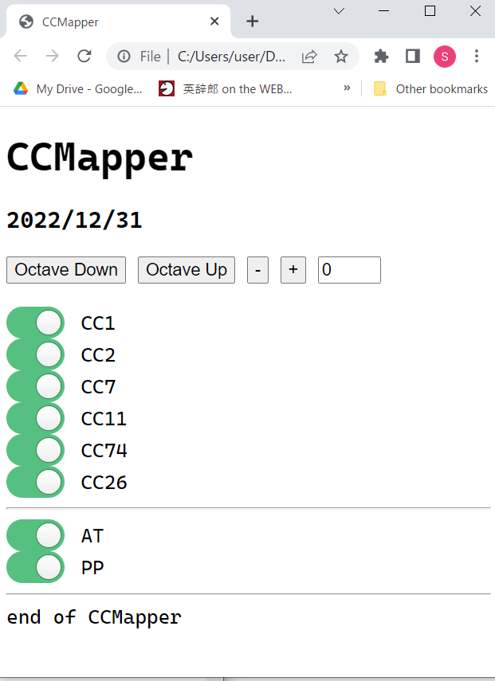

    
# CCMapper(Web Midi)  

2022/12/31      
初版    
  
## 概要    

CCMapperをjavascript+html(Web Midi)で実装した。  
ブラウザーは、chromeの限定されるが、Windows/Mac/Linux上で動作する。  
この機能は、[WIDI Bud Pro]経由でMIDIデータをリアルタイムでCC#2またはCC#11を受信して、CC#を任意のもの(複数)に変更して音源に送信する。   
webによるGUIを持っており、トランスポーズ、CCのオン/オフ(オンは緑色)を画面上で行なえる。　　 

なお、本プログラムは、https://fukuno.jig.jp/app/midi/midimonitor.html と https://github.com/tadfmac/poormidi のものを流用させていただいた。

## 準備
1.Windowsの場合  
仮想MIDIデバイスとして、loopMIDIがインストールされている必要がある。
参照：[loopMIDI](https://www.tobias-erichsen.de/software/loopmidi.html)  

MIDI信号の流れとしては以下のようになる：

```
[wind_controler(re.corder/Elfue etc)]→[WIDI Bud Pro]→(CCMapper)→[loopMIDI]→ [PC音源]
```

2.Macの場合  
仮想MIDIデバイスとして、IACドライバを設定する。名前はWindowsに合わせて「loopMIDI」とする。 
参照：[仮想MIDIデバイスの設定 - Macことはじめ](https://xshigee.github.io/web0/md/Mac_beginner.html)  

MIDI信号の流れとしては以下のようになる：

```
[wind_controler(re.corder/Elfue etc)]→(CCMapper)→[loopMIDI(IAC)]→ [PC音源]
```

3.linuxの場合、  
仮想MIDIデバイスとして、既存の[Midi Through port]を利用する。

MIDI信号の流れとしては以下のようになる：
```
[wind_controler(re.corder/Elfue etc)]→[WIDI Bud Pro]→(CCMapper3)→[Midi Through Port]→ [PC音源]
```

## 実行

以下の構成のファイルならびにディレクトリに作成して、  
CCMapper.htmlをchromeで開くとCCMapperが実行される。


ファイル・ディレクトリ構成
```

CCMapper.html
CCMapper_files/fukuno.js
CCMapper_files/poormidiM.ja
```

以下、実行画面：  
 
--
1. スイッチが緑色のときはオンを意味して該当のCCが送信される。  
1. オクターブ関係のボタンを押すとオクターブの値が変化して、その数値の分(半音単位)、ピッチが変わる。

以下をクリックするとCCMapperが起動する(chrome)：  
[CCMapper](html/CCMapper.html)  

## ソースコード
CCMapperのプログラムとしては以下を使用する：  

CCMapper.html
```html
<!DOCTYPE html>
<html><head><meta http-equiv="Content-Type" content="text/html; charset=UTF-8">
<title>CCMapper</title>

<h1>CCMapper</h1>
<h3>2022/12/31</h3>

<!-- 2022/12/31 modified for CCMApper -->
<!-- 2022/12/31 written by: xshige -->
<!-- 2022/12/31 forked from https://fukuno.jig.jp/app/midi/midimonitor.html, 
							https://github.com/tadfmac/poormidi -->

<script src="./CCMapper_files/fukuno.js"></script>
<script src="./CCMapper_files/poormidiM.js"></script>
<script>"use strict";

// the followings are forked from ofxMidi
// channel voice messages
const MIDI_NOTE_OFF = 0x80;
const MIDI_NOTE_ON  = 0x90;
const MIDI_CONTROL_CHANGE = 0xB0;
const MIDI_PROGRAM_CHANGE = 0xC0;
const MIDI_PITCH_BEND = 0xE0;
const MIDI_AFTERTOUCH = 0xD0; // aka channel pressure
const MIDI_POLY_AFTERTOUCH = 0xA0; // aka key pressure

// system messages
const MIDI_SYSEX  = 0xF0;
const MIDI_TIME_CODE = 0xF1;
const MIDI_SONG_POS_POINTER = 0xF2;
const MIDI_SONG_SELECT = 0xF3;
const MIDI_TUNE_REQUEST = 0xF6;
const MIDI_SYSEX_END = 0xF7;
const MIDI_TIME_CLOCK = 0xF8;
const MIDI_START = 0xFA;
const MIDI_CONTINUE = 0xFB;
const MIDI_STOP = 0xFC;
const MIDI_ACTIVE_SENSING = 0xFE;1
const MIDI_SYSTEM_RESET = 0xFF;

window.onload = function() {
	
	var transpose = 0;
	var curPitch = 0;

	var fCC1 = true;
	var fCC2 = true;
	var fCC7 = true;
	var fCC11 = true;
	var fCC74 = true;
	var fCC26 = true;
	var fAT = true;
	var fPP = true;

	var midi = new poormidi();
	midi.setHandler(function(e) {
		//const n = e.data[0]
		var status = e.data[0]&0xF0
		var ch = e.data[0]&0x0F
		if (status == MIDI_CONTROL_CHANGE) {
			if (e.data[1] == 11 || e.data[1] == 2) {
				if (fCC1) midi.sendCtlChange(ch,1,e.data[2]);
				if (fCC2) midi.sendCtlChange(ch,2,e.data[2]);
				if (fCC7) midi.sendCtlChange(ch,7,e.data[2]);
				if (fCC11) midi.sendCtlChange(ch,11,e.data[2]);
				if (fCC74) midi.sendCtlChange(ch,74,e.data[2]);
				if (fCC26) midi.sendCtlChange(ch,26,e.data[2]);
				// AT(CP)
				if (fAT) midi.send(MIDI_AFTERTOUCH|ch, e.data[2]);
    			// AT(PP)
    			if (fPP) midi.send(MIDI_POLY_AFTERTOUCH|ch, transpose+curPitch, e.data[2]);
    			// patch
    			// All Note Off
    			if (e.data[2] ==  0) midi.send(MIDI_CONTROL_CHANGE|ch,123, 0);
    			// All Sound Off
    			if (e.data[2] == 0) midi.send(MIDI_CONTROL_CHANGE|ch,120, 0);
			}
		}
		else if (status == MIDI_NOTE_ON) {
			curPitch = e.data[1];
			midi.sendNoteOn(ch,e.data[1]+transpose,e.data[2]);
		}
		else if (status == MIDI_NOTE_OFF) {
			//midi.sendNoteOff(ch,e.data[1]);
			midi.send(MIDI_NOTE_OFF|ch,e.data[1]+transpose,e.data[2]);		
		}
		else if (status == MIDI_PITCH_BEND) {
    		var int14 = e.data[2]; // 2nd byte
    		int14 <<= 7;
    		int14 |= e.data[1];
		    midi.send(MIDI_PITCH_BEND|ch,e.data[1],e.data[2]);
		}
    	return;
  	});
	/*
	get("test").onclick = function() {
		midi.sendNoteOn(0, 60, 100);
		setTimeout(function() {
			midi.sendNoteOff(0, 60);
		}, 1000);
	};
	*/
	get("octdown").onclick = function() {
		transpose -= 12;
		console.log("trans:"+transpose);
		document.getElementById("trans").value = transpose;
	}
	get("octup").onclick = function() {
		transpose += 12;
		console.log("trans:"+transpose);
		document.getElementById("trans").value = transpose;
	}
	get("semidown").onclick = function() {
		transpose -= 1;
		console.log("trans:"+transpose);
		document.getElementById("trans").value = transpose;
	}
	get("semiup").onclick = function() {
		transpose += 1;
		console.log("trans:"+transpose);
		document.getElementById("trans").value = transpose;
	}

	get("CC1").onclick = function() {
		fCC1 = document.form1.CC1.checked;
		console.log("CC1:"+fCC1);
	}
	get("CC2").onclick = function() {
		fCC2 = document.form1.CC2.checked;
		console.log("CC2:"+fCC2);
	}
	get("CC7").onclick = function() {
		fCC7 = document.form1.CC7.checked;
		console.log("CC7:"+fCC7);
	}
	get("CC11").onclick = function() {
		fCC11 = document.form1.CC11.checked;
		console.log("CC11:"+fCC11);
	}
	get("CC74").onclick = function() {
		fCC74 = document.form1.CC74.checked;
		console.log("CC74:"+fCC74);
	}
	get("CC26").onclick = function() {
		fCC26 = document.form1.CC26.checked;
		console.log("CC26:"+fCC26);
	}
	get("AT").onclick = function() {
		fAT = document.form1.AT.checked;
		console.log("AT:"+fAT);
	}
	get("PP").onclick = function() {
		fPP = document.form1.PP.checked;
		console.log("PP:"+fPP);
	}

};
</script>
<style>

*,
*:before,
*:after {
  box-sizing: border-box;
}

.toggle {
  cursor: pointer;
  display: inline-block;
}

.toggle-switch {
  display: inline-block;
  background: #ccc;
  border-radius: 16px;
  width: 58px;
  height: 32px;
  position: relative;
  vertical-align: middle;
  transition: background 0.25s;
}
.toggle-switch:before, .toggle-switch:after {
  content: "";
}
.toggle-switch:before {
  display: block;
  background: linear-gradient(to bottom, #fff 0%, #eee 100%);
  border-radius: 50%;
  box-shadow: 0 0 0 1px rgba(0, 0, 0, 0.25);
  width: 24px;
  height: 24px;
  position: absolute;
  top: 4px;
  left: 4px;
  transition: left 0.25s;
}
.toggle:hover .toggle-switch:before {
  background: linear-gradient(to bottom, #fff 0%, #fff 100%);
  box-shadow: 0 0 0 1px rgba(0, 0, 0, 0.5);
}
.toggle-checkbox:checked + .toggle-switch {
  background: #56c080;
}
.toggle-checkbox:checked + .toggle-switch:before {
  left: 30px;
}

.toggle-checkbox {
  position: absolute;
  visibility: hidden;
}

.toggle-label {
  margin-left: 5px;
  position: relative;
  top: 2px;
}

</style>
</head>
<body>

<!--
<button id="test">TEST</button>
<br/>
<br/>
-->

<button id="octdown">Octave Down</button>
<button id="octup">Octave Up</button>
<button id="semidown">-</button>
<button id="semiup">+</button>
<input type="text" id="trans" name="trans" value="0" size="2">
<br/>
<br/>

<form name="form1">
  <label class="toggle">
	<input class="toggle-checkbox" id="CC1" name="CC1" type="checkbox"  checked>
	<div class="toggle-switch"></div>
	<span class="toggle-label">CC1</span>
  </label>
  
  <br/>
  
  <label class="toggle">
	<input class="toggle-checkbox" id="CC2" name="CC2" type="checkbox" checked>
	<div class="toggle-switch"></div>
	<span class="toggle-label">CC2</span>
  </label>
  
  <br/>
  
  <label class="toggle">
	<input class="toggle-checkbox" type="checkbox"  id="CC7" name="CC7" checked>
	<div class="toggle-switch"></div>
	<span class="toggle-label">CC7</span>
  </label>
  
  <br/>
  
  <label class="toggle">
	<input class="toggle-checkbox" type="checkbox" id="CC11" name="CC11" checked>
	<div class="toggle-switch"></div>
	<span class="toggle-label">CC11</span>
  </label>

  <br/>
  
  <label class="toggle">
	<input class="toggle-checkbox" type="checkbox" id="CC74" name="CC74" checked>
	<div class="toggle-switch"></div>
	<span class="toggle-label">CC74</span>
  </label>

  <br/>
  
  <label class="toggle">
	<input class="toggle-checkbox" type="checkbox" id="CC26" name="CC26" checked>
	<div class="toggle-switch"></div>
	<span class="toggle-label">CC26</span>
  </label>

  <hr> 

  <label class="toggle">
	<input class="toggle-checkbox" type="checkbox" id="AT" name="AT" checked>
	<div class="toggle-switch"></div>
	<span class="toggle-label">AT</span>
  </label>

  <br/>
  
  <label class="toggle">
	<input class="toggle-checkbox" type="checkbox" id="PP" name="PP" checked>
	<div class="toggle-switch"></div>
	<span class="toggle-label">PP</span>
  </label>

  <hr>

  </form>
  end of CCMapper

</body></html>

```

CCMapper_files/fukuno.js  
\#修正なし(オリジナルのまま)  
```js

/* fukuno.js CC BY @taisuke */

'use strict';

String.prototype.startsWith = function(s) {
	return this.indexOf(s) == 0;
};
String.prototype.endsWith = function(s) {
	if (s.length > this.length)
		return false;
	return this.lastIndexOf(s) == this.length - s.length;
};
/*
Array.prototype.remove = function(o) {
	for (var i = 0; i < this.length; i++) {
		if (this[i] === o) {
			this.splice(i, 1);
			i--;
		}
	}
};
*/
var get = function(id) {
	return document.getElementById(id);
};
var create = function(tag, cls) {
	var res = document.createElement(tag);
	if (cls != null)
		res.className = cls;
	return res;
};
var clear = function(id) {
	var div = typeof id == "string" ? get(id) : id;
	while (div.hasChildNodes()) {
		div.removeChild(div.lastChild);
	}
	div.scrollTop = 0;
	div.scrollLeft = 0;
};
var removeAllChild = function(div) {
	while (div.hasChildNodes()) {
		div.removeChild(div.lastChild);
	}
};
var rnd = function(n) {
	return Math.floor(Math.random() * n);
};
var shuffle = function(array) {
	for (var i = 0; i < array.length; i++) {
		var n = rnd(array.length);
		var tmp = array[i];
		array[i] = array[n];
		array[n] = tmp;
	}
};
var addComma = function(num, beam) {
	var flg = num < 0;
	if (flg)
		num = -num;
	if (beam == null)
		beam = 0;
	if (isNaN(parseFloat(num)))
		return num;
	var f = parseFloat(num) - parseInt(num);
	var s = "" + parseInt(num);
	for (var i = 3; i < s.length; i += 4) {
		s = s.substring(0, s.length - i) + "," + s.substring(s.length - i);
	}
	if (beam > 0) {
		s += "." + fixnum(Math.floor(f * Math.pow(10, beam)), beam);
	}
	return (flg ? "-" : "") + s;
};
var removeComma = function(s, b) {
	if (s.length == 0)
		return s;
	var s2 = s.replace(/,/g, "");
	var n = parseFloat(s2);
	if (!isNaN(n))
		return n;
	return s;
};
var fixnum = function(n, m) {
	var s = '00000000000000000' + n;
	return s.substring(s.length - m);
};
var fixfloat = function(d, beam) {
	if (beam == 0)
		return Math.floor(d);
	var minus = "";
	if (d < 0) {
		d = -d;
		minus = "-";
	}
	if (beam == null)
		beam = 2;
	var k = Math.pow(10, beam);
	d *= k;
	var m = Math.floor(d % k);
	var s = Math.floor(d / k);
	return minus + s + "." + fixnum(m, beam);
};
var dec2hex = function(n, beam) {
	var hex = "";
	for (var i = 0; i < beam; i++) {
		var m = n & 0xf;
		hex = '0123456789abcdef'.charAt(m) + hex;
		n -= m;
		n >>= 4;
	}
	return hex;
};
var hex2bin = function(s) {
	var res = '';
	for (var i = 0; i < s.length; i++) {
		var n = '0123456789abcdef'.indexOf(s.charAt(i));
		if (n < 0)
			n = 0;
		for (var j = 0; j < 4; j++) {
			res += (n & (1 << (3 - j))) != 0 ? '1' : '0';
		}
	}
	return res;
};
var f2s = function(f) {
	return f.toString().match(/\n([\s\S]*)\n/)[1];
};
var createImage = function(s, cr, cg, cb) {
	if (cr == null) {
		cr = cg = cb = 0;
	}
	var w = 8;
	var r = 1;
	var wr = w * r;
	
	var bs = hex2bin(s);
	var canvas = document.createElement('canvas');
	canvas.width = wr;
	canvas.height = wr;
	var ctx = canvas.getContext('2d');
	var data = ctx.createImageData(wr, wr);
	var imgdata = data.data;
	for (var i = 0; i < w * w; i++) {
		var x = i % w;
		var y = Math.floor(i / w);
//		var b = Math.random() > .5;
		var b = bs.charAt(i) == '1';
		for (var j = 0; j < r; j++) {
			for (var k = 0; k < r; k++) {
				var idx = (x * r + j) * 4 + (y * r + k) * wr * 4;
				imgdata[idx + 0] = b ? cr : 255;
				imgdata[idx + 1] = b ? cg : 255;
				imgdata[idx + 2] = b ? cb : 255;
				imgdata[idx + 3] = b ? 255 : 0;
			}
		}
	}
	ctx.putImageData(data, 0, 0);
	return canvas.toDataURL("image/png");
};
var jsonp = function(url, callback) {
	var head = document.getElementsByTagName("head")[0];
	var script = document.createElement("script");
	if (callback) {
		if (url.indexOf("?") >= 0) {
			url += "&";
		} else {
			url += "?";
		}
		url += "callback=" + getCallbackMethod(callback);
	}
	script.setAttribute("src", url);
	script.setAttribute("type", "text/javascript");
//	script.setAttribute("id", 'jsonp');
	head.appendChild(script);
};
var getCallbackMethod = function(callback) {
	var scallback = "_cb_" + (Math.random() * 1000000 >> 0);
	window[scallback] = function(data) {
		window[scallback] = null;
		callback(data);
	};
	return scallback;
};
var getXHR = function() {
	if (window.XDomainRequest)
		return new XDomainRequest();
	if (window.XMLHttpRequest)
		return new XMLHttpRequest();
	if (window.ActiveXObject)
		return new ActiveXObject("Microsoft.XMLHTTP");
	return null;
};
var ajax = function(url, callback) {
	var data = "";
	var method = "GET";
	var async = true;
	var xhr = getXHR();
	xhr.open(method, url, async);
	xhr.onreadystatechange = function() {
		if (xhr.readyState == 4) {
			var xml = xhr.responseXML;
			callback(xml);
		}
	}
	xhr.setRequestHeader("If-Modified-Since", "Thu, 01 Jun 1970 00:00:00 GMT");
	xhr.send(data);
};
const convertXML2JSON = function(xml) { // attribute無視、名前重なったら配列化
	var f = function(xml) {
		var json = {};
		var text = [];
		var hasxml = false;
		var bkname = null;
		for (var i = 0; i < xml.childNodes.length; i++) {
			var node = xml.childNodes[i];
			var name = node.nodeName;
			if (name == "#text")
				text.push(node.textContent);
			else {
				hasxml = true;
				if (json[name] == null) {
					json[name] = f(node);
				} else {
					if (!(json[name] instanceof Array)) {
						json[name] = [ json[name] ];
					}
					json[name].push(f(node));
				}
			}
		}
		return hasxml ? json : text.join("");
	};
	return f(xml);
};
var debug = function(s) {
	var d = get('debug');
	if (d == null) {
		d = create('div');
		d.id = 'debug';
		document.body.appendChild(d);
	}
//	d.textContent = s;
	d.innerHTML = s;
};
var dump = function(o, name, target) { // default: div id=dump
	if (target == null) {
		debug("");
		target = get('debug');
	}
	dumpInner(o, name, 0, target);
};
var dumpInner = function(o, name, depth, target) {
	if (name == null)
		name = "";
	for (var n in o) {
		if (typeof o[n] == "object") {
			var div = create("div");
			div.style.paddingLeft = (depth * 30) + "px";
			div.textContent = n;
			target.appendChild(div);
			dumpInner(o[n], n, depth + 1, target);
		} else {
			var s = n + ": " + o[n];
	//		alert(n + " " + o[n]);
			var div = create("div");
			div.style.paddingLeft = (depth * 30) + "px";
			div.textContent = s;
			target.appendChild(div);
		}
	}
};
var dumpxml = function(xml, comp) {
	if (comp == null) {
		debug("");
		comp = get('debug');
	}
	var f = function(xml, n) {
		for (var i = 0; i < xml.childNodes.length; i++) {
			var node = xml.childNodes[i];
			var name = node.nodeName;
			var div = create("div");
			var s = [];
			s.push(name == "#text" ? node.textContent : name);
			var att = node.attributes;
			if (att != null && att.length > 0) {
				s.push(" (");
				for (var j = 0; j < att.length; j++) {
					var at = att[j];
					s.push(at.nodeName + "=" + at.childNodes[0].textContent);
					if (j < att.length - 1)
						s.push(" ");
				}
				s.push(")");
			}
			div.textContent = s.join("");
			div.style.paddingLeft = (n * 20) + "px";
			comp.appendChild(div);
			f(node, n + 1);
		}
	};
	f(xml, 0);
};
var getLanguage = function() {
	try {
		return (navigator.browserLanguage || navigator.language || navigator.userLanguage).substr(0, 2)
	} catch(e) {
	}
	return "en";
}
// color util hsb2rgb rgb2hsv
var rgb2hsv = function(rr, gg, bb) {
	var hsv = [ 0, 0, 0 ];
	var r = rr / 255;
	var g = gg /255;
	var b = bb / 255;
	var max = Math.max(r,g,b);
	var min = Math.min(r,g,b);
	if (max != 0) {
		hsv[1] = (max - min) / max;
		if (max == r)
			hsv[0] = 60 * (g - b) / (max - min);
		else if (max == g)
			hsv[0] = 60 * (b - r) / (max - min) + 120;
		else
			hsv[0] = 60 * (r - g) / (max - min) + 240;
		if (hsv[0] < 0)
			hsv[0] += 360;
	}
	hsv[2] = max;
	return hsv;
};
var hsv2rgb = function(h, s, v) {
	while (h < 0)
		h += 360;
	h %= 360;
	if (s == 0) {
		v *= 255;
		return [ v, v, v ];
	}
	var hi = h / 60 >> 0;
	var f = h / 60 - hi;
	var p = v * (1 - s);
	var q = v * (1 - f * s);
	var t = v * (1 - (1 - f) * s);
	var rgb = [ 1, 1, 1 ];
	if (hi == 0)
		rgb = [ v, t, p ];
	else if (hi == 1)
		rgb = [ q, v, p ];
	else if (hi == 2)
		rgb = [ p, v, t ];
	else if (hi == 3)
		rgb = [ p, q, v ];
	else if (hi == 4)
		rgb = [ t, p, v ];
	else if (hi == 5)
		rgb = [ v, p, q ];
	rgb[0] = rgb[0] * 255 >> 0;
	rgb[1] = rgb[1] * 255 >> 0;
	rgb[2] = rgb[2] * 255 >> 0;
	return rgb;
};
var rgb2css = function(r, g, b) {
	if (typeof r == 'object') {
		g = r[1];
		b = r[2];
		r = r[0];
	}
	return "#" + dec2hex(r, 2) + dec2hex(g, 2) + dec2hex(b, 2);
};

// ui (mouse & touch)
var setUI = function(comp) { // onuidown, onuimove, onuiup
	var istouch = 'ontouchstart' in window;
	var usecapture = false;
	if (istouch) {
		comp.addEventListener("touchstart", function(e) {
			if (this.onuidown != null)
				if (!this.onuidown(
					(e.changedTouches[0].pageX - this.offsetLeft) * this.ratio,
					(e.changedTouches[0].pageY - this.offsetTop) * this.ratio
				))
					e.preventDefault();
		}, usecapture);
		comp.addEventListener("touchmove", function(e) {
			if (this.onuimove != null)
				if (!this.onuimove(
					(e.changedTouches[0].pageX - this.offsetLeft) * this.ratio,
					(e.changedTouches[0].pageY - this.offsetTop) * this.ratio
				))
					e.preventDefault();
		}, usecapture);
		comp.addEventListener("touchend", function(e) {
			if (this.onuiup != null)
				if (!this.onuiup(
					(e.changedTouches[0].pageX - this.offsetLeft) * this.ratio,
					(e.changedTouches[0].pageY - this.offsetTop) * this.ratio
				))
					e.preventDefault();
		}, usecapture);
	}
	comp.addEventListener("mousedown", function(e) {
		if (this.onuidown != null)
			this.onuidown(e.offsetX * this.ratio, e.offsetY * this.ratio);
	}, usecapture);
	comp.addEventListener("mousemove", function(e) {
		if (this.onuimove != null)
			this.onuimove(e.offsetX * this.ratio, e.offsetY * this.ratio);
	}, usecapture);
	comp.addEventListener("mouseup", function(e) {
		if (this.onuiup != null)
			this.onuiup(e.offsetX * this.ratio, e.offsetY * this.ratio);
	}, usecapture);
};
// canvas
var getContext = function(canvas) {
	var g = canvas.getContext("2d");
	g.canvas1 = canvas;
	g.ratio = 1;
	g.init = function() {
		var ua = navigator.userAgent;
		if (ua.indexOf("iPhone") >= 0 || ua.indexOf("iPad") >= 0 || ua.indexOf("iPod") >= 0)
			this.ratio = window.devicePixelRatio;
		this.cw = this.canvas1.clientWidth * this.ratio;
		this.ch = this.canvas1.clientHeight * this.ratio;
		this.canvas1.width = this.cw;
		this.canvas1.height = this.ch;
		this.canvas1.ratio = this.ratio;
		if (this.draw != null)
			this.draw();
	};
	g.setColor = function(r, g, b, a) {
		if (a == null)
			a = 1;
		var c = "rgba(" + r + "," + g + "," + b + "," + a + ")";
		this.fillStyle = c;
		this.strokeStyle = c;
	};
	g.drawLine = function(x1, y1, x2, y2) {
		this.beginPath();
		this.moveTo(x1, y1);
		this.lineTo(x2, y2);
		this.closePath();
		this.stroke();
	};
	g.drawCircle = function(x, y, r) {
		this.beginPath();
		this.arc(x, y, r, 0, Math.PI * 2, false);
		this.closePath();
		this.stroke();
	};
	g.fillCircle = function(x, y, r) {
		this.beginPath();
		this.arc(x, y, r, 0, Math.PI * 2, false);
		this.closePath();
		this.fill();
	};
	// draw arrow
	g.drawArrow = function(x1, y1, x2, y2, arw, arh, fill) {
		var g = this;
		var dx = x2 - x1;
		var dy = y2 - y1;
		var len = Math.sqrt(dy * dy + dx * dx);
		var th = Math.atan2(dy, dx);
		var th2 = th - Math.PI / 2;
		if (len < arh * 1.5) {
			arh = len / 1.5;
			if (arh / 2 < arw)
				arw = arh / 2;
		}
		var dx1 = Math.cos(th2) * arw;
		var dy1 = Math.sin(th2) * arw;
		var dx2 = Math.cos(th) * (len - arh);
		var dy2 = Math.sin(th) * (len - arh);
		var dx3 = Math.cos(th2) * (arh - arw);
		var dy3 = Math.sin(th2) * (arh - arw);
		g.beginPath();
		g.moveTo(x1, y1);
		g.lineTo(x1 + dx1, y1 + dy1);
		g.lineTo(x1 + dx1 + dx2, y1 + dy1 + dy2);
		g.lineTo(x1 + dx1 + dx2 + dx3, y1 + dy1 + dy2 + dy3);
		g.lineTo(x2, y2);
		g.lineTo(x1 - dx1 + dx2 - dx3, y1 - dy1 + dy2 - dy3);
		g.lineTo(x1 - dx1 + dx2, y1 - dy1 + dy2);
		g.lineTo(x1 - dx1, y1 - dy1);
		g.closePath();
		if (fill)
			g.fill();
		else
			g.stroke();
	};
	g.fillArrow = function(x1, y1, x2, y2, arw, arh) {
		this.drawArrow(x1, y1, x2, y2, arw, arh, true);
	};
	return g;
};

// net util

var parseInt2 = function(n) {
	var n = parseInt(n);
	if (isNaN(n))
		return "-";
	return n;
};
var xml2json = function(url, callback) {
	//var host = "fukuno.jig.jp";
//	var host = "localhost:8080";
//	var host = "sabae.club";
	const host = "proxy.sabae.club";
	var base = "https://" + host + "/proxy/ITqT5WkhCf2yn1s9?cnv=xml2json";
	const callback2 = (sxml) => {
		const xml = new DOMParser().parseFromString(sxml, "text/xml");
		const res = convertXML2JSON(xml);
		callback(res);
	};
	var url2 = base + "&cache=no&callback=" + getCallbackMethod(callback2) + "&url=" + encodeURI(url);
	jsonp(url2);
};
var convertCSVtoArray = function(s) {
	var res = [];
	var st = 0;
	var line = [];
	var sb = null;
	if (!s.endsWith("\n"))
	s += "\n";
	var len = s.length;
	for (var i = 0; i < len; i++) {
		var c = s.charAt(i);
		if (c == '\r')
		continue;
		if (st == 0) {
			if (c == '\n') {
				if (line.length > 0)
				line.push("");
				res.push(line);
				line = [];
			} else if (c == ',') {
				line.push("");
			} else if (c == '"') {
				sb = "";
				st = 2;
			} else {
				sb = c;
				st = 1;
			}
		} else if (st == 1) {
			if (c == '\n') {
				line.push(sb);
				res.push(line);
				line = [];
				st = 0;
				sb = null;
			} else if (c == ',') {
				line.push(sb);
				sb = null;
				st = 0;
			} else {
				sb += c;
			}
		} else if (st == 2) {
			if (c == '"') {
				st = 3;
			} else {
				sb += c;
			}
		} else if (st == 3) {
			if (c == '"') {
				sb += c;
				st = 2;
			} else if (c == ',') {
				line.push(sb);
				sb = null;
				st = 0;
			} else if (c == '\n') {
				line.push(sb);
				res.push(line);
				line = [];
				st = 0;
				sb = null;
			}
		}
	}
	if (sb != null)
	line.push(sb);
	if (line.length > 0)
	res.push(line);
	return res;
	
	/* // いい加減バージョン
	var lines = s.split("\n");
	var res = [];
	for (var i = 0; i < lines.length; i++) {
		var ar = lines[i].split(",");
		res.push(ar);
	}
	return res;
	*/
};
var getJSON = function(url, callback, enc) {
	if (url.endsWith(".csv")) {
		getRawJSON(url, enc ? enc : "SJIS", function(csv) {
			callback(convertCSVtoArray(csv));
		});
	} else if (url.endsWith(".xml") || url.endsWith(".rdf")) {
		getXMLJSON(url, callback);
	} else {
		alert("not support type : " + url);
	}
};
var getXMLJSON = function(url, callback) {
//	var host = "sabae.club";
	//var host = "fukuno.jig.jp";
	var host = "proxy.sabae.club";
	var cnv = "xml2json";
	var base = "https://" + host + "/proxy/ITqT5WkhCf2yn1s9?cnv=" + cnv;
	var url2 = base + "&cache=no&callback=" + getCallbackMethod(callback) + "&url=" + encodeURI(url);
	jsonp(url2);
};
var getRawJSON = function(url, srcenc, callback) {
	//var host = "sabae.club";
//	host = "localhost:8080";
	//var host = "fukuno.jig.jp";
	var host = "proxy.sabae.club";
	var cache = "no";
	var base = "https://" + host + "/proxy/ITqT5WkhCf2yn1s9?";
	var url2 = base + "cnv=json&srcenc=" + srcenc + "&cache="  + cache + "&callback=" + getCallbackMethod(callback) + "&url=" + encodeURIComponent(url);
	jsonp(url2);
};
var getResizedImageURL = function(url, w, h) {
//	var host = "sabae.club";
	var host = "fukuno.jig.jp";
	var base = "https://" + host + "/proxy/ITqT5WkhCf2yn1s9?cnv=jpeg-rs-" + w + "x" + h;
	var url2 = base + "&cache=yes&url=" + encodeURI(url);
	return url2;
};

var getMapLink = function(lat, lng) {
	return "https://maps.google.com/?ll=" + lat + "," + lng;
};
var getSearchLink = function(s) {
	return "https://search.yahoo.co.jp/search?tt=c&ei=UTF-8&fr=sfp_as&aq=-1&oq=&p=" + encodeURIComponent(s) + "&meta=vc%3D";
};
var getLastDayOfMonth = function(year, month) {
	if (month == 0) {
		month = 12;
		year--;
	} else if (month == 13) {
		month = 1;
		year++;
	} else if (month == 2) {
		if (year % 4 == 0 && year % 100 != 0 || year % 400 == 0)
			return 29;
		return 28;
	}
	return 30 + (month + Math.floor(month / 8)) % 2;
};
```

CCMapper_files/poormidiM.js  
```js

// proormidiM.js
// 2022/12/31: modified for CCMapper (last M means 'Modified')

// poormidi.js (Very Poor) Web MIDI API Wrapper
// For Google Chrome Only :D

// 2015.02.23 Change for P&P on Chrome Canary !!!! (W.I.P. and experimental now)
// 2015.06.07 P&P feature has now supported.
// 2015.08.08 add sendCtlChange()
// 2015.08.08 On sendNoteOn(), sendNoteOff() and sendCtlChange(), 
//            arguments are now able to set midi-channel,
//            and also these can be omitted.
//            See also comments in this code, for details.

(function () {
  // input/output MIDI device related
  const indev0 = "WIDI Bud"; // for Windows/linux
  const indev1 = "Elefue"; // for Mac
  const indev2 = "re.corder"; // for Mac
  const indev3 = "NuRad"; // for Mac
  const outdev0 = "loopMIDI"; // for Windows/Mac
  const outdev1 = "Midi Through"; // for linux
  var innum = 1;
  var outnum = 1;

  poormidi = function(){
    this.midi = null;
    this.inputs = [];
    this.outputs = [];
    this.timer = null;

    this.success = function(access){
      console.log("poormidi.success()");
      this.midi = access;
      this.refreshPorts();
      this.midi.onstatechange = this.onStateChange;
    }.bind(this);

    this.failure = function(msg){
      console.log("poormidi.failure(): "+msg);
    }.bind(this);

    this.onMidiEvent = function(e){
      console.log("poormidi.onMidiEvent()");
    }.bind(this);

    this.setHandler = function(func){
      console.log("poormidi.setHandler()");
      this.onMidiEvent = func.bind(this);
    }.bind(this);

    this.sendNoteOn = function(){
      console.log("poormidi.sendNoteOn()");
      var note = 0;
      var velocity = 100;
      var channel = 0;
      if(arguments.length == 1){
        // midi.sendNoteOn(note);
        note = arguments[0];
      }else if(arguments.length == 2){
        // midi.sendNoteOn(note,velocity);
        note = arguments[0];
        velocity = arguments[1];
      }else if(arguments.length == 3){
        // midi.sendNoteOn(channel,note,velocity);
        channel = arguments[0] & 0x0f;
        note = arguments[1];
        velocity = arguments[2];
      }else{
        console.log("poormidi.sendNoteOn:parameter error!!");
        return;
      }
      /*  
      if(this.outputs.length > 0){
        for(var cnt=0;cnt<this.outputs.length;cnt++){
          console.log("poormidi.sendNoteOn() output to :"+this.outputs[cnt].name);
          this.outputs[cnt].send([0x90|channel,note&0x7f,velocity&0x7f]);
        }
      }
      */
      this.outputs[outnum].send([0x90|channel,note&0x7f,velocity&0x7f]);
    }.bind(this);

    this.sendNoteOff = function(){
      console.log("poormidi.sendNoteOff()");
      var note = 0;
      var channel = 0;
      if(arguments.length == 1){
        // midi.sendNoteOff(note);
        note = arguments[0];
      }else if(arguments.length == 2){
        // midi.sendNoteOff(channel,note);
        channel = arguments[0] & 0x0f;
        note = arguments[1];
      }else{
        console.log("poormidi.sendNoteOff:parameter error!!");
        return;
      } 
      this.outputs[outnum].send([0x80|channel,note,0]);
    }.bind(this);

    this.sendCtlChange = function(){
      console.log("poormidi.sendCtlChange()");
      var channel = 0;
      var number = 0;
      var value = 0;
      if(arguments.length == 2){
        // midi.sendCtlChange(number,value);
        number = arguments[0];
        value = arguments[1];
      }else if(arguments.length == 3){
        // midi.sendCtlChange(channel,number,value);
        channel = arguments[0] & 0x0f;
        number = arguments[1];
        value = arguments[2];
      }else{
        console.log("poormidi.sendCtlChange:parameter error!!");
        return;
      }
      this.outputs[outnum].send([0xB0|channel,number&0x7f,value&0x7f]);
    }.bind(this);


this.send = function(){
      console.log("poormidi.send()");
      var a0 = 0;
      var a1 = 0;
      var a2 = 0;
      if(arguments.length == 2){
        a0 = arguments[0];
        a1 = arguments[1];
        this.outputs[outnum].send([a0,a1]);
        return;
      }else if(arguments.length == 3){
        a0 = arguments[0];
        a1 = arguments[1];
        a2 = arguments[2];
        this.outputs[outnum].send([a0,a1,a2]);
        return;        
      }else{
        console.log("poormidi.send:parameter error!!");
        return;
      }
    }.bind(this);

    this.onStateChange = function(){
      console.log("poormidi.onStateChange()");
      if(this.timer != null){
        clearTimeout(this.timer);
      }
      this.timer = setTimeout(function(){
        this.refreshPorts();
        this.timer = null;
      }.bind(this),300);
    }.bind(this);

    this.refreshPorts = function(){
      console.log("poormidi.refreshPorts()");
      this.inputs = [];
      this.outputs = [];

      // inputs
      var it = this.midi.inputs.values();
      var num = 0;
      for(var o = it.next(); !o.done; o = it.next()){
        this.inputs.push(o.value);
        console.log("input port: "+o.value.name);
        if ( o.value.name.indexOf(indev0) != -1) {
          innum = num;
          break;
        }
        if ( o.value.name.indexOf(indev1) != -1) {
          innum = num;
          break;
        }
        if ( o.value.name.indexOf(indev2) != -1) {
          innum = num;
          break;
        }
        if ( o.value.name.indexOf(indev3) != -1) {
          innum = num;
          break;
        }
        num ++;
      }
      /*
      console.log("poormidi.refreshPorts() inputs: "+this.inputs.length);
      for(var cnt=0;cnt<this.inputs.length;cnt++){
        this.inputs[cnt].onmidimessage = this.onMidiEvent;
      }
      */
      this.inputs[innum].onmidimessage = this.onMidiEvent;

      // outputs
      var ot = this.midi.outputs.values();
      num = 0;
      for(var o = ot.next(); !o.done; o = ot.next()){
        this.outputs.push(o.value);
        console.log("output port: "+o.value.name);
        if ( o.value.name.indexOf(outdev0) != -1) {
          outnum = num;
          break;
        } else if ( o.value.name.indexOf(outdev1) != -1) {
          outnum = num;
          break;
        }
        num++;
      }
      console.log("poormidi.refreshPorts() outputs: "+this.outputs.length);
      // debug
      console.log("in:"+innum+" out:"+outnum);
    }.bind(this);

    this.onConnect = function(e){
      console.log("poormidi.onConnect()");
    }
    this.onDisConnect = function(e){
      console.log("poormidi.onDisConnect()");
    }

    navigator.requestMIDIAccess().then(this.success,this.failure);
  };

}).call(this);
```


動作環境のよる修正部分：  
以下の部分、Macの場合、入力デバイスに該当するものがなければ修正する。  
\# Elefue,re.corder,NuRadは登録済みなので修正不要
```js

  const indev0 = "WIDI Bud"; // for Windows/linux
  const indev1 = "Elefue"; // for Mac
  const indev2 = "re.corder"; // for Mac
  const indev3 = "NuRad"; // for Mac
```

CCMapperを起動したら、次に音源を立ち上げて入力MIDIデバイスをlinuxの場合は「Midi Through port」(windows/Macの場合は「loopMIDI port」)に設定する。

ここで、wind_controlerで吹くと音が出る。
                                                           
以下、linuxの場合で紹介しているが、windows/macでも同様にインストールできる。  

1. Surge XT  
[SURGE XT - Free & Open Source Hybrid Synthesizer](https://surge-synthesizer.github.io/)  
[Surge XT User Manual](https://surge-synthesizer.github.io/manual-xt/)  
1. Vital  
[VITAL - Spectral warping wavetable synth](https://vital.audio/)  
[Get Vital](https://vital.audio/#getvital)(フリー版もある)   


## 設定方法
起動時、実装されているCC＃が全て有効になっているので、大体の音源が、ブレスに対応して発音できる。
またトランスポーズのキーがあり、オクターブ単位または半音単位で上下できる。  
有効/無効の切り替えはないが、PitchBendは、Wind_Controlerの出力がそのまま音源に転送される。

## Surge XT のインストール
deb形式のものをダウンロードしてインストールする。

## vital のインストール
1. deb形式のものは、なぜかインストールできなかったので、zip形式のものをダウンロードして解凍する。
1. ~/bin/vitalのディレクトリを作成する。
1. 解凍した内容を~/bin/vitalのディレクトリのなかにコピーする。
1. 「export PATH=\$PATH:\$HOME/bin/vital」を実行してパスを設定する。
1. .bashrcの最後に「export PATH=\$PATH:\$HOME/bin/vital」を追加する。

実行例：
```
export PATH=$PATH:$HOME/bin/vital
which vital
/home/xxxx/bin/vital/vital
vital
```

## 参考情報   
Web MIDI関連：    
[Web MIDI APIを扱うためのMIDI基礎知識](https://zenn.dev/okunokentaro/articles/01f9reeb0d7mc8110knpfra4tk)  
[Web MIDI APIの動作テスト](https://webmidiaudio.com/npage102.html)  
[Web MIDI Monitor](https://fukuno.jig.jp/app/midi/midimonitor.html)  
[Web MIDI API (日本語訳) 2015年3月17日版ワーキングドラフト](https://g200kg.github.io/web-midi-api-ja/)  
[Getting Started With The Web MIDI API](https://www.smashingmagazine.com/2018/03/web-midi-api/)  


Javascript(node)関連：  
[Node.js® is an open-source, cross-platform JavaScript runtime environment](https://nodejs.org/en/)  
[A node.js wrapper for RtMidi providing MIDI I/O](https://github.com/justinlatimer/node-midi)  
[keypress](https://www.npmjs.com/package/keypress)   

loopMIDI関連：  
[loopMIDI](https://www.tobias-erichsen.de/software/loopmidi.html)  
[loopMIDIでつなぐ](https://webmidiaudio.com/npage501.html)  

WIDI_Bud_Pro関連：  
[WIDI Bud Pro](https://hookup.co.jp/products/cme/widi-bud-pro)  
[WIDI Bud Pro 技術情報](https://hookup.co.jp/support/product/widi-bud-pro)  

PC音源関連：  
[[WS音源探訪02] Vital Free Patch for Windsynth つくってみました](https://note.com/windsynth/n/n247ac73351b8)  
wind_controler向けのパッチがあり役に立つ  
[[WS音源探訪01] Vital](https://note.com/windsynth/n/na3b11d4a4f8e)  
[【無料】VitalAudioのWaveTableシンセVitalの紹介](https://chilloutwithbeats.com/vitalaudio-wavetable-vital-intro/)  
[Macことはじめ/仮想MIDIデバイスの設定,Bluetooth_MIDIデバイスの接続](https://xshigee.github.io/web0/md/Mac_beginner.html)  
[Respiro(VST3)を使ってみる](https://xshigee.github.io/web0/md/Respiro.html)  
[Lyrihorn 2(VST3)を使ってみる](https://xshigee.github.io/web0/md/re.corder_Lyrihorn-2.html)  
[EVI-NER(VST3)を使ってみる](https://xshigee.github.io/web0/md/re.corder_EVI-NER.html)  
[re.corder/Elefueに外部音源(Aria/Windows)を接続する(WIDI_Bud_Pro経由)](https://xshigee.github.io/web0/md/re.corder_Aria.html)  
[EWI5000をソフト音源(IFW)と接続する](https://xshigee.github.io/web0/md/EWI5000_IFW.html)  

re.corder関連：  
[owner’s manual re.corder](http://www.artinoise.com/wp-content/uploads/2021/02/artinoise-recorder-manual-ENG-v10.pdf)  
[re.corder Downloads](https://www.recorderinstruments.com/en/support-downloads/)  
[re.corder Frequently Asked Questions](https://www.recorderinstruments.com/en/frequently-asked-questions/)    

MIDI関連：  
[現時点、最強のBluetooth MIDIかも!?　各種BLE-MIDI機器と自動でペアリングしてくれるWIDI Masterがスゴイ！](https://www.dtmstation.com/archives/32976.html)  
[Midi View](https://hautetechnique.com/midi/midiview/)  

ASIO関連：  
[asio4all - ASIOドライバーのないオーディオインターフェイスをASIO対応にできるソフト](https://forest.watch.impress.co.jp/library/software/asio4all/)

Aria関連：  
[EWI MASTER BOOK CD付教則完全ガイド【改訂版】](https://www.alsoj.net/store/view/ALEWIS1-2.html#.YmNpctpBxPY)のp100-p119の音色の設定方法がある

以上  

[Go to Toplevel](https://xshigee.github.io/web0/)  

