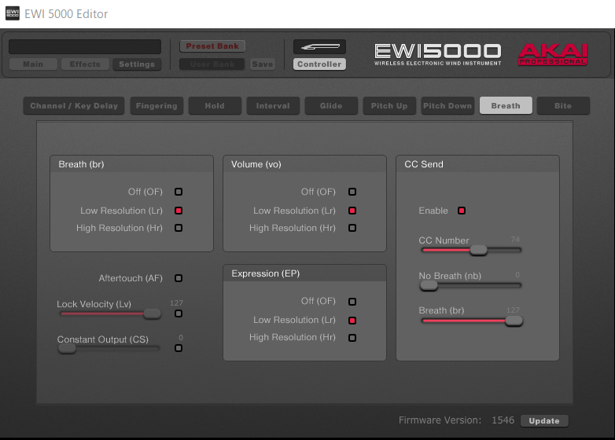

    
# EWI5000にMC-101(外部音源)を接続する    

2022/8/21      
初版    
  
## 概要    
EWI5000には、USBやMIDI-OUT端子があるので、これを使って外部音源を接続することができる。  
以下にRoland MC-101(外部音源)の接続方法について説明する。  
ここではワイヤレスMIDIで接続した場合について説明する。      
(現在のファームウェア・バージョンは、v1.72)  

なお、MC-101の取説などは以下のURLから入手できる：  
https://www.roland.com/jp/support/by_product/mc-101/owners_manuals/  

## 0. EWI5000のMIDI-OUT設定
1. EWI5000とPCをUSB接続する。
1. PCのEWI5000_Editorを起動する。
1. 画面で「Controller/Breath」を選択して
以下にように設定する：  
    * Breath(br): Low Resolution(Lr)  
    * Volume(vo): Low Resolution(Lr)  
    * Expression(EP): Low Resolution(Lr)  
    * CC Send: 74 (enable) nb:0 br:127
\# \[CC74] は、Cutoffを制御するものとして設定として追加する。
1. EWI5000_Editorを終了する。  
1. 必要なければPCとEWI5000とのUSBケーブルを外す。 

以降、この設定で外部音源と接続する。

### 1. bluetooth-MIDI接続
1. ２つのWIDI_Masterを用意する。
1. MC-101のMIDI-OUT/MIDI-INの両方にWIDI_Masterを接続する。(実際に必要なものはMIDI-INのみだが電源を供給するためにMIDI-OUTも接続する)
1. EWI5000のMIDI-OUTにWIDI_Masterを接続する。

以下の手順でEWI5000とMC-101を立ち上げる：
1. WIDI_Mastを接続したEWI5000の電源を入れる。
1. MC-101の電源を入れる。

## 2. MC-101設定
MC-101は機能が多いので、ここでは、最低限、音源として使用するときの設定について説明する。MC-101はプロジェクトという単位で４つのトラックが管理できるのでプロジェクトの各トラックごとに音色を定義するとトラックを切り替えることにより４つの音色を切り替えることができる。

1. Auto Channel設定  
システム設定である「Audo Channel」をMIDI入力デバイスあるEWIの出力チャンネルを設定し、入力されたMIDIデータを選択しているトラックに送る。  
「Auto Channel/システム設定(SYSTEM)」を参照のこと  

1. プロジェクト作成  
・「新しいプロジェクトを作成する」を参照のこと  

1. 各トラックに発音した音色を設定する。  
トラックを選択して、タイプをTONEに設定して、任意の音色を設定する。  
・「トラックを作成する」を参照のこと  
・「プリセット音色を取り込む」を参照のこと  
なお、第1トラックはDRUMトラックに固定されていてTONEに出来ないので、いったん、トラックを削除して新たにトラックを作成しなおす。(「トラックを異なるタイプに変更する」を参照のこと)

1. 以上でトラックを切り替えることで４つの音色を切り替えることができる。  

1. プロジェクト保存  
電源を落とすとプロジェクトに設定した内容が消えてしまうのでＳＤに保存する。
「プロジェクトを保存する」を参照のこと

---

以下、取説からの抜粋(多少、補足追加あり)：

### 新しいプロジェクトを作成する

1.［PROJECT］ボタンを押します。

2.［VALUE］ダイヤルで「NEW」を選び、［VALUE］ダイヤルを押します。

3.［VALUE］ダイヤルで「OK」を選び、［VALUE］ダイヤルを押します。

新しいプロジェクトが作成されます。
また、プロジェクトを変更していた場合は、確認画面が表示されます。現在のプロジェクトを保存したい場合は「WRITE」、保存しない場合は「NEW」を選んでください

### プロジェクトを保存する
SD カードにプロジェクトを保存します。

1.［PROJECT］ボタンを押します。

2.［VALUE］ダイヤルで「WRITE」を選び、［VALUE］ダイヤルを押します。

3.［VALUE］ダイヤルでプロジェクト名を変更します。
文字の下にカーソルが点滅します。
カーソルの位置の文字が変更されます。

操作 説明  
・MEASURE［<］［>］ 編集する文字を選びます。  
・［VALUE］ダイヤルを回す 文字を変更します。  
・［SHIFT］+ MEASURE［>］ スペースを挿入します。  
・［SHIFT］+ MEASURE［<］ 文字を削除します。  

4.［VALUE］ダイヤルを押します。
確認画面が表示されます。

［VALUE］ダイヤルで「OK」を選び、［VALUE］ダイヤルを押します。  
キャンセルする場合は、［VALUE］ダイヤルで「Cancel」を選び、［VALUE］ダイヤルを押します。  
※ 同じ名前のプロジェクトがあった場合、上書きします。                                                      
※ 鍵マークの付いたプロジェクトは、ロックされているので上書きできません。  
※ 同じ名前のプロジェクトがない場合、新たにプロジェクトを保存します  

### トラックを作成する
MC-101 には 4 種類のトラック・タイプ（TONE、DRUM、DRUM+COMP、LOOPER）があります。

トラックを作成するときに、トラック・タイプを指定することができます。トラック・タイプによって同時に使える数に上限があります。

1. TRACK SEL［1］～［4］ボタンを押して、空のトラックを選びます。
CREATE TRACK メニューが表示されます。

2.［VALUE］ダイヤルでタイプを選び、［VALUE］ダイヤルを押します。
トラックが作成されます。

トラック・タイプ 説明
TONE シンセサイザー音源です。音階を扱うサンプラーとしても使えます。
DRUM ドラム音源です。サンプラーとしても使えます。
DRUM+COMP コンプレッサー付きのドラム音源です（上限 1トラック）。
LOOPER タイム・ストレッチに対応したサンプリング・ルーパーです。

SD カードからのサンプルの取り込みと、外部入力や各トラックからの録音に対応しています。

### トラックを異なるタイプに変更する

トラックのタイプを変更するには、一度トラックを削除し、新たにトラックを作成します。

1.［SHIFT］ボタンと［PROJECT］ボタンを押しながら、変更したいトラックの TRACK SEL［1］～［4］ボタンを押します。  

確認画面が表示されます。   

2.［VALUE］ダイヤルで「OK」を選び、［VALUE］ダイヤルを押します。    

トラックが削除され、TRACK CREATE メニューが表示されます。  

3.［VALUE］ダイヤルで変更したいタイプを選び、［VALUE］ダイヤルを押します。

トラックが作成されます

### プリセット音色を取り込む
MC-101本体に内蔵された音色をプロジェクトに取り込むことができます。

1. TRACK SEL［1］～［4］ボタンで、音色を変更したいトラックを選びます。
2. PAD［NOTE］ボタンを押します。
NOTE モードになります。

3.［VALUE］ダイヤルを押します。
ブラウザー・メニューが表示されます。

4.［VALUE］ダイヤルで「PRESET」を選び、［VALUE］ダイヤルを押します。
サウンド・ブラウザーが表示されます。

5.カテゴリーを選び、［VALUE］ダイヤルを押します。

All Number は番号順で表示され、All Alphabet はアルファベット順で表示されます。また、TONEトラックでは、Syn.Bass や Syn.Lead といった楽器ごとのカテゴリーを指定することができます。

6.音色を選び、［VALUE］ダイヤルを押します。

音色がインポートされ、NOTE モード画面に戻ります。

※ SOUND SOURCE が CLIP モードの場合、音色を確認するには再生中のクリップである必要があります。

### Auto Channel/システム設定(SYSTEM)

パッドや MIDI、つまみの動作を設定します。
この設定は MC-101 本体に記憶されます。

1.［SHIFT］ボタンを押しながら［FILTER］ボタンを押します。
UTILITY MENU 画面が表示されます。

2.［VALUE］ダイヤルで「SYSTEM」を選び、［VALUE］ダイヤルを押します。
SYSTEM SETTING 画面が表示されます。

3.［VALUE］ダイヤルで変更したいパラメーターを選び、値を設定します。

Auto Chanel:  

入力された MIDI 信号を、TRACK SEL［1］～［4］ボタンで選ばれているトラックに送信します。

MIDI 鍵盤などを接続する際に便利な機能です。

システム設定（MIDI タブ）で入力デバイスのMIDIチャンエルを設定する。

MIDI Rx Auto Channel

設定した MIDI チャンネルに入力があった場合、TRACK SEL［1］～［4］ボタンで選択中のトラックへ MIDI 信号を送信します

### 接続した SD カードをパソコンで管理する

ストレージモードで PC と USB 接続することで、MC-101 に接続したSD カードの内容をパソコン上で管理できます。   
※ ストレージモード中は他の操作はできません。

1. MC-101 の電源が切れた状態で、USB ケーブルが挿さっていないことを確認します。

2. [PROJECT]ボタンを押しながら、MC-101 の電源を入れます。
ストレージ・モードで起動されます。

3. USB ケーブルを挿して、パソコンと接続します。
パソコンに SD カードのフォルダーが表示されます。

4. 取りはずすときは、パソコンで安全な取りはずし操作をしてから、はずしてください。

5. MC-101 の電源を切ってください。

### 工場出荷状態の設定に戻す(FACTORY RESET)

注意
FACTORY RESET を実行する前に、必要に応じてプロジェクトを保存してください。

1.［SHIFT］ボタンを押しながら［FILTER］ボタンを押します。
UTILITY MENU 画面が表示されます。

2.［VALUE］ ダ イ ヤ ル で「FACTORY RESET」 を 選 び、［VALUE］ダイヤルを押します。

3.［VALUE］ダイヤルで「OK」を選び、［VALUE］ダイヤルを押します。

システム設定が工場出荷の状態に戻ります。

キャンセルする場合は、「Cancel」を選び、［VALUE］ダイヤルを押します。

## トラブルシュート
USB給電で動作させた場合、PCなどから電源をとったとき電源に余力がないと正常動作しているがヘッドフォン出力が極端に小さいなどがあったので、ちゃんとしたACアダプターから給電すること。

## 参考情報           

MC-101関連：  
[MC-101 GROOVEBOX](https://www.roland.com/jp/products/mc-101/)  
[MC-101を音源として使うための参考情報](https://amynay.livedoor.blog/archives/14215827.html)  

MIDI関連：  
[現時点、最強のBluetooth MIDIかも!?　各種BLE-MIDI機器と自動でペアリングしてくれるWIDI Masterがスゴイ！](https://www.dtmstation.com/archives/32976.html)  

EWI関連：  
[EWI MASTER BOOK CD付教則完全ガイド【改訂版】](https://www.alsoj.net/store/view/ALEWIS1-2.html#.YmNpctpBxPY)

以上  

[Go to Toplevel](https://xshigee.github.io/web0/)  

