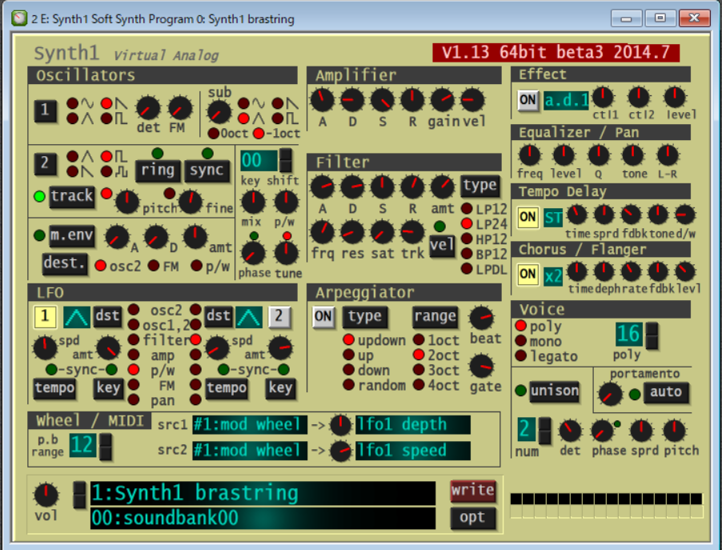

    
# EWI5000をソフト音源(Synth1)と接続する   

2022/5/28  
vsthost.exeのフォルダを管理者権限がいらないフォルダに変更した。  
(そうしないと設定などが保存できないようだ)  

2022/5/26     
初版    
  
## 概要    
EWI5000(+WIDI_Master)をソフト音源(Synth1)とbluetooth-MIDIでPC(windows)と接続する。

### 0. EWI5000のMIDI-OUT設定
1. EWI5000とPCをUSB接続する。
1. PCのEWI5000_Editorを起動する。
1. 画面で「Controller/Breath」を選択して  
以下にように設定する：  
Breath(br): Low Resolution(Lr)  
Volume(vo): Low Resolution(Lr)  
Expression(EP): Low Resolution(Lr)  
1. EWI5000_Editorを終了する。  
1. PCとEWI5000とのUSBケーブルを外す。  

### 1. bluetooth-MIDI接続
以下の手順でbluetooth-MIDI接続を行う：
1. EWI5000用に1つのWIDI_Masterを用意する。
1. EWI5000のMIDI-OUTにWIDI_Masterを接続する。

以下の手順でEWI5000とPCを立ち上げる：
1. WIDI_Masterを接続したEWI5000の電源を入れる。
1. PCはWIDI_Budを刺して、特に設定なしで起動できる。
1. 以上でEWI5000側のWIDI_MasterとPCのWIDI_Bugが自動的にペアリングして接続する。   

### 2.ソフト音源(Synth1)をインストールする
1. 以下のurlからダウンロードして解凍する   
https://daichilab.sakura.ne.jp/softsynth/Synth1V113beta3.zip
1. 追加プリセットを以下のurlからダウンロードする
https://plugins4free.com/addons/16k-Synth1-Presets.zip
1. VSTPlugInのフォルダにコピーする
    1.「C:\Program Files\VSTPlugIn」を(存在していないなら)作成する
    1. 上で解凍したSynth1-113beta_x64(フォルダ)をVSTPllugInの中にコピーする
    1. コピーしたSynth1-113beta_x64をSynth1にリネームする
    1. 「C:\Program Files\VSTPlugIn\Synth1\zipbank」の中に追加プリセット16k-Synth1-Presets.zipをコピーする
    1. 「C:\Program Files\VSTPlugIn\Synth1」の中のinitsettings.exeを実行(クリック)する

### 3.VST_HOSTをインストールする
1. 以下のurlからダウンロードして解凍する 
https://www.hermannseib.com/programs/vsthostx86.zip  
\# 64ビット版もあるが、互換性の考慮から上の32ビットを使用する  
\# たとえば、IFW(VSTi)は、64ビット版では動作しない  
1. 解凍したvsthostx86(フォルダ)を「user/Documents」にコピーする  
1. 起動しやすくするために上のフォルダにあるvsthost.exeのショートカットを作り、ディスクトップに置く  

### 4.VST_HOSTを起動する
1. vsthost.exeのショートカットをクリックして起動する
1. VSTフォルダを設定する
    1. \[File/Set Plugin Path...]を選択する
    1. 入力欄「C:\Program Files\VSTPlugIn\Synth1」を入力する
    1. \[OK]をクリックする
1. 使用したいVSTを選択する
    1. \[File/Plugin]を選択して選択肢を表示する
    1. \[Synth1 Soft Synth]を選ぶ
1. MIDIデバイスを選択する
    1. \[Device/MIDI]を選択してデバイス名を表示する
    1. \[WidiBud]を選ぶ(bluetooth-MIDIを使用する場合)
    (USB接続の場合、\[EWI5000]を選ぶ)  
1. WAVEデバイスを選択する
    \[Device/Wave]を選択して以下に設定する  
    * Input Port: \* No Wave \*  
    * Output Port: ASIO: ASIOALL v2  
    * Sample Rtae: 44100  
    * Buffer: 64 samples (音が途切れるようなら大きくする)
1. VST画面を表示する
    1. 右上の右から3番目アイコンをクリックする
     
    デフォルト音色として以下が表示される：  
    \[1: Synth1 brastring]  
    \[00:soundbank00]  

以上でEWIと音源が接続された状態になるので、EWIを吹くとPCから音が出る。  
吹いても音がしない場合、\[Engine/Run]でVSTを(再)起動する。  

### EWI向けの設定
実例としてSynth1画面から以下を設定する： 
```
その１：
[wheel/MIDI]
(1)src1/src2に[#2:breath ctrl],[#7:volume],[#11:expression]などを割り当てる
(2)nobで影響の度合いを制御する
(3)変化させるパラメータを指定する
音色を変えるパラメータ例：
src1:#2 breath-(nob)-[filter frq]
src2:#7:volume-(nob)-[filter A]
nobはパラメータの影響度合いを制御するために変更する

```

### Mute/Thru機能
* 右側のスピーカ・アイコンでMuteのon/offができる  
 (「X」はMuteの状態を表す)
* 左側のスピーカ・アイコンでThruのon/offができる  
 (「-」はThruの状態を表す)

### Program保存
現状の状態を保存するには以下を実行する：
1. \[Performance/Save As ...]を選択する
1. 保存状態を書き込むスロットを選択する  
(未使用は、[** Init **] になっている)
1. スロット名(Name)を入力する
1. \[OK]をクリックする

VST_HOST起動時に保存した状態に戻す場合   、  
画面の左上のスロットのプルダウンメニューから  
以前に保存したスロットを選択する。  

### Preset保存
現状、使用しているVST設定を保存するには以下を実行する：
1. [Plugin/Save Bank As...]を選択する
1. ファイル保存画面になるので、任意のファイル名で指定する。  
注意：ファイルタイプは、自動的に\.vstpresetか\.fxbが追加される。  
\.vstpresetは、古いバージョンのVSTの設定ファイルタイプになるようだ。  

VST_HOST起動時に保存したVST設定に戻す場合  
\[Plugin/Load Bank...] を選択し、設定ファイルを選ぶ。

### トラブル・シュート
上の手順で音が出ない場合、以下のことが考えられる：
* EWI5000の送信MIDIチャンネルが1以外になっている。
経験上、誤ってEWI5000の\[SETUP]ボタンなどを押して意図せずに送信チャンネルが1以外になっていることがあった。
* (bluetooth-MIDIで使用する際)EWI5000がPCとUSBケーブルで接続されたままになっている。  
このときは、USB-MIDIのほうが優先的に選択されEWI本体のMIDI-OUTにデータが出力されないようだ。

## AE-20に関する補足
Aerophone(AE-20)も上の説明で「EWI5000(+WIDI_Master)」の部分をAE-20に読み替えた形で同様のことが可能である。

## 参考情報

Synth1関連：  
[Synth1](https://daichilab.sakura.ne.jp/softsynth/index.html)  
[【無料シンセ】Synth1のインストール方法｜おすすめプリセットのダウンロード先も紹介](https://oyu-sound.com/synth1-install/)  
[大人気フリー(VST)Synth1を使おう！ (調整方法)](https://www.dtm-navi.com/a12.html)  

VST_HOST関連：  
[VSTHost](https://www.hermannseib.com/english/vsthost.htm)  
[VSTHost取説](https://www.hermannseib.com/documents/VSTHost.pdf)  

[How to Run Any VST Plugin as Standalone (Without a DAW)](https://guitargearfinder.com/guides/run-vst-plugins-standalone/)  
[VSTHostの設定と操作](https://yppts.adam.ne.jp/music/isogi/vsthost.html)  

WIDI関連：  
[EWI5000をWIDI_Bud経由で外部音源(Aria/Windows)と接続する](https://xshigee.github.io/web0/md/EWI5000_WIDI_Bud.html)  
[EWI5000にSWAM音源(@iPad)を接続する](https://xshigee.github.io/web0/md/EWI5000_SWAM.html)  
[EWI5000に外部音源(EWI3000m,Aria/Windows)を接続する](EWI5000_EWI-Aria.md)    
[EWI5000でAerophone(AE-20)を外部音源として使用する](EWI5000_ExtAE-20.md)    
[Aerophone(AE-20)にWIDI_uhostを使用する](AE-20_WIDI_uhost.md)    
[Aerophone(AE-20)に外部音源(VL70m)を接続する](AE-20_VL70m.md)    
[EWI5000に外部音源(VL70m)を接続する](EWI5000_VL70m.md)    
[Aerophone(AE-20)に外部音源(EWI3000m,Aria/Windows)を接続する](AE-20-ExternalAria.md)    
[EWI5000に外部音源(EWI3000m,Aria/Windows)を接続する](EWI5000_EWI-Aria.md)    
[EWI5000ことはじめ](EWI5000_EWI-GetStarted.md) 
[EWI3000をEWI-USB(もどき)として使う(Aria/Windows編)](EWI3000_EWI-Aria.md)   
[EWI3000をEWI-USB(もどき)として使う(iPhone/iPad編)](EWI3000_EWI-USB.md)   

MIDI関連：  
[現時点、最強のBluetooth MIDIかも!?　各種BLE-MIDI機器と自動でペアリングしてくれるWIDI Masterがスゴイ！](https://www.dtmstation.com/archives/32976.html)  
[CME WIDI BUD-- BLE MIDI adapter for any BLE MIDI devices](https://xkeyair.com/widi-bud/)  
[WIDI BUDってなんだ？](https://dirigent.jp/blog/widi-bud%E3%81%A3%E3%81%A6%E3%81%AA%E3%82%93%E3%81%A0)  


以上  

[Go to Toplevel](https://xshigee.github.io/web0/)  

