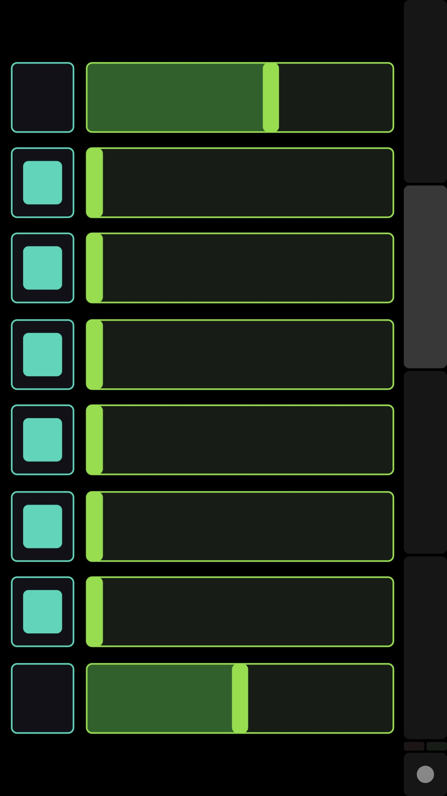
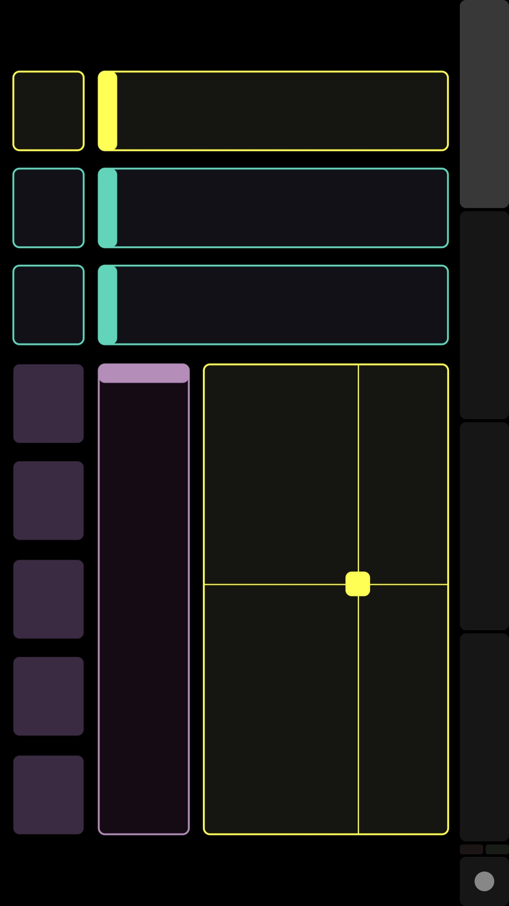

    
# OSC_CCMapper3(RiMidi) for R1/Elesa  

2023/12/23  
実行ファイル作成方法を追加した。  

2023/12/17        
初版    
  
## 概要
本記事は[OSC_CCMapper3(RiMidi) for Win/Mac](https://xshigee.github.io/web0/md/OSC_CCMapper3_Win_Mac.html)をベースにR1/Elesaのサポートを追加したものである。Winの場合、MIDI_Bud(USB dongle)経由なので本件の変更なしでも動作する。したがって、Mac専用の修正になる。  
具体的には、ソースであるProgram.csのみの変更である。

---

本件は「[CCMapper3(RiMidi) for Win/Mac](https://xshigee.github.io/web0/md/CCMapper3_Win_Mac.html)」にOSC通信機能を追加して、iPhone/AndroidのTouchOSCアプリで制御できるようにしたものである。    
リアルタイムでCC#2またはCC#11を受信して、CC#を任意のもの(複数)に変更するCCMapperをC#で実装したものであり、キー入力のかわりにTouchOSCをGUIとして使用できる。    
なお、ソースコードは、Windows/MacOS共通になっている。  
本記事のみに完結するようにしているため「[CCMapper3(RiMidi) for Win/Mac](https://xshigee.github.io/web0/md/CCMapper3_Win_Mac.html)」と内容が一部ダブっている。  

Ref:  
[Wind Synthesizer R1 - Musical Instrument From the Future!](https://store.robkoo.com/products/buy_r1)  
[TAHORNG Elesa10](https://www.fineassist.jp/products/TH/Elesa/entry-234.html)  


## 準備
1.Windowsの場合、  
仮想MIDIデバイスとして、loopMIDIがインストールされている必要がある。  
参照：[loopMIDI](https://www.tobias-erichsen.de/software/loopmidi.html)  

MIDI信号の流れとしては以下のようになる：
```
[wind_controler(re.corder/Elfue etc)]→[WIDI Bud Pro]→(CCMapper3)→[loopMIDI]→ [PC音源]
```

2.Macの場合  
仮想MIDIデバイスとして、IACドライバを設定する。名前はWindowsに合わせて「loopMIDI」とする。
参照：[MacのAudio MIDI設定でMIDI情報をアプリケーション間で送信する](https://support.apple.com/ja-jp/guide/audio-midi-setup/ams1013/mac)  

MIDI信号の流れとしては以下のようになる：
```
[wind_controler(re.corder/Elfue etc)]→(CCMapper3)→[loopMIDI(IAC)]→ [PC音源]
```

## 使用ライブラリ
以下のライブラリをNuGetマネージャーでインストールしてプログラムに組み込む：　　
```
Rug.OSC
RtMidi.Core
Serilog.Sinks.Console
```

## CCMapper
CCMapperのプログラムとしては以下を使用する：  

OSC_CCMapper3_cs_RtMidi/Program.cs  
```cs

// 2023/12/17
// R1,Elesa supported for Mac
// 2023/5/3
// osc_CCMapper3_RtMidi

// OSC controled CCMapper3(RiMidi) for Win/Mac
// written by: xshige
// 2023/1/26

/************************************

2023/1/26
 
Mix16/TouchOSC controler

toggles
1: Velocity Fixed/PANIC button: toggle 
2: AT/PP: toggle
3: CC74: toggle
4: CC26: toggle
5: CC11: toggle
6: CC7 : toggle
7: CC2 : toggle
8: CC1 : toggle

faders
1: Fixed Velocity value(0-127)
8: Modulation Depth value(0-2.0) // related CC1

experimental
xy
x: PitchBend
y: Cutoff(CC74)

************************************/


// CCMapper3(RiMidi) for Win/Mac
// written by:xshige

// 2023/1/22
// Panic button
// z

// 2023/1/5
// PitchBen(d) transefer
// d toggle

// Velocity F(i)xed
// i toggle

// 2022/12/15
// Pitch Bend transfer

// NoteOn/Off Tranfer Switch added
// t toggle

// 2022/12/10 Transpose added
// [↑] [↓] +/- semitone
// [←] [→] -/+ octave

// 2022/12/1 Keycontrol Support
//-----------------------------
// modifier:
// 1(x1) 2(x2) 3(x3) 4(x4) 5(x5) 6(x6) 7(x7) 8(x8) 9(x9) 0(x10)

// CC1(MW):
// m toggle

// CC2(Breath Control)
// b toggle

// CC7(Volume)
// v toggle

// CC11(Expression)
// x toggle

// CC74(CutoffFreq):
// c toggle

// CC26(EqGain)
// e toggle

// AT(Channel Pressure):
// a toggle

// PP(Polyphonic Pressure):
// p toggle

// n NotFixed(apply modifier)
// f Fixed Modifier x1)

// OTHER CC
// o toggle

//---------------------------------

// 2022/11/29: Aftertouch support
// 2022/11/28: CC74 sent for Cutoff Filter
// 2022/11/27: CC1 sent for vibrate
// 2022/11/26: NuRad added
// 2022/11/17: auto selecting input/output devices
// 2022/11/13

using RtMidi.Core.Devices;
using RtMidi.Core.Enums;
using RtMidi.Core.Messages;
using Serilog;
using System;
using System.Collections.Generic;
using System.Diagnostics;
using System.Drawing;
using System.Net;
using System.Security.Cryptography.X509Certificates;
using System.Text.RegularExpressions;
using System.Threading.Channels;

using Rug.Osc;
using System.Text;
using System.Threading;

namespace RtMidi.Core.CCMapper
{
    public class Program
    {
        static OscReceiver receiver;
        static OscSender sender;
        static Thread thread;

        int limit127(int x, float m)
        {
            int rv = (int)((float)x * m);
            if (127 <= rv)
                rv = 127;
            return rv;
        }

        public static void Main(string[] args)
        {
            Log.Logger = new LoggerConfiguration()
            //.WriteTo.ColoredConsole()
            .WriteTo
                .Console()
                //.MinimumLevel.Debug() // disp debug info.
                .CreateLogger();

            using (MidiDeviceManager.Default)
            {
                var p = new Program();
            }
        }

        public Program()
        {

            // MIDI devices
            var inputList = new List<IMidiInputDevice>();
            var outputList = new List<IMidiOutputDevice>();

            NoteOnMessage curMsg = new NoteOnMessage();
            var prevC = ConsoleKey.A;

            int transpose = 0; // transpose offset

            float cc1mod = 1;

            bool logOut = false; //20023/1/9 // true to disp log on console

            bool enableSendNote = true; // false will Note send note

            bool enableCC1 = false; // 2023/1/5: true will send CC1, false will send received CC1
            bool enableCC74 = true; // true will send CC74
            bool enableAT = true; // true will send AT
            bool enablePP = true;
            bool enableVL = true; // volume
            bool enableBC = true; // breath
            bool enableCC26 = true; // EqGain
            bool enableEX = true; // Expression
            bool enableOTHER = false; // 2023/1/5: other CC

            bool enablePB = true; //  2023/1/5: true will send PB
            bool enableVFixed = false; // 2023/1/5
            int VFixedValue = 77; // 2023/1/5

            bool chgCC1 = false; // true will change mod value
            bool chgCC74 = false;
            bool chgAT = false;
            bool chgPP = false;
            bool chgVL = false;
            bool chgBC = false;
            bool chgEX = false;

            float modDepth = 1; // Modulation Depth

            //------------------------------------------------------------------------
            // OSC related

            bool OSCdebug = false; // true to disp log

            static string ByteArrayToString(byte[] ba)
            {
                StringBuilder hex = new StringBuilder(ba.Length * 3);
                foreach (byte b in ba)
                    hex.AppendFormat("{0:x2}:", b);
                return hex.ToString();
            }

            int port = 8000;
            int outPort = 9000;
            IPAddress sendAddress = IPAddress.Parse("192.168.0.6"); // IP address of iPhone(TouchOSC)

            // Create the receiver
            receiver = new OscReceiver(port);
            // Create the sender
            sender = new OscSender(sendAddress, outPort);

            // Create a thread to do the listening
            thread = new Thread(new ThreadStart(ListenLoop));

            // Connect the receiver
            receiver.Connect();

            // Start the listen thread
            thread.Start();

            // Connect the sender
            sender.Connect();


            void RestoreFlags()
            {
                // OSC value reset ---------------------------
                float f1 = (float)VFixedValue / 127;
                //Console.WriteLine(f1);
                sender.Send(new OscMessage("/2/fader1", f1));
                Thread.Sleep(100); // NEED THAT!
                sender.Send(new OscMessage("/2/fader2", 0));
                Thread.Sleep(100);
                sender.Send(new OscMessage("/2/fader3", 0));
                Thread.Sleep(100);
                sender.Send(new OscMessage("/2/fader4", 0));
                Thread.Sleep(100);
                sender.Send(new OscMessage("/2/fader5", 0));
                Thread.Sleep(100);
                sender.Send(new OscMessage("/2/fader6", 0));
                Thread.Sleep(100);
                sender.Send(new OscMessage("/2/fader7", 0));
                Thread.Sleep(100);
                float d1 = (float)(modDepth * 0.5);
                sender.Send(new OscMessage("/2/fader8", d1));
                Thread.Sleep(100);
                // toggles
                if (enableCC1) sender.Send(new OscMessage("/2/toggle8", 1));
                else sender.Send(new OscMessage("/2/toggle8", 0));

                if (enableBC) sender.Send(new OscMessage("/2/toggle7", 1));
                else sender.Send(new OscMessage("/2/toggle7", 0));

                if (enableVL) sender.Send(new OscMessage("/2/toggle6", 1));
                else sender.Send(new OscMessage("/2/toggle6", 0));

                if (enableEX) sender.Send(new OscMessage("/2/toggle5", 1));
                else sender.Send(new OscMessage("/2/toggle5", 0));

                if (enableCC26) sender.Send(new OscMessage("/2/toggle4", 1));
                else sender.Send(new OscMessage("/2/toggle4", 0));

                if (enableCC74) sender.Send(new OscMessage("/2/toggle3", 1));
                else sender.Send(new OscMessage("/2/toggle3", 0));

                if (enableAT) sender.Send(new OscMessage("/2/toggle2", 1));
                else sender.Send(new OscMessage("/2/toggle2", 0));

                if (enableVFixed) sender.Send(new OscMessage("/2/toggle1", 1));
                else sender.Send(new OscMessage("/2/toggle1", 0));

            }


            // OSC listenner
            //<<<<<<<<<<<<<<<<<<<<<<<<<<<<<<<<<<<<<<<<<<<<<<<<<<<<<<<<<<<<<<<<<<<<<<<<<<<<<<<<<
            //static void ListenLoop()
            void ListenLoop()
            {
                try
                {
                    while (receiver.State != OscSocketState.Closed)
                    {
                        // if we are in a state to recieve
                        if (receiver.State == OscSocketState.Connected)
                        {
                            // get the next message
                            // this will block until one arrives or the socket is closed
                            OscPacket packet = receiver.Receive();

                            var arg0 = packet.ToString().Split(',')[0]; // get OSC address

                            // for TouchOSC layout Simple/1 or Mix16/2
                            // faders
                            if (arg0.Equals("/1/fader1") || arg0.Equals("/2/fader1"))
                            {
                                var ba = packet.ToByteArray();

                                if (BitConverter.IsLittleEndian)
                                    Array.Reverse(ba);
                                float f1 = BitConverter.ToSingle(ba, 0);

                                if (OSCdebug) Console.WriteLine(arg0);
                                if (OSCdebug) Console.WriteLine(f1);
                                if (OSCdebug) Console.WriteLine("");

                                VFixedValue = (int)(f1 * 127);
                                Console.WriteLine("Fixed Velocity: {0}", VFixedValue);
                            }
                            else if (arg0.Equals("/1/fader2") || arg0.Equals("/2/fader2"))
                            {
                                var ba = packet.ToByteArray();

                                if (BitConverter.IsLittleEndian)
                                    Array.Reverse(ba);
                                float f1 = BitConverter.ToSingle(ba, 0);

                                if (OSCdebug) Console.WriteLine(arg0);
                                if (OSCdebug) Console.WriteLine(f1);
                                if (OSCdebug) Console.WriteLine("");
                            }
                            else if (arg0.Equals("/1/fader3") || arg0.Equals("/2/fader3"))
                            {
                                var ba = packet.ToByteArray();

                                if (BitConverter.IsLittleEndian)
                                    Array.Reverse(ba);
                                float f1 = BitConverter.ToSingle(ba, 0);

                                if (OSCdebug) Console.WriteLine(arg0);
                                if (OSCdebug) Console.WriteLine(f1);
                                if (OSCdebug) Console.WriteLine("");
                            }
                            else if (arg0.Equals("/1/fader4") || arg0.Equals("/2/fader4"))
                            {
                                var ba = packet.ToByteArray();

                                if (BitConverter.IsLittleEndian)
                                    Array.Reverse(ba);
                                float f1 = BitConverter.ToSingle(ba, 0);

                                if (OSCdebug) Console.WriteLine(arg0);
                                if (OSCdebug) Console.WriteLine(f1);
                                if (OSCdebug) Console.WriteLine("");
                            }
                            else if (arg0.Equals("/1/fader5") || arg0.Equals("/2/fader5"))
                            {
                                var ba = packet.ToByteArray();

                                if (BitConverter.IsLittleEndian)
                                    Array.Reverse(ba);
                                float f1 = BitConverter.ToSingle(ba, 0);

                                if (OSCdebug) Console.WriteLine(arg0);
                                if (OSCdebug) Console.WriteLine(f1);
                                if (OSCdebug) Console.WriteLine("");
                            }
                            else if (arg0.Equals("/1/fader6") || arg0.Equals("/2/fader6"))
                            {
                                var ba = packet.ToByteArray();

                                if (BitConverter.IsLittleEndian)
                                    Array.Reverse(ba);
                                float f1 = BitConverter.ToSingle(ba, 0);

                                if (OSCdebug) Console.WriteLine(arg0);
                                if (OSCdebug) Console.WriteLine(f1);
                                if (OSCdebug) Console.WriteLine("");
                            }
                            else if (arg0.Equals("/1/fader7") || arg0.Equals("/2/fader7"))
                            {
                                var ba = packet.ToByteArray();

                                if (BitConverter.IsLittleEndian)
                                    Array.Reverse(ba);
                                float f1 = BitConverter.ToSingle(ba, 0);

                                if (OSCdebug) Console.WriteLine(arg0);
                                if (OSCdebug) Console.WriteLine(f1);
                                if (OSCdebug) Console.WriteLine("");
                            }
                            else if (arg0.Equals("/1/fader8") || arg0.Equals("/2/fader8"))
                            {
                                var ba = packet.ToByteArray();

                                if (BitConverter.IsLittleEndian)
                                    Array.Reverse(ba);
                                float f1 = BitConverter.ToSingle(ba, 0);

                                if (OSCdebug) Console.WriteLine(arg0);
                                if (OSCdebug) Console.WriteLine(f1);
                                if (OSCdebug) Console.WriteLine("");

                                modDepth = (float)(f1 / 0.5);
                                Console.WriteLine("Mod Depth: {0:f3}", modDepth);

                            }
                            //--------------------------------------------------------------------
                            // toggles
                            else if (arg0.Equals("/1/toggle1") || arg0.Equals("/2/toggle1"))
                            {
                                var ba = packet.ToByteArray();

                                if (BitConverter.IsLittleEndian)
                                    Array.Reverse(ba);
                                float f1 = BitConverter.ToSingle(ba, 0);

                                if (OSCdebug) Console.WriteLine(arg0);
                                if (OSCdebug) Console.WriteLine(f1);
                                if (OSCdebug) Console.WriteLine("");

                                Panic();
                                if (f1 == 0) enableVFixed = false; else enableVFixed = true;
                                if (enableVFixed)
                                    Console.WriteLine("Fixed Velocity enabled");
                                else
                                    Console.WriteLine("Fixed Velocity disabled");

                            }
                            else if (arg0.Equals("/1/toggle2") || arg0.Equals("/2/toggle2"))
                            {
                                var ba = packet.ToByteArray();

                                if (BitConverter.IsLittleEndian)
                                    Array.Reverse(ba);
                                float f1 = BitConverter.ToSingle(ba, 0);

                                if (OSCdebug) Console.WriteLine(arg0);
                                if (OSCdebug) Console.WriteLine(f1);
                                if (OSCdebug) Console.WriteLine("");

                                if (f1 == 0) enableAT = false; else enableAT = true;
                                enablePP = enableAT; // sync AT and PP

                                if (enableAT)
                                    Console.WriteLine("AT/PP enabled");
                                else
                                    Console.WriteLine("AT/PP disabled");

                            }
                            else if (arg0.Equals("/1/toggle3") || arg0.Equals("/2/toggle3"))
                            {
                                var ba = packet.ToByteArray();

                                if (BitConverter.IsLittleEndian)
                                    Array.Reverse(ba);
                                float f1 = BitConverter.ToSingle(ba, 0);

                                if (OSCdebug) Console.WriteLine(arg0);
                                if (OSCdebug) Console.WriteLine(f1);
                                if (OSCdebug) Console.WriteLine("");

                                if (f1 == 0) enableCC74 = false; else enableCC74 = true;
                                if (enableCC26)
                                    Console.WriteLine("CC74 enabled");
                                else
                                    Console.WriteLine("CC74 disabled");

                            }
                            else if (arg0.Equals("/1/toggle4") || arg0.Equals("/2/toggle4"))
                            {
                                var ba = packet.ToByteArray();

                                if (BitConverter.IsLittleEndian)
                                    Array.Reverse(ba);
                                float f1 = BitConverter.ToSingle(ba, 0);

                                if (OSCdebug) Console.WriteLine(arg0);
                                if (OSCdebug) Console.WriteLine(f1);
                                if (OSCdebug) Console.WriteLine("");

                                if (f1 == 0) enableCC26 = false; else enableCC26 = true;
                                if (enableCC26)
                                    Console.WriteLine("CC26 enabled");
                                else
                                    Console.WriteLine("CC26 disabled");

                            }
                            else if (arg0.Equals("/1/toggle5") || arg0.Equals("/2/toggle5"))
                            {
                                var ba = packet.ToByteArray();

                                if (BitConverter.IsLittleEndian)
                                    Array.Reverse(ba);
                                float f1 = BitConverter.ToSingle(ba, 0);

                                if (OSCdebug) Console.WriteLine(arg0);
                                if (OSCdebug) Console.WriteLine(f1);
                                if (OSCdebug) Console.WriteLine("");

                                if (f1 == 0) enableEX = false; else enableEX = true;
                                if (enableEX)
                                    Console.WriteLine("CC11 enabled");
                                else
                                    Console.WriteLine("CC11 disabled");

                            }
                            else if (arg0.Equals("/1/toggle6") || arg0.Equals("/2/toggle6"))
                            {
                                var ba = packet.ToByteArray();

                                if (BitConverter.IsLittleEndian)
                                    Array.Reverse(ba);
                                float f1 = BitConverter.ToSingle(ba, 0);

                                if (OSCdebug) Console.WriteLine(arg0);
                                if (OSCdebug) Console.WriteLine(f1);
                                if (OSCdebug) Console.WriteLine("");

                                if (f1 == 0) enableVL = false; else enableVL = true;
                                if (enableVL)
                                    Console.WriteLine("CC7 enabled");
                                else
                                    Console.WriteLine("CC7 disabled");

                            }
                            else if (arg0.Equals("/1/toggle7") || arg0.Equals("/2/toggle7"))
                            {
                                var ba = packet.ToByteArray();

                                if (BitConverter.IsLittleEndian)
                                    Array.Reverse(ba);
                                float f1 = BitConverter.ToSingle(ba, 0);

                                if (OSCdebug) Console.WriteLine(arg0);
                                if (OSCdebug) Console.WriteLine(f1);
                                if (OSCdebug) Console.WriteLine("");

                                if (f1 == 0) enableBC = false; else enableBC = true;
                                if (enableBC)
                                    Console.WriteLine("CC2 enabled");
                                else
                                    Console.WriteLine("CC2 disabled");


                            }
                            else if (arg0.Equals("/1/toggle8") || arg0.Equals("/2/toggle8"))
                            {
                                var ba = packet.ToByteArray();

                                if (BitConverter.IsLittleEndian)
                                    Array.Reverse(ba);
                                float f1 = BitConverter.ToSingle(ba, 0);

                                if (OSCdebug) Console.WriteLine(arg0);
                                if (OSCdebug) Console.WriteLine(f1);
                                if (OSCdebug) Console.WriteLine("");

                                if (f1 == 0) enableCC1 = false; else enableCC1 = true;
                                if (enableCC1)
                                    Console.WriteLine("MW(CC1) enabled");
                                else
                                    Console.WriteLine("MW(CC1) disabled");
                            }
                            //---------------------------------------------------------


                            else if (arg0.Equals("/1/xy") || arg0.Equals("/3/xy"))
                            {
                                var ba = packet.ToByteArray();

                                if (BitConverter.IsLittleEndian)
                                    Array.Reverse(ba);
                                float y = BitConverter.ToSingle(ba, 0);
                                float x = BitConverter.ToSingle(ba, 4);

                                if (OSCdebug) Console.WriteLine(arg0);
                                if (OSCdebug) Console.WriteLine(x);
                                if (OSCdebug) Console.WriteLine(y);

                                if (OSCdebug) Console.WriteLine(packet.ToString()); // debug
                                if (OSCdebug) Console.WriteLine("");

                                // convert int to enums
                                var eChannel = (Enums.Channel)Enum.ToObject(typeof(Enums.Channel), 0);  // zero relative

                                // PitchBend -8191 thru +8191 (0-16382)
                                int int14 = (int)(16382 * x);
                                outputList[0].Send(new PitchBendMessage(eChannel, int14));

                                // CutoffFreq
                                int int7 = (int)(127 * y);
                                outputList[0].Send(new ControlChangeMessage(eChannel, 74, int7));

                            }

                            else if (arg0.Equals("/1") || arg0.Equals("/2") || arg0.Equals("/3") || arg0.Equals("/4"))
                            {
                                if (OSCdebug) Console.WriteLine("debug"); //debug
                                if (OSCdebug) Console.WriteLine(packet.ToString()); // debug
                                if (OSCdebug) Console.WriteLine("");
                            }


                            else if (arg0.Equals("/ping"))
                            {

                                if (OSCdebug) Console.WriteLine("debug"); //debug
                                if (OSCdebug) Console.WriteLine(packet.ToString()); // debug
                                if (OSCdebug) Console.WriteLine("");

                            }

                            // other OSC message
                            else
                            {
                                // Write the packet to the console
                                Console.WriteLine(packet.ToString());
                            }
                            // DO SOMETHING HERE!

                        } //connected
                    }
                }
                catch (Exception ex)
                {
                    // if the socket was connected when this happens
                    // then tell the user
                    if (receiver.State == OscSocketState.Connected)
                    {
                        Console.WriteLine("Exception in listen loop");
                        Console.WriteLine(ex.Message);
                    }
                }
            }
            //>>>>>>>>>>>>>>>>>>>>>>>>>>>>>>>>>>>>>>>>>>>>>>>>>>>>>>>>>>>>>>>>>>>>>>>>>>>>>>>>>


            //<<<<<<<<<<<<<<<<<<<<<<<<<<<<<<<<<<<<<<<<<<<<<<<<<<<<<<<<<<<<<<<<<<<<<<<<<<<<<<<
            // Event Handlers

            // Listen to all available midi devices
            void ControlChangeHandler(IMidiInputDevice sender, in ControlChangeMessage msg)
            {
                if (logOut)
                    Console.WriteLine(
                        $"[{sender.Name}] ControlChange: Channel:{msg.Channel} Control:{msg.Control} Value:{msg.Value}"
                    );
                if (msg.Control == 11 || msg.Control == 2)
                {
                    // for Aria
                    if (enableBC)
                    {
                        if (chgBC)
                            outputList[0].Send(
                                new ControlChangeMessage(
                                    msg.Channel,
                                    2,
                                    limit127(msg.Value, cc1mod)
                                )
                            );
                        else
                            outputList[0].Send(new ControlChangeMessage(msg.Channel, 2, msg.Value));
                    }
                    if (enableVL)
                    {
                        if (chgVL)
                            outputList[0].Send(
                                new ControlChangeMessage(
                                    msg.Channel,
                                    7,
                                    limit127(msg.Value, cc1mod)
                                )
                            );
                        else
                            outputList[0].Send(new ControlChangeMessage(msg.Channel, 7, msg.Value));
                    }
                    if (enableCC26)
                        outputList[0].Send(new ControlChangeMessage(msg.Channel, 26, msg.Value));

                    // Expression added
                    if (enableEX)
                    {
                        if (chgEX)
                            outputList[0].Send(
                                new ControlChangeMessage(
                                    msg.Channel,
                                    11,
                                    limit127(msg.Value, cc1mod)
                                )
                            );
                        else
                            outputList[0].Send(
                                new ControlChangeMessage(msg.Channel, 11, msg.Value)
                            );
                    }

                    // CC1 added
                    if (enableCC1)
                    {
                        outputList[0].Send(new ControlChangeMessage(msg.Channel, 1, limit127(msg.Value, modDepth)));
                        /*
                        if (chgCC1)
                            outputList[0].Send(
                                new ControlChangeMessage(
                                    msg.Channel,
                                    limit127(msg.Value, cc1mod)
                                )
                            );
                        else
                            outputList[0].Send(new ControlChangeMessage(msg.Channel, 1, msg.Value));
                        */
                    }

                    // CC74 added
                    if (enableCC74)
                    {
                        if (chgCC74)
                            outputList[0].Send(
                                new ControlChangeMessage(
                                    msg.Channel,
                                    74,
                                    limit127(msg.Value, cc1mod)
                                )
                            );
                        else
                            outputList[0].Send(
                                new ControlChangeMessage(msg.Channel, 74, msg.Value)
                            );
                    }

                    // Aftertouch for Channel
                    if (enableAT)
                    {
                        if (chgAT)
                            outputList[0].Send(
                                new ChannelPressureMessage(msg.Channel, limit127(msg.Value, cc1mod))
                            );
                        else
                            outputList[0].Send(new ChannelPressureMessage(msg.Channel, msg.Value));

                        //outputList[0].Send(new PitchBendMessage(msg.Channel, msg.Value));
                    }

                    // Aftertouch for key
                    if (enablePP)
                    {
                        // convert enums to int for transpose
                        int iKey = (int)curMsg.Key;
                        iKey += transpose;
                        var eKey = (Enums.Key)Enum.ToObject(typeof(Enums.Key), iKey);

                        if (chgPP)
                            outputList[0].Send(
                                new PolyphonicKeyPressureMessage(
                                    curMsg.Channel,
                                    eKey,
                                    limit127(msg.Value, cc1mod)
                                )
                            );
                        else
                            outputList[0].Send(
                                new PolyphonicKeyPressureMessage(curMsg.Channel, eKey, msg.Value)
                            );
                    }
                }

                if (msg.Control == 1)
                {
                    if (!enableCC1)
                        outputList[0].Send(new ControlChangeMessage(msg.Channel, 1, msg.Value));
                }

                // the following CC ignore(not sent)
                if (msg.Control == 7)
                    return; // EWI5000
                if (msg.Control == 68)
                    return; // EWI5000
                if (msg.Control == 74)
                    return; // EWI5000
                if (msg.Control == 34)
                    return; // CC#34(Hires/Breath Controler) ignored
                if (msg.Control == 39)
                    return; // CC#39(Hires/Volume) ignored
                if (msg.Control == 43)
                    return; // CC#43(Hires/Expression) ignored
                if (msg.Control == 88)
                    return; // CC#88(Hires/NoteOn) ignored
                // portamento/glide support
                if (msg.Control == 65)
                { // portamento on/off
                    outputList[0].Send(new ControlChangeMessage(msg.Channel, 65, msg.Value));
                    //if (PORTA.value) {
                    //    midiout.send_message(message);
                    //    return;
                    //}
                    if (msg.Control == 5)
                    { // portamento/glide time
                        outputList[0].Send(new ControlChangeMessage(msg.Channel, 5, msg.Value));
                        //if (PORTA.value) {
                        //    midiout.send_message(message);
                        //    return;
                        //}
                    }
                    if (msg.Control == 84)
                    { // portamento control
                        outputList[0].Send(new ControlChangeMessage(msg.Channel, 84, msg.Value));
                        //if (PORTA.value) {
                        //    midiout.send_message(message);
                        //    return;
                        //}
                    }
                    //----------------------
                    else // other CC
                    {
                        if (enableOTHER)
                            outputList[0].Send(msg);
                        return;
                    }
                }
            }

            void NoteOnHandler(IMidiInputDevice sender, in NoteOnMessage msg)
            {
                if (logOut)
                    Console.WriteLine(
                        $"[{sender.Name}] NoteOn: Channel:{msg.Channel} Key:{msg.Key} Velocity:{msg.Velocity}"
                    );

                // convert enums to int for transpose
                int iKey = (int)msg.Key; // bug fixed 2023/1/8: NG:curMsg.Key;
                iKey += transpose;
                var eKey = (Enums.Key)Enum.ToObject(typeof(Enums.Key), iKey);

                // change NoteOn to NoteOff (patch 2023/1/21 for NuRad)
                if (msg.Velocity == 0)
                {
                    outputList[0].Send(new NoteOffMessage(msg.Channel, eKey, msg.Velocity));
                    return;
                }

                curMsg = msg;

                // 2023/1/5
                int vv;
                if (enableVFixed)
                    vv = VFixedValue;
                else
                    vv = msg.Velocity;
                //
                if (enableSendNote)
                    outputList[0].Send(new NoteOnMessage(msg.Channel, eKey, vv));
            }

            void NoteOffHandler(IMidiInputDevice sender, in NoteOffMessage msg)
            {
                if (logOut)
                    Console.WriteLine(
                        $"[{sender.Name}] NoteOff: Channel:{msg.Channel} Key:{msg.Key} Velocity:{msg.Velocity}"
                    );

                // convert enums to int for transpose
                int iKey = (int)msg.Key; // bug fixed 2023/1/8: NG:curMsg.Key;
                iKey += transpose;
                var eKey = (Enums.Key)Enum.ToObject(typeof(Enums.Key), iKey);

                if (enableSendNote)
                    outputList[0].Send(new NoteOffMessage(msg.Channel, eKey, msg.Velocity));
            }

            void ChannelPressureHandler(IMidiInputDevice sender, in ChannelPressureMessage msg)
            {
                outputList[0].Send(new ChannelPressureMessage(msg.Channel, msg.Pressure));
            }

            void PolyphonicKeyPressureHandler(
                IMidiInputDevice sender,
                in PolyphonicKeyPressureMessage msg
            )
            {
                outputList[0].Send(
                    new PolyphonicKeyPressureMessage(msg.Channel, msg.Key, msg.Pressure)
                );
            }

            void PitchBendHandler(IMidiInputDevice sender, in PitchBendMessage msg)
            {
                if (enablePB)
                    outputList[0].Send(new PitchBendMessage(msg.Channel, msg.Value));
            }

            //>>>>>>>>>>>>>>>>>>>>>>>>>>>>>>>>>>>>>>>>>>>>>>>>>>>>>>>>>>>>>>>>>>>>>>>>>>>>>>>

            void Panic()
            {
                var eChannel = (Enums.Channel)Enum.ToObject(typeof(Enums.Channel), 1);

                // All Sound Off
                outputList[0].Send(new ControlChangeMessage(eChannel, 120, 0));
                // All Note Off
                outputList[0].Send(new ControlChangeMessage(eChannel, 123, 0));
            }

            //-------------------------------------------------------------------------

            // the following device will be opened
            string ID0 = "WIDI Bud Pro"; // for Windows/Linux
            string ID1 = "Elefue"; // for Mac
            string ID2 = "re.corder"; // for Mac
            string ID3 = "Nu"; // for Mac (with WIDI Master/NuRAD,NuEVI)
            string ID4 = "EWI"; // for Mac (with WIDI Master/EWI5000,EWI4000,EVI3010 etc)
            string ID5 = "AE-"; // for Mac (Roland)
            string ID6 = "YDS-"; // for Mac (YAMAHA)
            //string ID7 = "Saxophone"; // for USB-MIDI (YAMAHA)
            string ID7 = "ROBKOO"; // for R1 (ROBKOO)
            string ID8 = "Elesa"; // for Elesa (TAHORNG)
            string OD = "loopMIDI"; // for Windows/Mac
            //string OD = "SE-0"; // for Mac
            
            // List all available MIDI API's
            foreach (var api in MidiDeviceManager.Default.GetAvailableMidiApis())
            {
                Console.WriteLine($"Available API: {api}");
            }

            try
            {
                // disp input/output devices
                Console.WriteLine("---- INPUT DEVICE ----");
                foreach (var inputDeviceInfo in MidiDeviceManager.Default.InputDevices)
                {
                    Console.WriteLine($"{inputDeviceInfo.Name}");
                }
                Console.WriteLine("---- OUTPUT DEVICE ----");
                foreach (var outputDeviceInfo in MidiDeviceManager.Default.OutputDevices)
                {
                    Console.WriteLine($"{outputDeviceInfo.Name}");
                }

                Console.WriteLine("-----------------------");
                foreach (var inputDeviceInfo in MidiDeviceManager.Default.InputDevices)
                {
                    // one device only
                    if (inputDeviceInfo.Name.Contains(ID0))
                    {
                        Console.WriteLine($"Opening input:[{inputDeviceInfo.Name}]");

                        var inputDevice = inputDeviceInfo.CreateDevice();
                        inputList.Add(inputDevice);

                        inputDevice.ControlChange += ControlChangeHandler;
                        inputDevice.NoteOn += NoteOnHandler;
                        inputDevice.NoteOff += NoteOffHandler;

                        inputDevice.PitchBend += PitchBendHandler;

                        inputDevice.ChannelPressure += ChannelPressureHandler;
                        inputDevice.PolyphonicKeyPressure += PolyphonicKeyPressureHandler;

                        inputDevice.Open();

                        break;
                    }
                    //Console.WriteLine("ID1");
                    if (inputDeviceInfo.Name.Contains(ID1))
                    {
                        Console.WriteLine($"Opening input:[{inputDeviceInfo.Name}]");

                        var inputDevice = inputDeviceInfo.CreateDevice();
                        inputList.Add(inputDevice);

                        inputDevice.ControlChange += ControlChangeHandler;
                        inputDevice.NoteOn += NoteOnHandler;
                        inputDevice.NoteOff += NoteOffHandler;

                        inputDevice.PitchBend += PitchBendHandler;

                        inputDevice.ChannelPressure += ChannelPressureHandler;
                        inputDevice.PolyphonicKeyPressure += PolyphonicKeyPressureHandler;

                        inputDevice.Open();

                        break;
                    }
                    //Console.WriteLine("ID2");
                    if (inputDeviceInfo.Name.Contains(ID2))
                    {
                        Console.WriteLine($"Opening input:[{inputDeviceInfo.Name}]");

                        var inputDevice = inputDeviceInfo.CreateDevice();
                        inputList.Add(inputDevice);

                        inputDevice.ControlChange += ControlChangeHandler;
                        inputDevice.NoteOn += NoteOnHandler;
                        inputDevice.NoteOff += NoteOffHandler;

                        inputDevice.PitchBend += PitchBendHandler;

                        inputDevice.ChannelPressure += ChannelPressureHandler;
                        inputDevice.PolyphonicKeyPressure += PolyphonicKeyPressureHandler;

                        inputDevice.Open();

                        break;
                    }
                    //Console.WriteLine("ID3");
                    if (inputDeviceInfo.Name.Contains(ID3))
                    {
                        Console.WriteLine($"Opening input:[{inputDeviceInfo.Name}]");

                        var inputDevice = inputDeviceInfo.CreateDevice();
                        inputList.Add(inputDevice);

                        inputDevice.ControlChange += ControlChangeHandler;
                        inputDevice.NoteOn += NoteOnHandler;
                        inputDevice.NoteOff += NoteOffHandler;

                        inputDevice.PitchBend += PitchBendHandler;

                        inputDevice.ChannelPressure += ChannelPressureHandler;
                        inputDevice.PolyphonicKeyPressure += PolyphonicKeyPressureHandler;

                        inputDevice.Open();

                        break;
                    }
                    //Console.WriteLine("ID4");
                    if (inputDeviceInfo.Name.Contains(ID4))
                    {
                        Console.WriteLine($"Opening input:[{inputDeviceInfo.Name}]");

                        var inputDevice = inputDeviceInfo.CreateDevice();
                        inputList.Add(inputDevice);

                        inputDevice.ControlChange += ControlChangeHandler;
                        inputDevice.NoteOn += NoteOnHandler;
                        inputDevice.NoteOff += NoteOffHandler;

                        inputDevice.PitchBend += PitchBendHandler;

                        inputDevice.ChannelPressure += ChannelPressureHandler;
                        inputDevice.PolyphonicKeyPressure += PolyphonicKeyPressureHandler;

                        inputDevice.Open();

                        break;
                    }
                    //Console.WriteLine("ID5");
                    if (inputDeviceInfo.Name.Contains(ID5))
                    {
                        Console.WriteLine($"Opening input:[{inputDeviceInfo.Name}]");

                        var inputDevice = inputDeviceInfo.CreateDevice();
                        inputList.Add(inputDevice);

                        inputDevice.ControlChange += ControlChangeHandler;
                        inputDevice.NoteOn += NoteOnHandler;
                        inputDevice.NoteOff += NoteOffHandler;

                        inputDevice.PitchBend += PitchBendHandler;

                        inputDevice.ChannelPressure += ChannelPressureHandler;
                        inputDevice.PolyphonicKeyPressure += PolyphonicKeyPressureHandler;

                        inputDevice.Open();

                        break;
                    }
                    //Console.WriteLine("ID6");
                    if (inputDeviceInfo.Name.Contains(ID6))
                    {
                        Console.WriteLine($"Opening input:[{inputDeviceInfo.Name}]");

                        var inputDevice = inputDeviceInfo.CreateDevice();
                        inputList.Add(inputDevice);

                        inputDevice.ControlChange += ControlChangeHandler;
                        inputDevice.NoteOn += NoteOnHandler;
                        inputDevice.NoteOff += NoteOffHandler;

                        inputDevice.PitchBend += PitchBendHandler;

                        inputDevice.ChannelPressure += ChannelPressureHandler;
                        inputDevice.PolyphonicKeyPressure += PolyphonicKeyPressureHandler;

                        inputDevice.Open();

                        break;
                    }
                    //Console.WriteLine("ID7");
                    if (inputDeviceInfo.Name.Contains(ID7))
                    {
                        Console.WriteLine($"Opening input:[{inputDeviceInfo.Name}]");

                        var inputDevice = inputDeviceInfo.CreateDevice();
                        inputList.Add(inputDevice);

                        inputDevice.ControlChange += ControlChangeHandler;
                        inputDevice.NoteOn += NoteOnHandler;
                        inputDevice.NoteOff += NoteOffHandler;

                        inputDevice.PitchBend += PitchBendHandler;

                        inputDevice.ChannelPressure += ChannelPressureHandler;
                        inputDevice.PolyphonicKeyPressure += PolyphonicKeyPressureHandler;

                        inputDevice.Open();

                        break;
                    }
                    //Console.WriteLine("ID8");
                    if (inputDeviceInfo.Name.Contains(ID8))
                    {
                        Console.WriteLine($"Opening input:[{inputDeviceInfo.Name}]");

                        var inputDevice = inputDeviceInfo.CreateDevice();
                        inputList.Add(inputDevice);

                        inputDevice.ControlChange += ControlChangeHandler;
                        inputDevice.NoteOn += NoteOnHandler;
                        inputDevice.NoteOff += NoteOffHandler;

                        inputDevice.PitchBend += PitchBendHandler;

                        inputDevice.ChannelPressure += ChannelPressureHandler;
                        inputDevice.PolyphonicKeyPressure += PolyphonicKeyPressureHandler;

                        inputDevice.Open();

                        break;
                    }
                }

                //---------------------------------------------------------------------
                foreach (var outputDeviceInfo in MidiDeviceManager.Default.OutputDevices)
                {
                    // one device only
                    if (outputDeviceInfo.Name.Contains(OD))
                    {
                        Console.WriteLine($"Opening output:[{outputDeviceInfo.Name}]");

                        // check Windows or Mac
                        /*
                        if (outputDeviceInfo.Name.Contains("bus1")) enableSendNote = false;
                        if (!enableSendNote) Console.WriteLine("running at Mac Env.");
                        else Console.WriteLine("running at Windows Env.");
                        */
                        if (outputDeviceInfo.Name.Contains("bus1"))
                            Console.WriteLine("running at Mac Env.");
                        else
                            Console.WriteLine("running at Windows Env.");

                        var outputDevice = outputDeviceInfo.CreateDevice();
                        outputList.Add(outputDevice);

                        outputDevice.Open();
                    }
                }

                Console.WriteLine(
                    "MW(CC1)/BC/VL/EX/CF(CC74)/CC26/AT(CP/PP)/other/PANIC/Tranpose PitchBend_xfer support version"
                );
                //Console.WriteLine("Press 'q' key to stop...");
                Console.WriteLine("Press '^C' key to exit...");

                RestoreFlags();

                while (true)
                {
                    var c = Console.ReadKey();
                    if (c.Key == ConsoleKey.Q)
                    {
                        break;
                    }
                    if (c.Key == ConsoleKey.D1)
                    {
                        Console.WriteLine("");

                        cc1mod = 1;

                        Console.WriteLine("mod: x1");
                    }

                    if (c.Key == ConsoleKey.D2)
                    {
                        Console.WriteLine("");

                        cc1mod = 2;

                        Console.WriteLine("mod: x2");
                    }

                    if (c.Key == ConsoleKey.D3)
                    {
                        Console.WriteLine("");

                        cc1mod = 3;

                        Console.WriteLine("mod: x3");
                    }

                    if (c.Key == ConsoleKey.D4)
                    {
                        Console.WriteLine("");

                        cc1mod = 4;

                        Console.WriteLine("mod: x4");
                    }
                    if (c.Key == ConsoleKey.D5)
                    {
                        Console.WriteLine("");

                        cc1mod = 5;

                        Console.WriteLine("mod: x5");
                    }
                    if (c.Key == ConsoleKey.D6)
                    {
                        Console.WriteLine("");

                        cc1mod = 6;

                        Console.WriteLine("mod: x6");
                    }
                    if (c.Key == ConsoleKey.D7)
                    {
                        Console.WriteLine("");

                        cc1mod = 7;

                        Console.WriteLine("mod: x7");
                    }
                    if (c.Key == ConsoleKey.D8)
                    {
                        Console.WriteLine("");

                        cc1mod = 8;

                        Console.WriteLine("mod: x8");
                    }
                    if (c.Key == ConsoleKey.D9)
                    {
                        Console.WriteLine("");

                        cc1mod = 9;

                        Console.WriteLine("mod: x9");
                    }
                    if (c.Key == ConsoleKey.D0)
                    {
                        Console.WriteLine("");

                        cc1mod = 10;

                        Console.WriteLine("mod: x10");
                    }
                    //  transpose
                    if (c.Key == ConsoleKey.UpArrow)
                    {
                        //Console.WriteLine("");

                        transpose++;

                        Console.WriteLine("trans:{0}", transpose);
                    }
                    if (c.Key == ConsoleKey.DownArrow)
                    {
                        //Console.WriteLine("");

                        transpose--;

                        Console.WriteLine("trans:{0}", transpose);
                    }
                    //--
                    if (c.Key == ConsoleKey.LeftArrow)
                    {
                        //Console.WriteLine("");

                        transpose -= 12;

                        Console.WriteLine("trans:{0}", transpose);
                    }
                    if (c.Key == ConsoleKey.RightArrow)
                    {
                        //Console.WriteLine("");

                        transpose += 12;

                        Console.WriteLine("trans:{0}", transpose);
                    }
                    //----------------------------------------
                    if (c.Key == ConsoleKey.A)
                    {
                        Console.WriteLine("");

                        enableAT = (!enableAT);
                        if (enableAT)
                            Console.WriteLine("AT(CP) enabled");
                        else
                            Console.WriteLine("AT(CP) disabled");

                        prevC = c.Key;
                    }
                    if (c.Key == ConsoleKey.C)
                    {
                        Console.WriteLine("");

                        enableCC74 = (!enableCC74);
                        if (enableCC74)
                            Console.WriteLine("CF(CC74) enabled");
                        else
                            Console.WriteLine("CF(CC74) disabled");

                        prevC = c.Key;
                    }
                    if (c.Key == ConsoleKey.M)
                    {
                        Console.WriteLine("");

                        enableCC1 = (!enableCC1);
                        if (enableCC1)
                            Console.WriteLine("MW(CC1) enabled");
                        else
                            Console.WriteLine("MW(CC1) disabled");

                        prevC = c.Key;
                    }
                    if (c.Key == ConsoleKey.P)
                    {
                        Console.WriteLine("");

                        enablePP = (!enablePP);
                        if (enablePP)
                            Console.WriteLine("AT(PP) enabled");
                        else
                            Console.WriteLine("AT(PP) disabled");

                        prevC = c.Key;
                    }
                    if (c.Key == ConsoleKey.B)
                    {
                        Console.WriteLine("");

                        enableBC = (!enableBC);
                        if (enableBC)
                            Console.WriteLine("BC enabled");
                        else
                            Console.WriteLine("BC disabled");

                        prevC = c.Key;
                    }
                    if (c.Key == ConsoleKey.V)
                    {
                        Console.WriteLine("");

                        enableVL = (!enableVL);
                        if (enableVL)
                            Console.WriteLine("VL enabled");
                        else
                            Console.WriteLine("VL disabled");

                        prevC = c.Key;
                    }
                    if (c.Key == ConsoleKey.E)
                    {
                        Console.WriteLine("");

                        enableCC26 = (!enableCC26);
                        if (enableCC26)
                            Console.WriteLine("CC26 enabled");
                        else
                            Console.WriteLine("CC26 disabled");

                        //prevC = c.Key;
                    }
                    if (c.Key == ConsoleKey.X)
                    {
                        Console.WriteLine("");

                        enableEX = (!enableEX);
                        if (enableEX)
                            Console.WriteLine("EX enabled");
                        else
                            Console.WriteLine("EX disabled");

                        prevC = c.Key;
                    }
                    if (c.Key == ConsoleKey.O)
                    {
                        Console.WriteLine("");

                        enableOTHER = (!enableOTHER);
                        if (enableOTHER)
                            Console.WriteLine("Other enabled");
                        else
                            Console.WriteLine("Other disabled");

                        //prevC = c.Key;
                    }
                    // 2023/1/5
                    if (c.Key == ConsoleKey.D)
                    {
                        Console.WriteLine("");

                        enablePB = (!enablePB);
                        if (enablePB)
                            Console.WriteLine("PB enabled");
                        else
                            Console.WriteLine("PB disabled");
                    }
                    if (c.Key == ConsoleKey.I)
                    {
                        Console.WriteLine("");

                        enableVFixed = (!enableVFixed);
                        if (enableVFixed)
                            Console.WriteLine("Velocity Fixed");
                        else
                            Console.WriteLine("Velociry Dynamic");
                    }

                    //---------------------------------------------
                    if (c.Key == ConsoleKey.S)
                    {
                        Console.WriteLine("");

                        // disp setup status
                        Console.WriteLine(
                            "chgCC1:{0} chgCC74:{1} chgAT:{2} chgPP:{3} chgVL:{4} chgBC:{5} mod:x{6}",
                            chgCC1,
                            chgCC74,
                            chgAT,
                            chgPP,
                            chgVL,
                            chgBC,
                            cc1mod
                        );
                    }
                    //---------------------------------------------
                    // None Fixed Modifier
                    if (c.Key == ConsoleKey.N)
                    {
                        Console.WriteLine("");

                        if (prevC == ConsoleKey.M)
                        {
                            enableCC1 = true;
                            chgCC1 = true;

                            Console.WriteLine("MW(CC1) changed modifier");
                        }
                        if (prevC == ConsoleKey.C)
                        {
                            enableCC74 = true;
                            chgCC74 = true;

                            Console.WriteLine("CF(CC74) changed modifier");
                        }
                        if (prevC == ConsoleKey.A)
                        {
                            enableAT = true;
                            chgAT = true;

                            Console.WriteLine("AT(CP) changed modifier");
                        }
                        if (prevC == ConsoleKey.P)
                        {
                            enablePP = true;
                            chgPP = true;

                            Console.WriteLine("AT(PP) changed modifier");
                        }

                        if (prevC == ConsoleKey.V)
                        {
                            enableVL = true;
                            chgVL = true;

                            Console.WriteLine("VL changed modifier");
                        }

                        if (prevC == ConsoleKey.B)
                        {
                            enableBC = true;
                            chgBC = true;

                            Console.WriteLine("BC changed modifier");
                        }
                        // disp setup status
                        Console.WriteLine(
                            "chgCC1:{0} chgCC74:{1} chgAT:{2} chgPP:{3} chgVL:{4} chgBC:{5} mod:x{6}",
                            chgCC1,
                            chgCC74,
                            chgAT,
                            chgPP,
                            chgVL,
                            chgBC,
                            cc1mod
                        );
                    }
                    // Fixed Modifier(x1)
                    if (c.Key == ConsoleKey.F)
                    {
                        Console.WriteLine("");

                        if (prevC == ConsoleKey.M)
                        {
                            enableCC1 = true;
                            chgCC1 = false;

                            Console.WriteLine("MW(CC1) fixed modifier");
                        }
                        if (prevC == ConsoleKey.C)
                        {
                            enableCC74 = true;
                            chgCC74 = false;

                            Console.WriteLine("CF(CC1) fixed modifier");
                        }
                        if (prevC == ConsoleKey.A)
                        {
                            enableAT = true;
                            chgAT = false;

                            Console.WriteLine("AT(CP) fixed modifier");
                        }
                        if (prevC == ConsoleKey.P)
                        {
                            enablePP = true;
                            chgPP = false;

                            Console.WriteLine("AT(PP) fixed modifier");
                        }
                        if (prevC == ConsoleKey.V)
                        {
                            enableVL = true;
                            chgVL = false;

                            Console.WriteLine("VL fixed modifier");
                        }
                        if (prevC == ConsoleKey.B)
                        {
                            enableBC = true;
                            chgBC = false;

                            Console.WriteLine("BC fixed modifier");
                        }
                        // disp setup status
                        Console.WriteLine(
                            "chgCC1:{0} chgCC74:{1} chgAT:{2} chgPP:{3} chgVL:{4} chgBC:{5} mod:x{6}",
                            chgCC1,
                            chgCC74,
                            chgAT,
                            chgPP,
                            chgVL,
                            chgBC,
                            cc1mod
                        );
                    }
                    //---------------------------------------------
                    // SendNore toggle
                    if (c.Key == ConsoleKey.T)
                    {
                        Console.WriteLine("");

                        enableSendNote = (!enableSendNote);
                        if (enableSendNote)
                            Console.WriteLine("SendNote enabled");
                        else
                            Console.WriteLine("SendNote disabled");
                    }

                    //---------------------------------------------
                    // Panic
                    if (c.Key == ConsoleKey.Z)
                    {
                        Console.WriteLine("");
                        Panic();
                        Console.WriteLine("PANIC Done!");
                    }
                    //===========================================
                }
            } //try
            finally
            {
                foreach (var device in inputList)
                {
                    device.ControlChange -= ControlChangeHandler;
                    device.NoteOn -= NoteOnHandler;
                    device.NoteOff -= NoteOffHandler;
                    device.PitchBend -= PitchBendHandler;
                    device.ChannelPressure -= ChannelPressureHandler;
                    device.PolyphonicKeyPressure -= PolyphonicKeyPressureHandler;

                    device.Dispose();
                }
                foreach (var device in outputList)
                {
                    device.Dispose();
                }
            }
        }
    }
}

```

環境依存部分として以下があり、TouchOSCのiPhone/AndroidのIPアドレスを設定する：  

```cs

            int port = 8000;
            int outPort = 9000;
            IPAddress sendAddress = IPAddress.Parse("192.168.1.4"); // IP address of iPhone(TouchOSC)
```

## 対応ソフト音源
色々な音源で必要と思われるCC#を有効にしているので、Ariaだけでなく、以下の音源でも、そのまま利用できる。多数のCC#が有効になっているが、特に問題がなければ、そのままで、かまわないが、それぞれのCC#をオフにする。

1. Aria(USB-EWI)  
1. Lyrihorn-2(VST3)  
[Lyrihorn-2](https://www.davidsonaudioandmultimedia.com/products/lyrihorn-2)  
1. EVI-NER(VST3)  
[EVI-NER](https://www.davidsonaudioandmultimedia.com/products/evi-ner)  
1. IFW(VST3)  
1. Respiro  
[RESPIRO - Physical Modeling Wind Synth](https://www.imoxplus.com/site/)
1. TubeSynth(VST3)  
[TUBE SYNTH - VIRTUAL INSTRUMENTS](https://www.airmusictech.com/virtual-instruments/tubesynth.html)  
1. Surge XT  
[SURGE XT - Free & Open Source Hybrid Synthesizer](https://surge-synthesizer.github.io/)  
[Surge XT User Manual](https://surge-synthesizer.github.io/manual-xt/)  
1. Vital  
[VITAL - Spectral warping wavetable synth](https://vital.audio/)  
[Get Vital](https://vital.audio/#getvital)(フリー版もある)   


## 操作方法
1. iPhone/AndroidのTouchOSCを起動してLAYOUT:Mix16のページ２でCCMapperのOSC通信待ちにする。  
(設定のCONNECTIONのOSC:xxx:xxx:xxx:xxxにはホストPCのIPアドレスを設定する)  
1. (windowsの場合、WIDI_Bud_ProをUSBに刺して)CCMpperを起動する。  
TouchOSCは以下の画面になる：  
  

左からtoggle,faderが1から8まで並んでいて以下の機能が割り当てられている：
```
Mix16/TouchOSC controler

toggles
1: Velocity Fixed/PANIC button: toggle 
2: AT/PP: toggle
3: CC74: toggle
4: CC26: toggle
5: CC11: toggle
6: CC7 : toggle
7: CC2 : toggle
8: CC1 : toggle

faders
1: Fixed Velocity value(0-127)
8: Modulation Depth value(0-2.0) // related CC1

```
実験的機能：  
ページ１に切り替えると以下のような画面になる：
  
この画面でxyに以下の機能が割り当てられている： 
```
experimental
xy
x: PitchBend
y: Cutoff(CC74)
```

今までのコンソールのキー入力も使用可能だが
GUIがカバーしていない機能として以下が役に立つ：
```

// PitchBen(d) transefer
// d toggle

// NoteOn/Off Tranfer Switch
// t toggle

// Transpose
// [↑] [↓] +/- semitone
// [←] [→] -/+ octave

```

次に音源を立ち上げて入力MIDIデバイスを「loopMIDI port」に設定する。ここで、wind_controlerで吹くと音が出る。
Macの場合、WIDI_Bud経由でないので、あらかじめ、bluetooth対応controlerを接続(ペアリング)しておく必要がある。  
また、USB-MIDI対応controlerの場合、PC/Macに接続すると自動認識して、そのまま使用できる。  
トランスポーズのキーがあり、オクターブ単位または半音単位で上下できる。  
有効/無効の切り替えはないが、PitchBendは、Wind_Controlerの出力がそのまま音源に転送される。

## 処理量
GUI付きCCMaperとして「[Flet_CCMapper(RtMidi/python3)](https://xshigee.github.io/web0/md/CCMapper_Flet_Pyhon3RtMidi.html)」があり、Vitalのような比較的重いソフト音源を使った場合、fletの処理のせいか、MIDIメッセージを落とし、音が出っぱなしになったりした。
本件のCCMapperはC#実装で、それに比べると処理が軽く、GUIを外部のTouchOSCが担当しているので、現状、今までのCCMapperのなかでは、処理が一番軽い印象がある。

## 実行ファイル作成方法(.NETアプリの発行)

以下を実行するとpublishディレクトリが作成され、その中に実行ファイルが作成される：  
```
Windows用：
dotnet publish -c Release --self-contained true -r win-x64

Linux用：
dotnet publish -c Release --self-contained true -r linux-x64

mac用：
dotnet publish -c Release --self-contained true -r osx-x64

```
実例：  

Windowsの場合
```
PS C:\cs_ws\OSC_CCMapper3_cs_RtMidi\bin\Release\net6.0\win-x64\publish> ls *.exe

    Directory: C:\cs_ws\OSC_CCMapper3_cs_RtMidi\bin\Release\net6.0\win-x64\publish

Mode                 LastWriteTime         Length Name
----                 -------------         ------ ----
-a---          2023/12/21    22:19         147968 OSC_CCMapper3_cs_RtMidi.exe
...
...

OSC_CCMapper3_cs_RtMidi.exeが実行ファイルになる

```

Macの場合
```
% pwd
/Users/xxxxx/cs_ws/OSC_CCMapper3_cs_RtMidi/bin/Release/net7.0/osx-x64/publish

% ls -l OSC*

-rwxr-xr-x@ 1 xshige2  staff  117456 12 21 22:42 OSC_CCMapper3_cs_RtMidi
-rw-r--r--  1 xshige2  staff   31545 12 21 22:42 OSC_CCMapper3_cs_RtMidi.deps.json
-rw-r--r--  1 xshige2  staff   25600 12 21 22:42 OSC_CCMapper3_cs_RtMidi.dll
-rw-r--r--  1 xshige2  staff   17396 12 21 22:42 OSC_CCMapper3_cs_RtMidi.pdb
-rw-r--r--  1 xshige2  staff     271 12 21 22:42 OSC_CCMapper3_cs_RtMidi.runtimeconfig.json

OSC_CCMapper3_cs_RtMidiが実行ファイルになる
```

Linuxの場合
```
$ pwd
/home/xxxxx/cs_ws/apptest1/bin/Release/net8.0/linux-x64/publish

実行：
~/cs_ws/apptest1/bin/Release/net8.0/linux-x64/publish$ ./apptest1
  _   _      _ _         __        __         _     _ _
 | | | | ___| | | ___    \ \      / /__  _ __| | __| | |
 | |_| |/ _ \ | |/ _ \    \ \ /\ / / _ \| '__| |/ _` | |
 |  _  |  __/ | | (_) |    \ V  V / (_) | |  | | (_| |_|
 |_| |_|\___|_|_|\___( )    \_/\_/ \___/|_|  |_|\__,_(_)
                     |/

apptest1が実行ファイルになる

```
ref:  
[.NET CLI を使用した .NET アプリの発行](https://learn.microsoft.com/ja-jp/dotnet/core/deploying/deploy-with-cli)  

抜粋：  
mkdir apptest1  
cd apptest1  
dotnet new console  
dotnet add package Figgle  

Program.cs  
```C#

using System;

namespace apptest1
{
    class Program
    {
        static void Main(string[] args)
        {
            Console.WriteLine(Figgle.FiggleFonts.Standard.Render("Hello, World!"));
        }
    }
}
```

## 参考情報     
Mac関連：  
[Macでエイリアスを作成する/削除する](https://support.apple.com/ja-jp/guide/mac-help/mchlp1046/mac)  
一部抜粋：  
「Option＋Commandキーを押しながらオリジナルの項目を他のフォルダまたはデスクトップにドラッグすると、エイリアスの作成と移動をワンステップで行えます。」

MIDI tool関連：  
[Protokol - A responsive heavy duty console for troubleshooting control protocols](https://hexler.net/protokol#get)  
MIDIトラフィックをモニターできるツール。(お勧め)  

TouchOSC関連：  
[TouchOSCMk1](https://hexler.net/touchosc-mk1#get)  
昔からあるTouchOSCで「MK1」付きに改名している  
[Open Sound Control](https://ja.wikipedia.org/wiki/OpenSound_Control)  
[iPhone でスクリーンショットを撮る](https://support.apple.com/ja-jp/HT200289)  

C#ビルド方法(参考)：  
[CCMapper(C#版/RtMidi)](https://xshigee.github.io/web0/md/CCMapper_CS_RtMidi.html)  

loopMIDI関連：  
[loopMIDI](https://www.tobias-erichsen.de/software/loopmidi.html)  
[loopMIDIでつなぐ](https://webmidiaudio.com/npage501.html)  

WIDI_Bud_Pro関連：  
[WIDI Bud Pro](https://hookup.co.jp/products/cme/widi-bud-pro)  
[WIDI Bud Pro 技術情報](https://hookup.co.jp/support/product/widi-bud-pro)  

PC音源関連：  
[[WS音源探訪02] Vital Free Patch for Windsynth つくってみました](https://note.com/windsynth/n/n247ac73351b8)  
wind_controler向けのパッチがあり役に立つ  
[[WS音源探訪01] Vital](https://note.com/windsynth/n/na3b11d4a4f8e)  
[【無料】VitalAudioのWaveTableシンセVitalの紹介](https://chilloutwithbeats.com/vitalaudio-wavetable-vital-intro/)  
[Macことはじめ/仮想MIDIデバイスの設定,Bluetooth_MIDIデバイスの接続](https://xshigee.github.io/web0/md/Mac_beginner.html)  
[Respiro(VST3)を使ってみる](https://xshigee.github.io/web0/md/Respiro.html)  
[Lyrihorn 2(VST3)を使ってみる](https://xshigee.github.io/web0/md/re.corder_Lyrihorn-2.html)  
[EVI-NER(VST3)を使ってみる](https://xshigee.github.io/web0/md/re.corder_EVI-NER.html)  
[re.corder/Elefueに外部音源(Aria/Windows)を接続する(WIDI_Bud_Pro経由)](https://xshigee.github.io/web0/md/re.corder_Aria.html)  
[EWI5000をソフト音源(IFW)と接続する](https://xshigee.github.io/web0/md/EWI5000_IFW.html)  

re.corder関連：  
[owner’s manual re.corder](http://www.artinoise.com/wp-content/uploads/2021/02/artinoise-recorder-manual-ENG-v10.pdf)  
[re.corder Downloads](https://www.recorderinstruments.com/en/support-downloads/)  
[re.corder Frequently Asked Questions](https://www.recorderinstruments.com/en/frequently-asked-questions/)    

MIDI関連：  
[現時点、最強のBluetooth MIDIかも!?　各種BLE-MIDI機器と自動でペアリングしてくれるWIDI Masterがスゴイ！](https://www.dtmstation.com/archives/32976.html)  
[Midi View](https://hautetechnique.com/midi/midiview/)  

ASIO関連：  
[asio4all - ASIOドライバーのないオーディオインターフェイスをASIO対応にできるソフト](https://forest.watch.impress.co.jp/library/software/asio4all/)

Aria関連：  
[EWI MASTER BOOK CD付教則完全ガイド【改訂版】](https://www.alsoj.net/store/view/ALEWIS1-2.html#.YmNpctpBxPY)のp100-p119の音色の設定方法がある

以上  

[Go to Toplevel](https://xshigee.github.io/web0/)  

