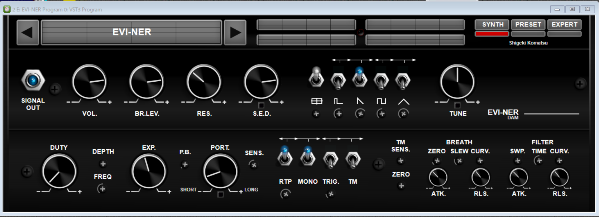

    
# EVI-NER(VST3)を使ってみる

2022/10/23      
初版    
  
## 概要    
wind_controler用のVST3プラグインとしてEVI-NERがあるのでインストールして使ってみる。  
wind_controlerとして、EWI5000とre.corderを接続してみた。

## EVI-NER購入($15)
[https://www.davidsonaudioandmultimedia.com/products/evi-ner](https://www.davidsonaudioandmultimedia.com/products/evi-ner)  
上のホームページから購入したいプラグインをカートに入れ、クレジットカードで購入できる。購入時に電子メールを設定するので、そのメールアドレスに対して、ダウンロートURL、アクティベーション情報の2通のメールが送られてくる。  
    
## ダウンロード/インストール

1. ダウンロート/インストール  
上で入手したダウンロードアドレスから購入プラグイン(.zip)をダウンロートし、解凍してインストールする。

\*重要\*     
\# PCの環境の問題だと思うが、  
\# プラグインがウィルス認識されて正常にインストールできなかったので  
\# インストール前ならびにVST実行前にはウィルスチェッカーを無効にする必要がある。  

2. 該当pluginのコピー  
プラグイン・インストール後、VSTが以下に置かれるので  
「C:\\Program Files\\Common Files\\VST3\\EVI-NER」  
自分の環境に合わせてプラグインを適切な場所にコピーする。  

(例)  
自分の環境では「C:\\Program Files\\VSTPlugIn」にプラグインを置いているので  
ここに「C:\\Program Files\\Common Files\\VST3\\EVI-NER」をコピーした。
     

## EVI-NER実行

1. EVI-NERプラグインを設定する。
「[EWI5000をソフト音源(IFW)と接続する](https://xshigee.github.io/web0/md/EWI5000_IFW.html)」を参考にEVI-NERプラグインを設定する。  
(IFWの部分をEVI-NERに読み替える)

2. vsthost.exeを実行してEVI-NERプラグインを立ち上げる。  
VSTを立ち上げると画面の左側の[SIGNAL OUT]が「？」になっているが、これは購入直後でアクティベーションをしていないせいであるので、[SIGNAL OUT]をクリックするとアクティベーション情報の入力画面になるので  
購入時に電子メールで送られてくる以下を入力して、アクティベートする。   

「Name or Company:」、「Email:」、  
「Serial Number Row 1:」、「Serial Number Row 2:」

3. これでwind_controlerを吹くと音が出る状態になる。  

マニュアルはアクティベーションの入力画面のマニュアルSWを切り替えると
表示される。マニュアルは以下にインストールされるようだ：  
C:/Program%20Files/Davidson%20Audio%20&%20Multimedia/EVI-NER/EVI-NER%20User%20Manual.pdf

EVI-NRE画面：  
  

EWI5000とre.corderを接続して音が出ることを確認した。  

EWI5000のMIDI-OUT設定は  
「[EWI5000に外部音源(EWI3000m,Aria/Windows)を接続する](https://xshigee.github.io/web0/md/EWI5000_EWI-Aria.html)」
のMIDI-OUT設定を採用した。

re.corderのMIDI-OUT設定は  
「[re.corder/Elefueに外部音源(Aria/Windows)を接続する(WIDI_Bud_Pro経由)](https://xshigee.github.io/web0/md/re.corder_Aria.html)」
のMIDI-OUT設定を採用した。
                                                                
## 参考情報  
re.corder関連：  
[owner’s manual re.corder](http://www.artinoise.com/wp-content/uploads/2021/02/artinoise-recorder-manual-ENG-v10.pdf)  
[re.corder Downloads](https://www.recorderinstruments.com/en/support-downloads/)  
[re.corder Frequently Asked Questions](https://www.recorderinstruments.com/en/frequently-asked-questions/)    

MIDI関連：  
[現時点、最強のBluetooth MIDIかも!?　各種BLE-MIDI機器と自動でペアリングしてくれるWIDI Masterがスゴイ！](https://www.dtmstation.com/archives/32976.html)  
[Pocket MIDI](https://www.microsoft.com/ja-jp/p/pocket-midi/9ntv7mflbbvx?activetab=pivot:overviewtab)  

ASIO関連：  
[asio4all - ASIOドライバーのないオーディオインターフェイスをASIO対応にできるソフト](https://forest.watch.impress.co.jp/library/software/asio4all/)

Aria関連：  
[EWI MASTER BOOK CD付教則完全ガイド【改訂版】](https://www.alsoj.net/store/view/ALEWIS1-2.html#.YmNpctpBxPY)のp100-p119の音色の設定方法がある

以上  

[Go to Toplevel](https://xshigee.github.io/web0/)  

