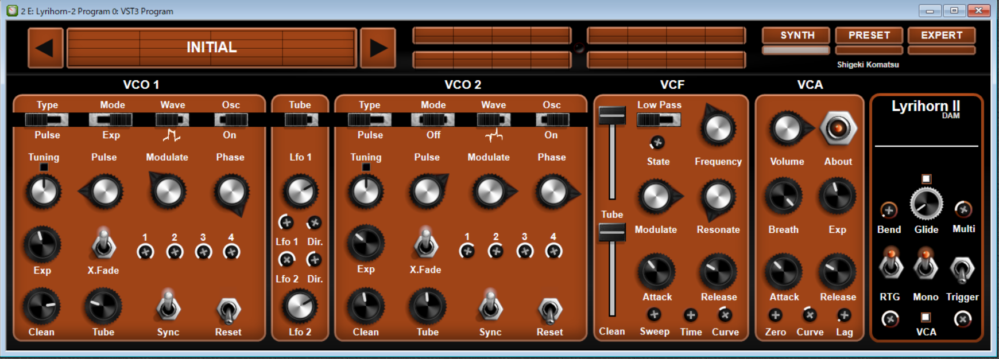

# Lyrihorn-2(VST3)を使ってみる

22022/10/26      
初版    
  
## 概要    
wind_controler用のVST3プラグインとしてLyrihorn-2があるのでインストールして使ってみる。  
wind_controlerとして、EWI5000とre.corderを接続してみた。 
\#  名前から推測するとLyriconの音色をシミュレートしたもののようである。  
[リリコン Lyricon](https://ja.wikipedia.org/wiki/%E3%83%AA%E3%83%AA%E3%82%B3%E3%83%B3)  


## Lyrihorn-2購入($30)
[https://www.davidsonaudioandmultimedia.com/collections/plugns/products/lyrihorn-2](https://www.davidsonaudioandmultimedia.com/collections/plugns/products/lyrihorn-2)
上のホームページから購入したいプラグインをカートに入れ、クレジットカードで購入できる。  
購入時に電子メールを設定するので、そのメールアドレスに対して、ダウンロートURL「Your downloads are ready」、
MachineID確認要求「Lyrihorn-2 Activation」の2通のメールが送られてくる。  
\# ２つのメールの間には3時間ほどの時差があった。  
\# これは状況により変化すると思われる。  
ここまで来たら以下を実行する：  
1. MachineIDを確認するためにLyrihorn-2をインストールして起動して
VST画面のVCAセクションのAboutが「?」になっているので、そこをクリックする。
画面にMachineIDが表示されるので、それをメモする。
1. MachineID確認要求「Lyrihorn-2 Activation」メールの返信として、上でメモしたMachineIDを送信する、
1. 上のメール返信として、アクティベーション情報のメールが送られてくる。（実績として11時間後だった）
    
    
## ダウンロード/インストール

1. ダウンロート/インストール  
上で入手したダウンロードアドレスから購入プラグイン(.zip)をダウンロートし、解凍してインストールする。

\*重要\*     
\# PCの環境の問題だと思うが、  
\# プラグインがウィルス認識されて正常にインストールできなかったので  
\# インストール前ならびにVST実行前にはウィルスチェッカーを無効にする必要がある。  

2. 該当pluginのコピー  
プラグイン・インストール後、VSTが以下に置かれるので  
「C:\\Program Files\\Common Files\\VST3\\Lyrihorn-2」  
自分の環境に合わせてプラグインを適切な場所にコピーする。  

(例)  
自分の環境では「C:\\Program Files\\VSTPlugIn」にプラグインを置いているので  
ここに「C:\\Program Files\\Common Files\\VST3\\Lyrihorn-2」をコピーした。
     

## Lyrihorn-2実行

1. Lyrihorn-2プラグインを設定する。  
「[EWI5000をソフト音源(IFW)と接続する](https://xshigee.github.io/web0/md/EWI5000_IFW.html)」を参考にEVI-NERプラグインを設定する。  
(IFWの部分をEVI-NERに読み替える)  

2. vsthost.exeを実行してLyrihorn-2プラグインを立ち上げる。   
VST起動時にVST画面のVCAセクションのAboutをクリックして
電子メールで送られてきた以下のアクティベーション情報を入力するとアクティベーションが完了する。

```
Machine ID 1:
こちらから送ったMachineID(確認用)

Name or Company:

Email:
購入時の電子メールアドレス

Serial Number Row 1:

Serial Number Row 2:

Serial Number Row 3:

```

3. これでwind_controlerを吹くと音が出る状態になる。  

マニュアルは以下にインストールされるようだ：  
C:/Program%20Files/Davidson%20Audio%20&%20Multimedia/Lyrihorn-2/Lyrihorn%202%20User%20Manual.pdf


Lyrihorn-2画面：  
  

EWI5000とre.corderを接続して音が出ることを確認した。  

EWI5000のMIDI-OUT設定は  
「[EWI5000に外部音源(EWI3000m,Aria/Windows)を接続する](https://xshigee.github.io/web0/md/EWI5000_EWI-Aria.html)」
のMIDI-OUT設定を採用した。  

re.corderのMIDI-OUT設定は  
「[re.corder/Elefueに外部音源(Aria/Windows)を接続する(WIDI_Bud_Pro経由)](https://xshigee.github.io/web0/md/re.corder_Aria.html)」
のMIDI-OUT設定を採用した。  
Pressure(breath)のCurveはembedded2のほうが吹きやすいかもしれない。  

                                                                
## 参考情報  
re.corder関連：  
[owner’s manual re.corder](http://www.artinoise.com/wp-content/uploads/2021/02/artinoise-recorder-manual-ENG-v10.pdf)  
[re.corder Downloads](https://www.recorderinstruments.com/en/support-downloads/)  
[re.corder Frequently Asked Questions](https://www.recorderinstruments.com/en/frequently-asked-questions/)    

MIDI関連：  
[現時点、最強のBluetooth MIDIかも!?　各種BLE-MIDI機器と自動でペアリングしてくれるWIDI Masterがスゴイ！](https://www.dtmstation.com/archives/32976.html)  
[Midi View](https://hautetechnique.com/midi/midiview/)   


ASIO関連：  
[asio4all - ASIOドライバーのないオーディオインターフェイスをASIO対応にできるソフト](https://forest.watch.impress.co.jp/library/software/asio4all/)

Aria関連：  
[EWI MASTER BOOK CD付教則完全ガイド【改訂版】](https://www.alsoj.net/store/view/ALEWIS1-2.html#.YmNpctpBxPY)のp100-p119の音色の設定方法がある

以上  

[Go to Toplevel](https://xshigee.github.io/web0/)  

